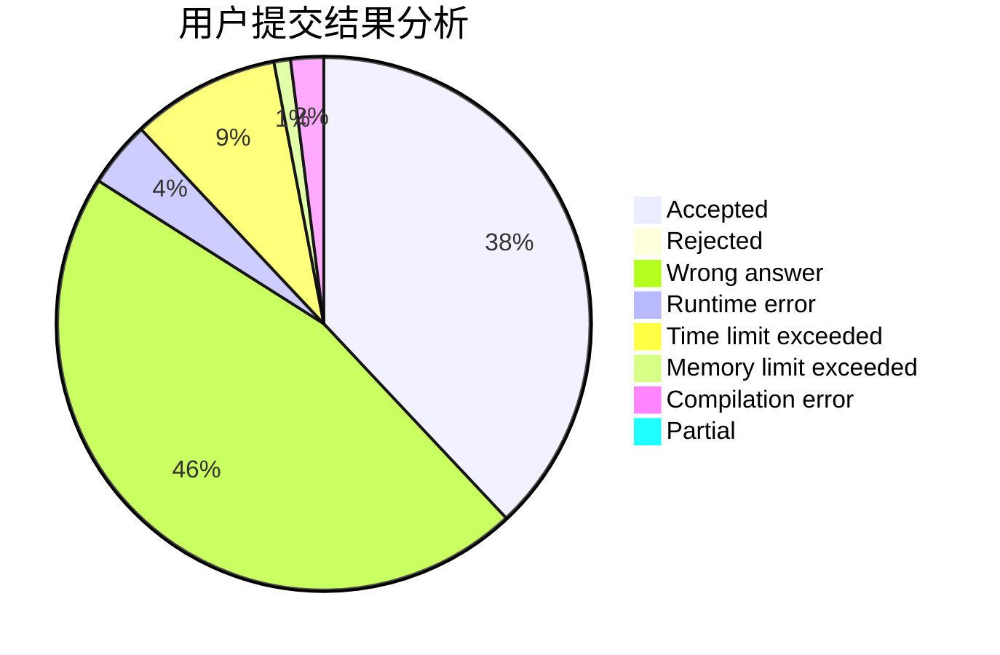
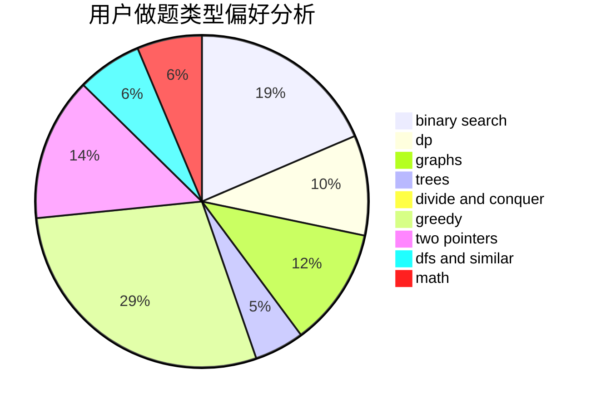

# CQU-Songer

<!-- tabs:start -->

#### **用户提交结果分析**

#### **用户做题类型偏好分析**

<!-- tabs:end -->
# 推荐题目
[491B](https://codeforces.com/contest/491/problem/B)
[212E](https://codeforces.com/contest/212/problem/E)
[1358F](https://codeforces.com/contest/1358/problem/F)
[279D](https://codeforces.com/contest/279/problem/D)
[622C](https://codeforces.com/contest/622/problem/C)
[1282A](https://codeforces.com/contest/1282/problem/A)
[622A](https://codeforces.com/contest/622/problem/A)
[1070B](https://codeforces.com/contest/1070/problem/B)
[1156B](https://codeforces.com/contest/1156/problem/B)
[1282D](https://codeforces.com/contest/1282/problem/D)
