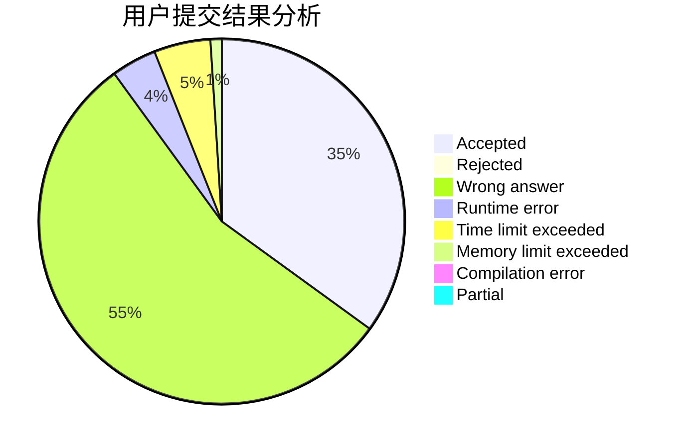
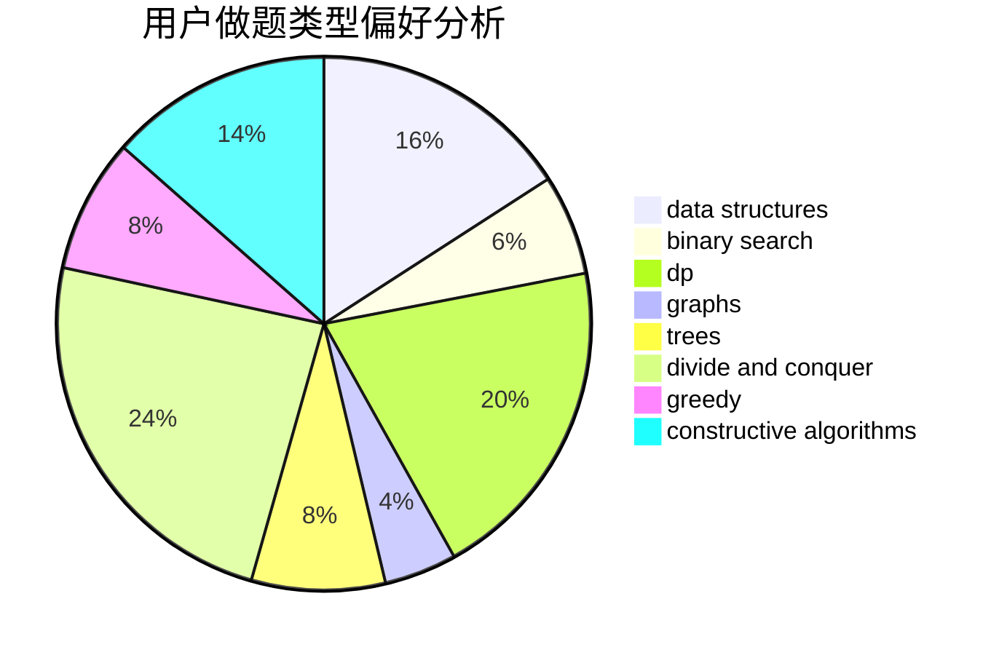
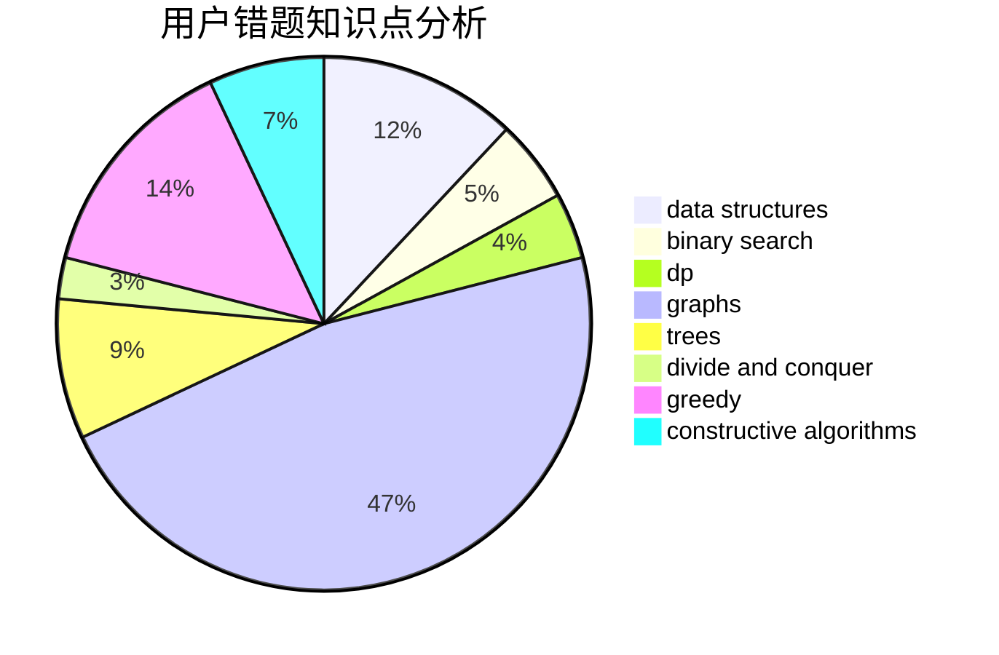

# stevenzheng2002

<!-- tabs:start -->

#### **用户提交结果分析**

#### **用户做题类型偏好分析**

#### **用户错题知识点分析**

<!-- tabs:end -->
# 推荐题目
[1342A](https://codeforces.com/contest/1342/problem/A)		greedy,
                        math		  
[933B](https://codeforces.com/contest/933/problem/B)		math		  
[1108A](https://codeforces.com/contest/1108/problem/A)		implementation		  
[1099F](https://codeforces.com/contest/1099/problem/F)		binary search,
                        data structures,
                        dfs and similar,
                        dp,
                        games,
                        trees		  
[1156D](https://codeforces.com/contest/1156/problem/D)		dfs and similar,
                        divide and conquer,
                        dp,
                        dsu,
                        trees		  
[838E](https://codeforces.com/contest/838/problem/E)		dp		  
[1081D](https://codeforces.com/contest/1081/problem/D)		dsu,
                        graphs,
                        shortest paths,
                        sortings		  
[1297B](https://codeforces.com/contest/1297/problem/B)		*special problem,
                        implementation,
                        sortings		  
[955B](https://codeforces.com/contest/955/problem/B)		implementation		  
[666A](https://codeforces.com/contest/666/problem/A)		dp,
                        implementation,
                        strings		  
