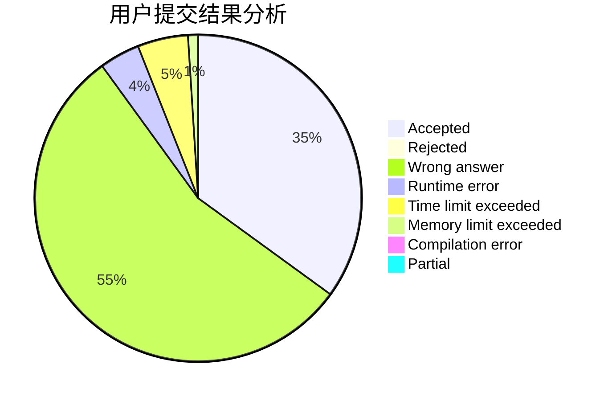
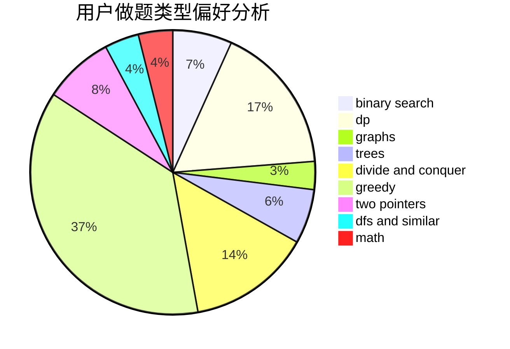

# stevenzheng2002

<!-- tabs:start -->

#### **用户提交结果分析**

#### **用户做题类型偏好分析**

<!-- tabs:end -->
# 推荐题目
[1342A](https://codeforces.com/contest/1342/problem/A)
[933B](https://codeforces.com/contest/933/problem/B)
[1108A](https://codeforces.com/contest/1108/problem/A)
[1099F](https://codeforces.com/contest/1099/problem/F)
[1156D](https://codeforces.com/contest/1156/problem/D)
[838E](https://codeforces.com/contest/838/problem/E)
[1081D](https://codeforces.com/contest/1081/problem/D)
[1297B](https://codeforces.com/contest/1297/problem/B)
[955B](https://codeforces.com/contest/955/problem/B)
[666A](https://codeforces.com/contest/666/problem/A)
