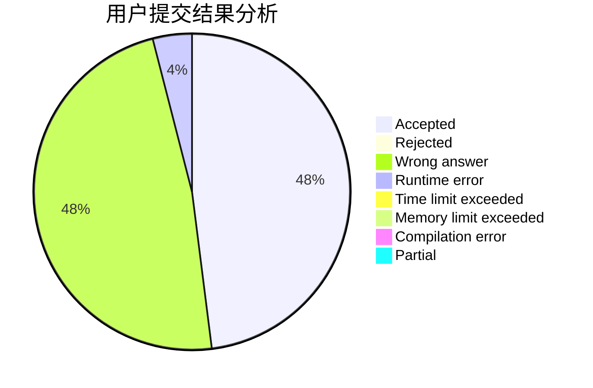
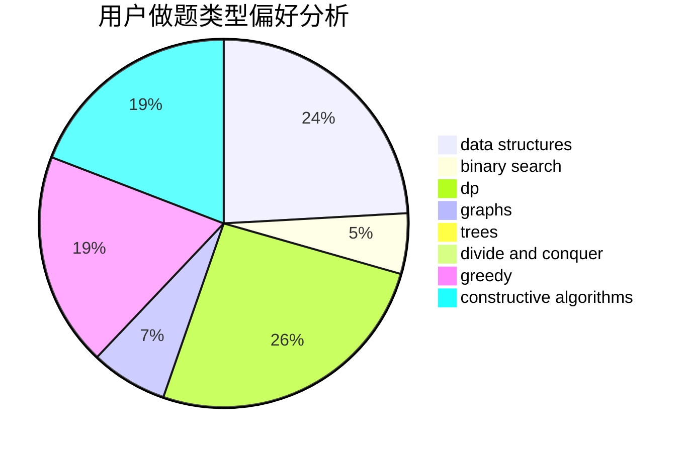
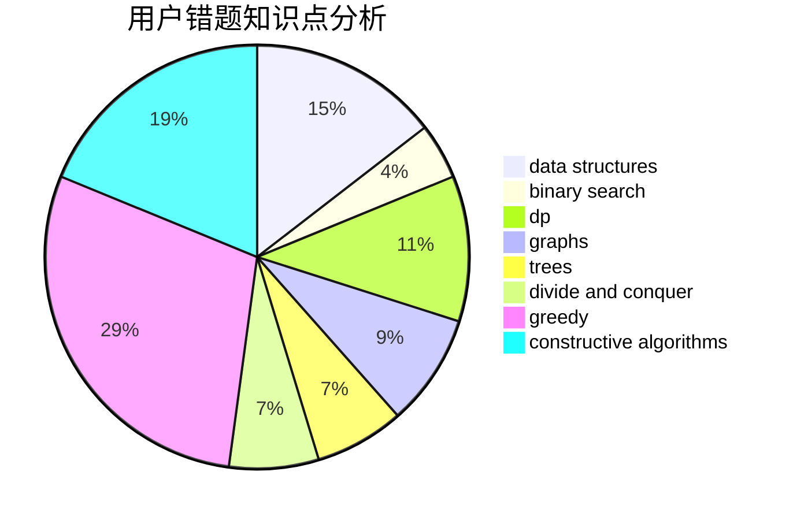

# sto_sjc_orz

<!-- tabs:start -->

#### **用户提交结果分析**

#### **用户做题类型偏好分析**

#### **用户错题知识点分析**

<!-- tabs:end -->
# 推荐题目
[246D](https://codeforces.com/contest/246/problem/D)		brute force,
                        dfs and similar,
                        graphs		  
[1364D](https://codeforces.com/contest/1364/problem/D)		constructive algorithms,
                        dfs and similar,
                        graphs,
                        greedy,
                        implementation,
                        trees		  
[208A](https://codeforces.com/contest/208/problem/A)		strings		  
[1240C](https://codeforces.com/contest/1240/problem/C)		dsu,graphs,sortings,trees		  
[767D](https://codeforces.com/contest/767/problem/D)		binary search,
                        data structures,
                        greedy,
                        sortings,
                        two pointers		  
[763B](https://codeforces.com/contest/763/problem/B)		constructive algorithms,
                        geometry		  
[966E](https://codeforces.com/contest/966/problem/E)		dsu,graphs,sortings,trees		  
[1249E](https://codeforces.com/contest/1249/problem/E)		dp,
                        shortest paths		  
[981H](https://codeforces.com/contest/981/problem/H)		combinatorics,
                        data structures,
                        dp,
                        fft,
                        math		  
[1195B](https://codeforces.com/contest/1195/problem/B)		binary search,
                        brute force,
                        math		  
