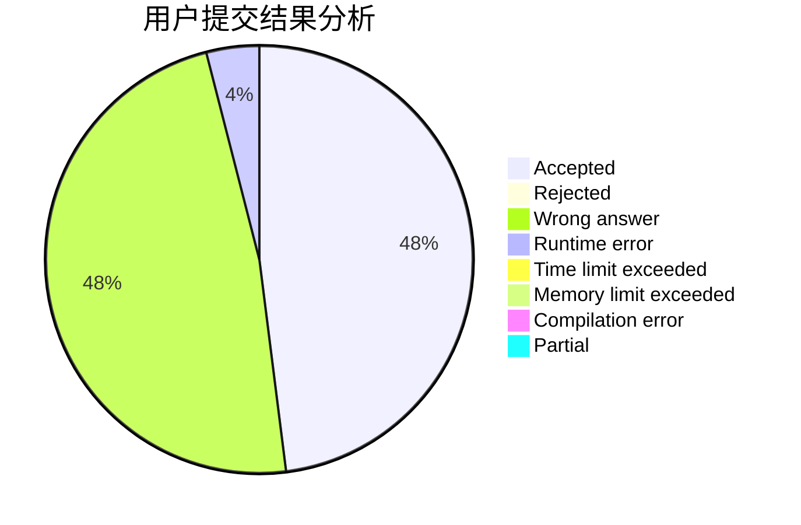
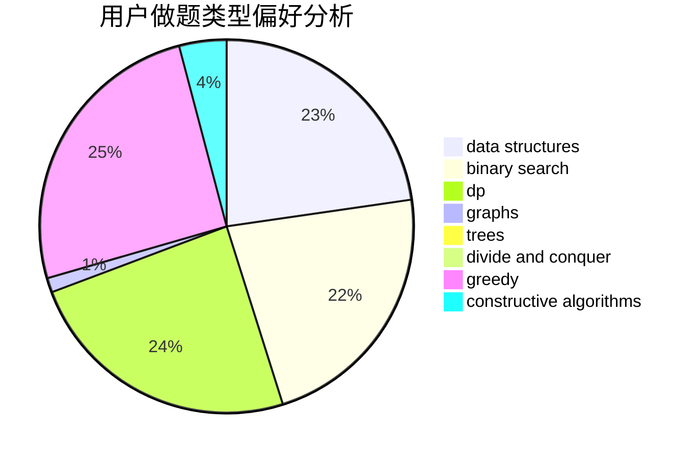
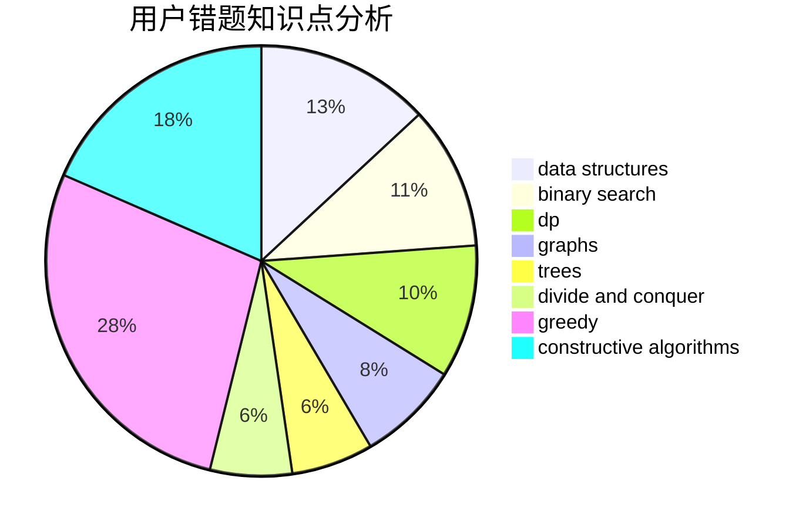

# sto_sjc_orz

<!-- tabs:start -->

#### **用户提交结果分析**

#### **用户做题类型偏好分析**

#### **用户错题知识点分析**

<!-- tabs:end -->
# 推荐题目
[228D](https://codeforces.com/contest/228/problem/D)		data structures		  
[1357B1](https://codeforces.com/contest/1357B/problem/1)		nan		  
[180D](https://codeforces.com/contest/180/problem/D)		greedy,
                        strings		  
[1234F](https://codeforces.com/contest/1234/problem/F)		bitmasks,
                        dp		  
[748C](https://codeforces.com/contest/748/problem/C)		constructive algorithms,
                        math		  
[742E](https://codeforces.com/contest/742/problem/E)		dsu,graphs,sortings,trees		  
[949E](https://codeforces.com/contest/949/problem/E)		brute force		  
[1244C](https://codeforces.com/contest/1244/problem/C)		brute force,
                        math,
                        number theory		  
[960A](https://codeforces.com/contest/960/problem/A)		implementation		  
[118B](https://codeforces.com/contest/118/problem/B)		constructive algorithms,
                        implementation		  
