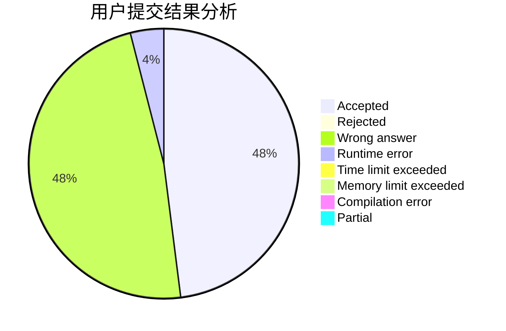
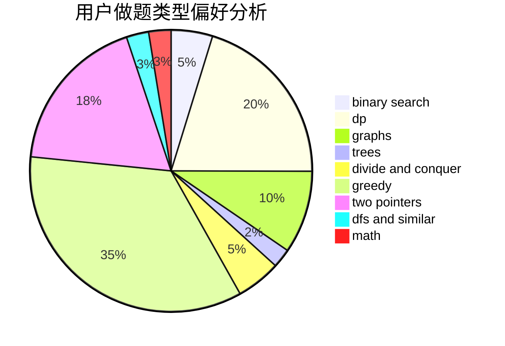

# sto_sjc_orz

<!-- tabs:start -->

#### **用户提交结果分析**

#### **用户做题类型偏好分析**

<!-- tabs:end -->
# 推荐题目
[246D](https://codeforces.com/contest/246/problem/D)
[1364D](https://codeforces.com/contest/1364/problem/D)
[208A](https://codeforces.com/contest/208/problem/A)
[1240C](https://codeforces.com/contest/1240/problem/C)
[767D](https://codeforces.com/contest/767/problem/D)
[763B](https://codeforces.com/contest/763/problem/B)
[966E](https://codeforces.com/contest/966/problem/E)
[1249E](https://codeforces.com/contest/1249/problem/E)
[981H](https://codeforces.com/contest/981/problem/H)
[1195B](https://codeforces.com/contest/1195/problem/B)
