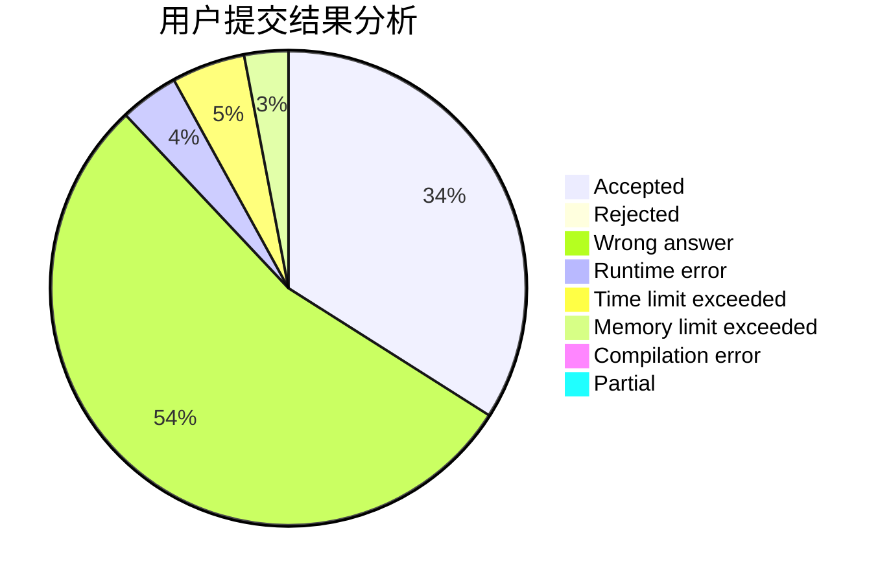
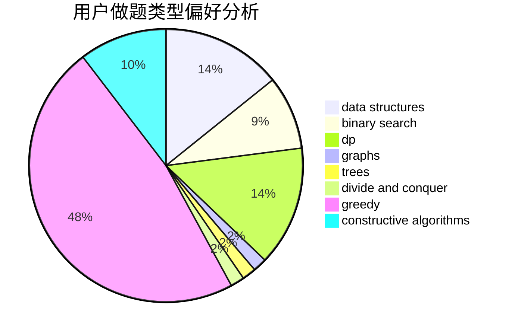
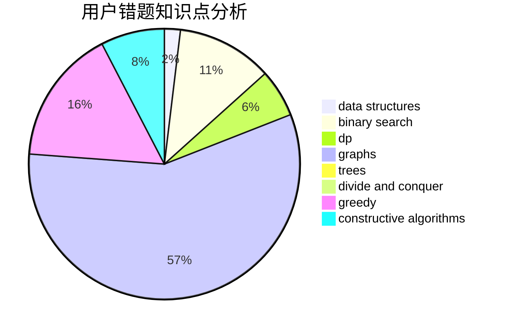

# stoorz

<!-- tabs:start -->

#### **用户提交结果分析**

#### **用户做题类型偏好分析**

#### **用户错题知识点分析**

<!-- tabs:end -->
# 推荐题目
[708E](https://codeforces.com/contest/708/problem/E)		dp,
                        math		  
[1366F](https://codeforces.com/contest/1366/problem/F)		binary search,
                        dp,
                        geometry,
                        graphs		  
[720D](https://codeforces.com/contest/720/problem/D)		data structures,
                        dp,
                        sortings		  
[653A](https://codeforces.com/contest/653/problem/A)		brute force,
                        implementation,
                        sortings		  
[1013E](https://codeforces.com/contest/1013/problem/E)		dsu,graphs,sortings,trees		  
[93A](https://codeforces.com/contest/93/problem/A)		implementation		  
[44A](https://codeforces.com/contest/44/problem/A)		implementation		  
[138D](https://codeforces.com/contest/138/problem/D)		dp,
                        games		  
[acmsguru6](https://codeforces.com/contest/acmsguru/problem/6)		dsu,graphs,sortings,trees		  
[894A](https://codeforces.com/contest/894/problem/A)		brute force,
                        dp		  
