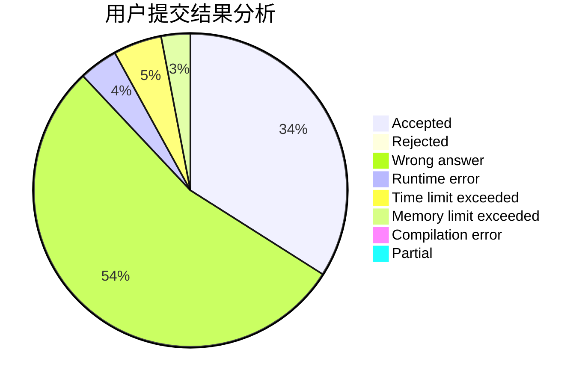
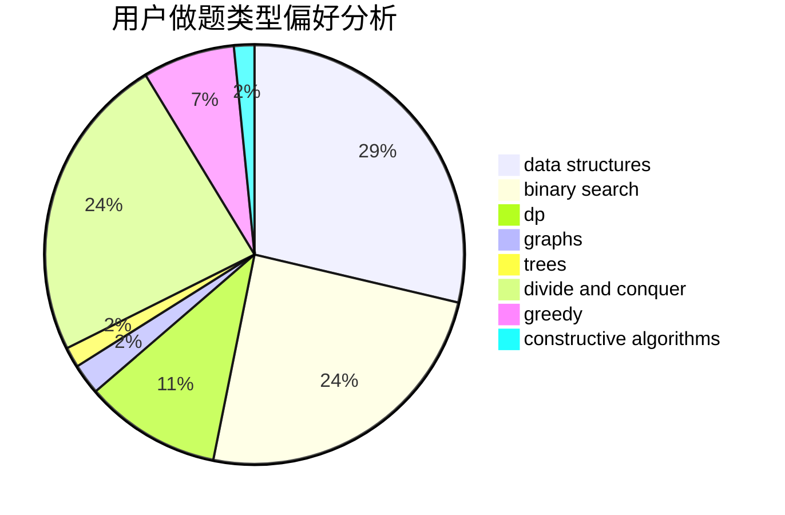
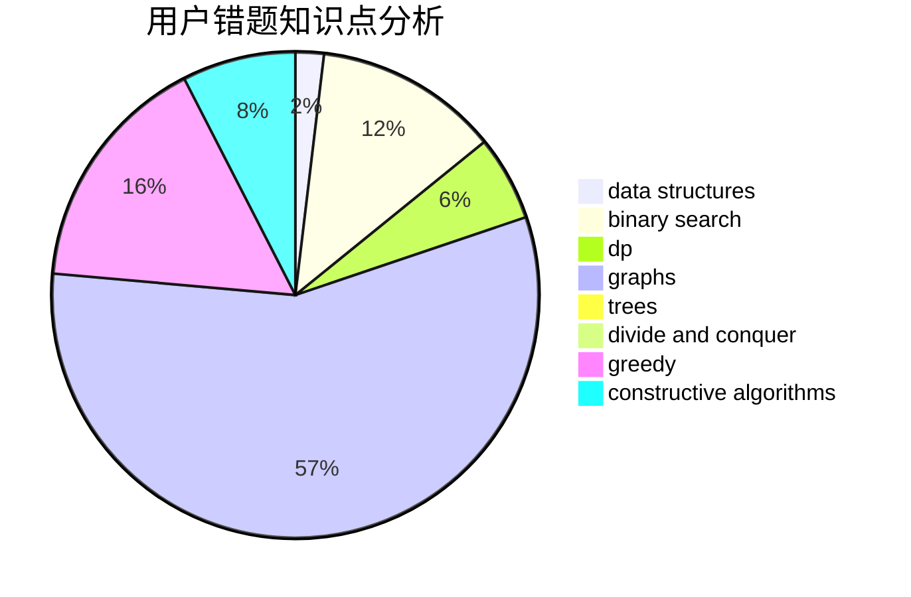

# stoorz

<!-- tabs:start -->

#### **用户提交结果分析**

#### **用户做题类型偏好分析**

#### **用户错题知识点分析**

<!-- tabs:end -->
# 推荐题目
[687A](https://codeforces.com/contest/687/problem/A)		dfs and similar,
                        graphs		  
[1358D](https://codeforces.com/contest/1358/problem/D)		binary search,
                        brute force,
                        greedy,
                        implementation,
                        two pointers		  
[702A](https://codeforces.com/contest/702/problem/A)		dp,
                        greedy,
                        implementation		  
[626F](https://codeforces.com/contest/626/problem/F)		dp		  
[1013B](https://codeforces.com/contest/1013/problem/B)		greedy		  
[919F](https://codeforces.com/contest/919/problem/F)		games,
                        graphs,
                        shortest paths		  
[427B](https://codeforces.com/contest/427/problem/B)		data structures,
                        implementation		  
[1380F](https://codeforces.com/contest/1380/problem/F)		data structures,
                        dp,
                        matrices		  
[986D](https://codeforces.com/contest/986/problem/D)		fft,
                        math		  
[873B](https://codeforces.com/contest/873/problem/B)		dp,
                        implementation		  
