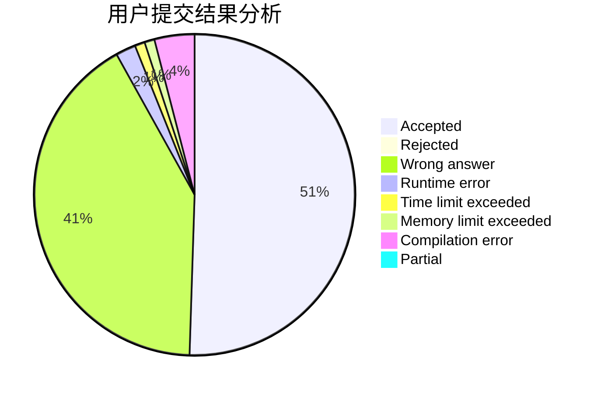
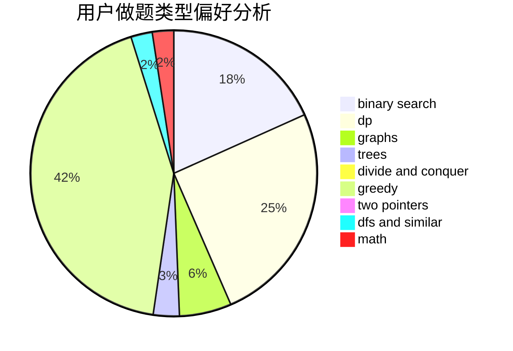

# study_ing

<!-- tabs:start -->

#### **用户提交结果分析**

#### **用户做题类型偏好分析**

<!-- tabs:end -->
# 推荐题目
[600D](https://codeforces.com/contest/600/problem/D)
[327A](https://codeforces.com/contest/327/problem/A)
[1364D](https://codeforces.com/contest/1364/problem/D)
[938B](https://codeforces.com/contest/938/problem/B)
[319C](https://codeforces.com/contest/319/problem/C)
[605C](https://codeforces.com/contest/605/problem/C)
[496B](https://codeforces.com/contest/496/problem/B)
[299C](https://codeforces.com/contest/299/problem/C)
[295C](https://codeforces.com/contest/295/problem/C)
[1063E](https://codeforces.com/contest/1063/problem/E)
