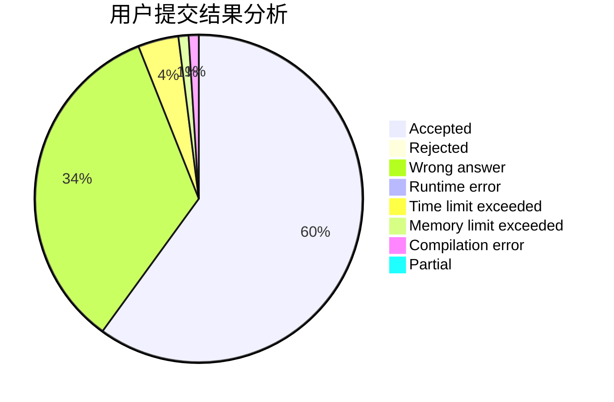
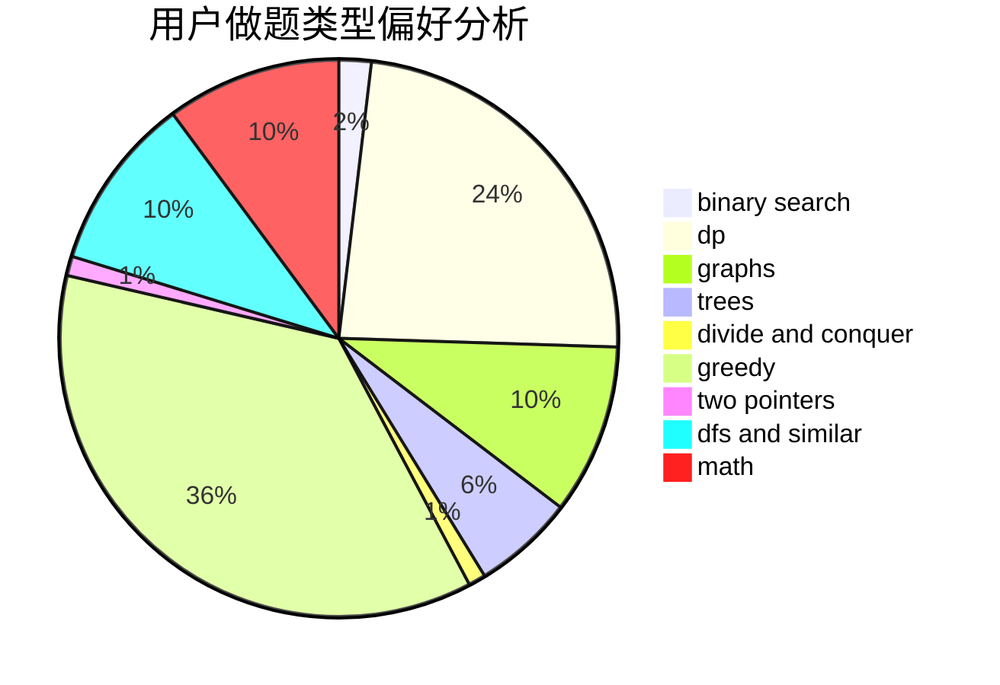

# sudamagicZhai

<!-- tabs:start -->

#### **用户提交结果分析**

#### **用户做题类型偏好分析**

<!-- tabs:end -->
# 推荐题目
[12822](https://codeforces.com/contest/1282/problem/2)
[359C](https://codeforces.com/contest/359/problem/C)
[666A](https://codeforces.com/contest/666/problem/A)
[1132G](https://codeforces.com/contest/1132/problem/G)
[7E](https://codeforces.com/contest/7/problem/E)
[772D](https://codeforces.com/contest/772/problem/D)
[858A](https://codeforces.com/contest/858/problem/A)
[1505D](https://codeforces.com/contest/1505/problem/D)
[670B](https://codeforces.com/contest/670/problem/B)
[1060F](https://codeforces.com/contest/1060/problem/F)
