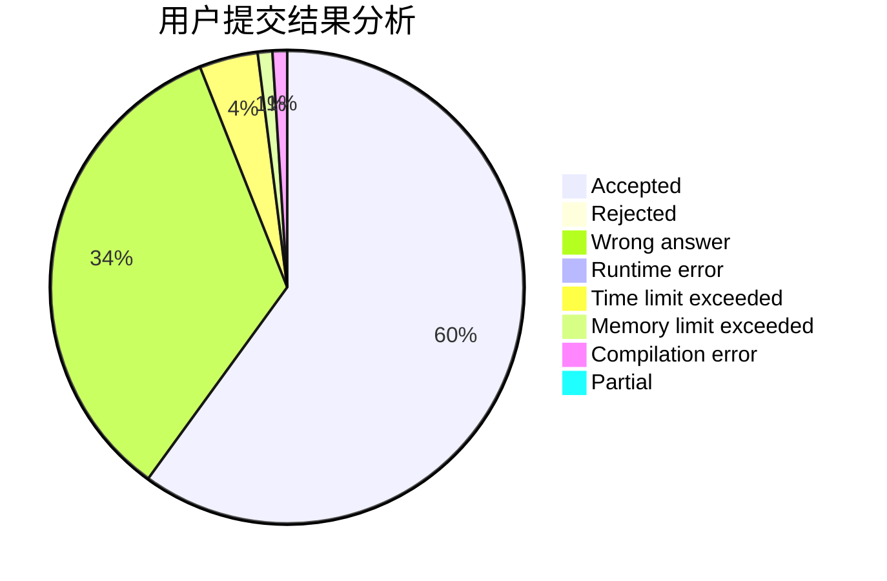
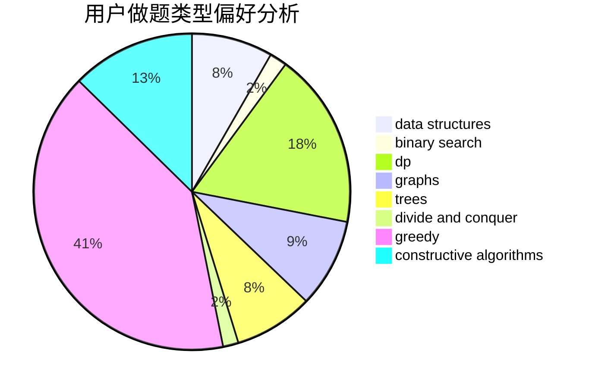
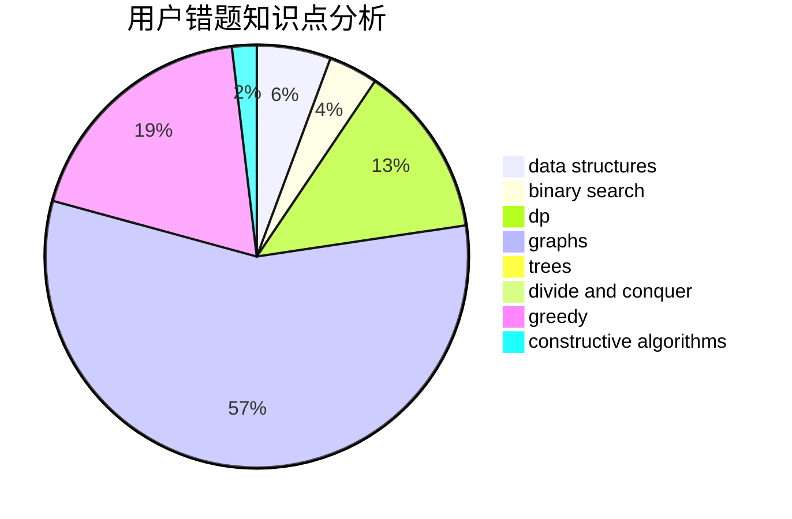

# sudamagicZhai

<!-- tabs:start -->

#### **用户提交结果分析**

#### **用户做题类型偏好分析**

#### **用户错题知识点分析**

<!-- tabs:end -->
# 推荐题目
[12822](https://codeforces.com/contest/1282/problem/2)		dsu,graphs,sortings,trees		  
[359C](https://codeforces.com/contest/359/problem/C)		math,
                        number theory		  
[666A](https://codeforces.com/contest/666/problem/A)		dp,
                        implementation,
                        strings		  
[1132G](https://codeforces.com/contest/1132/problem/G)		data structures,
                        dp,
                        trees		  
[7E](https://codeforces.com/contest/7/problem/E)		dp,
                        expression parsing,
                        implementation		  
[772D](https://codeforces.com/contest/772/problem/D)		bitmasks,
                        dp		  
[858A](https://codeforces.com/contest/858/problem/A)		brute force,
                        math,
                        number theory		  
[1505D](https://codeforces.com/contest/1505/problem/D)		number theory		  
[670B](https://codeforces.com/contest/670/problem/B)		implementation		  
[1060F](https://codeforces.com/contest/1060/problem/F)		combinatorics,
                        dp		  
