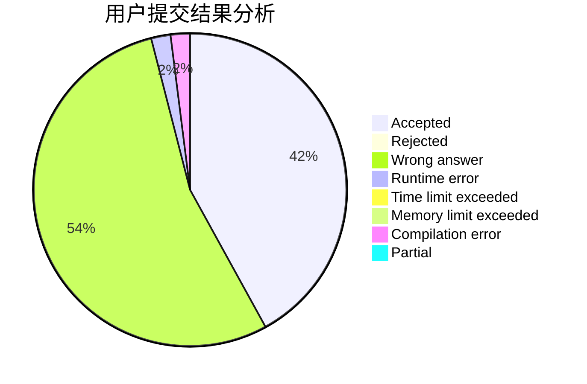
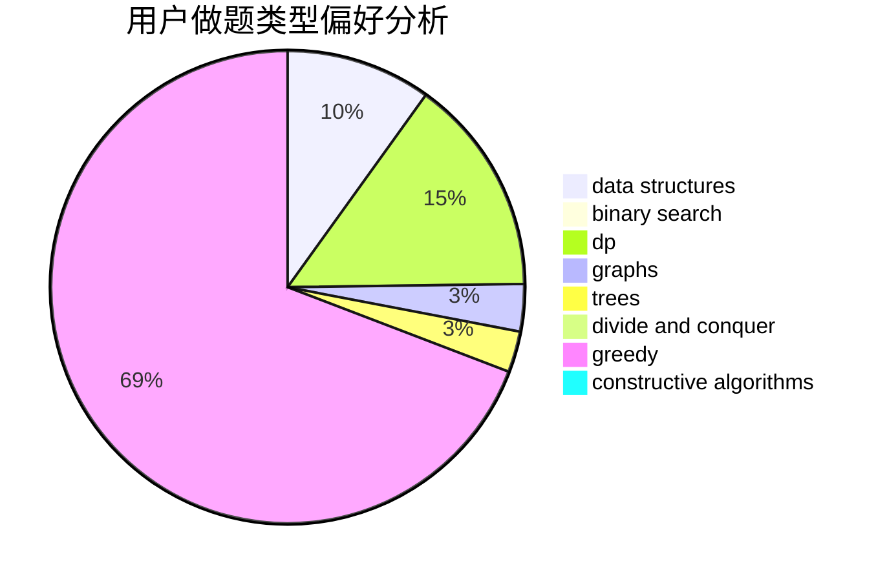

# summer_

<!-- tabs:start -->

#### **用户提交结果分析**

#### **用户做题类型偏好分析**

#### **用户错题知识点分析**

<!-- tabs:end -->
# 推荐题目
[269D](https://codeforces.com/contest/269/problem/D)		data structures,
                        dp,
                        graphs,
                        sortings		  
[1283A](https://codeforces.com/contest/1283/problem/A)		math		  
[527E](https://codeforces.com/contest/527/problem/E)		dfs and similar,
                        graphs		  
[1154D](https://codeforces.com/contest/1154/problem/D)		greedy		  
[1077C](https://codeforces.com/contest/1077/problem/C)		nan		  
[1508C](https://codeforces.com/contest/1508/problem/C)		data structures,
                        dfs and similar,
                        dsu,
                        graphs,
                        greedy,
                        math		  
[1510I](https://codeforces.com/contest/1510/problem/I)		greedy,
                        interactive,
                        math,
                        probabilities		  
[906A](https://codeforces.com/contest/906/problem/A)		implementation,
                        strings		  
[1214E](https://codeforces.com/contest/1214/problem/E)		constructive algorithms,
                        graphs,
                        math,
                        sortings,
                        trees		  
[471C](https://codeforces.com/contest/471/problem/C)		binary search,
                        brute force,
                        greedy,
                        math		  
