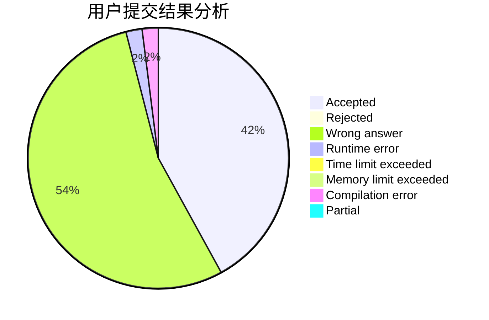
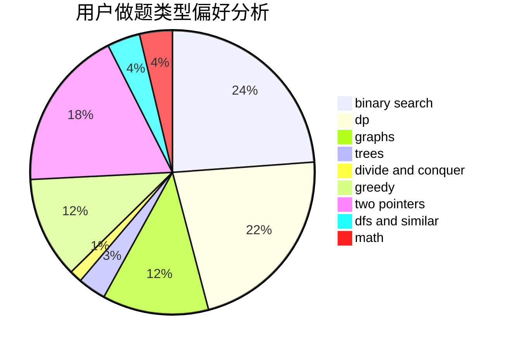

# summer_

<!-- tabs:start -->

#### **用户提交结果分析**

#### **用户做题类型偏好分析**

<!-- tabs:end -->
# 推荐题目
[285E](https://codeforces.com/contest/285/problem/E)
[1290A](https://codeforces.com/contest/1290/problem/A)
[551E](https://codeforces.com/contest/551/problem/E)
[1156D](https://codeforces.com/contest/1156/problem/D)
[1077D](https://codeforces.com/contest/1077/problem/D)
[15A](https://codeforces.com/contest/15/problem/A)
[166A](https://codeforces.com/contest/166/problem/A)
[91A](https://codeforces.com/contest/91/problem/A)
[1220A](https://codeforces.com/contest/1220/problem/A)
[48A](https://codeforces.com/contest/48/problem/A)
