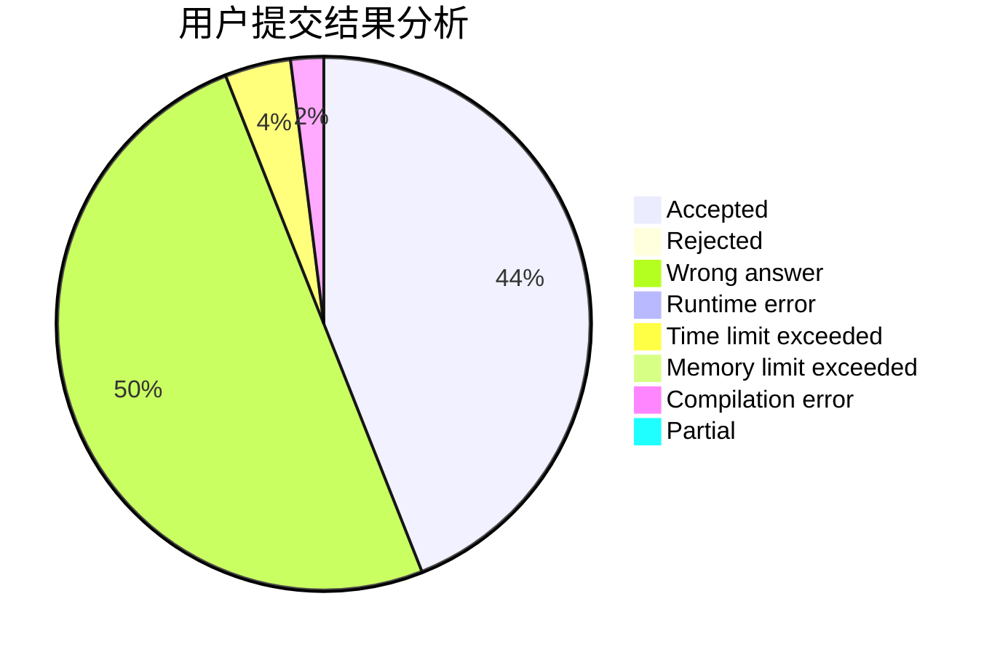
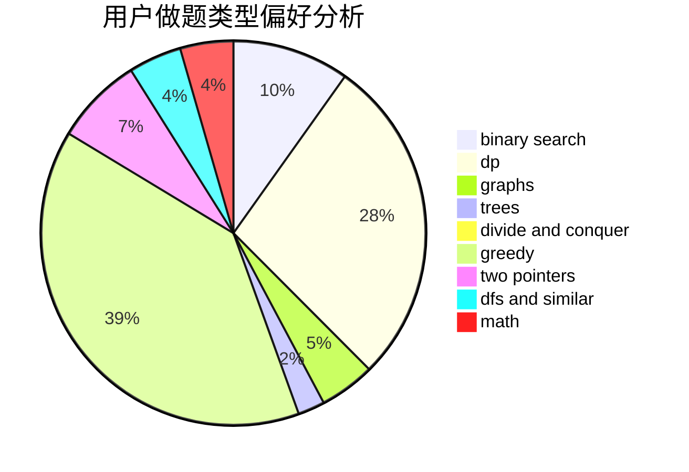

# sun_sky

<!-- tabs:start -->

#### **用户提交结果分析**

#### **用户做题类型偏好分析**

<!-- tabs:end -->
# 推荐题目
[982A](https://codeforces.com/contest/982/problem/A)
[631B](https://codeforces.com/contest/631/problem/B)
[1118B](https://codeforces.com/contest/1118/problem/B)
[1102F](https://codeforces.com/contest/1102/problem/F)
[226B](https://codeforces.com/contest/226/problem/B)
[730E](https://codeforces.com/contest/730/problem/E)
[1172B](https://codeforces.com/contest/1172/problem/B)
[463B](https://codeforces.com/contest/463/problem/B)
[231E](https://codeforces.com/contest/231/problem/E)
[1190A](https://codeforces.com/contest/1190/problem/A)
