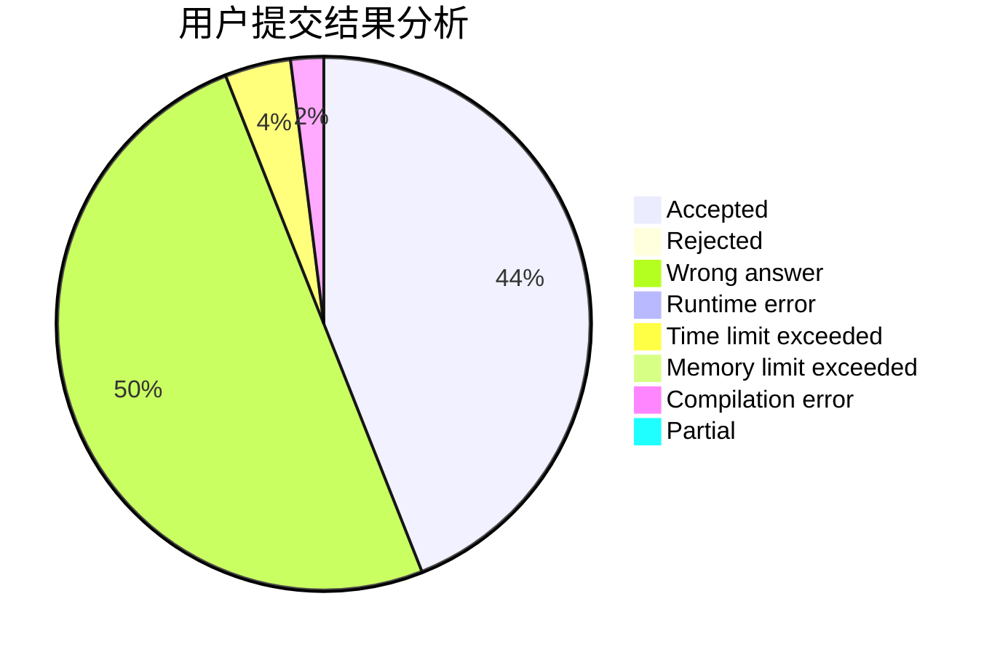
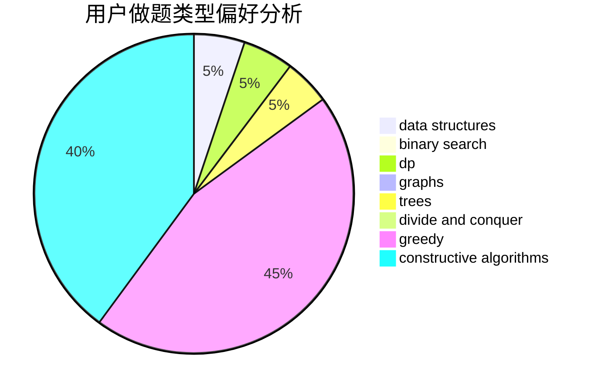
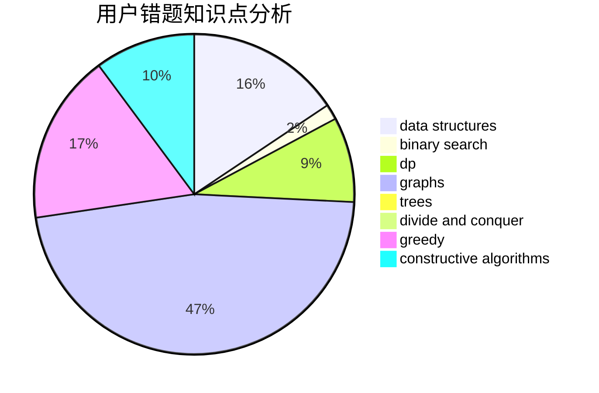

# sun_sky

<!-- tabs:start -->

#### **用户提交结果分析**

#### **用户做题类型偏好分析**

#### **用户错题知识点分析**

<!-- tabs:end -->
# 推荐题目
[960B](https://codeforces.com/contest/960/problem/B)		data structures,
                        greedy,
                        sortings		  
[612A](https://codeforces.com/contest/612/problem/A)		brute force,
                        implementation,
                        strings		  
[1116D2](https://codeforces.com/contest/1116D/problem/2)		nan		  
[1102C](https://codeforces.com/contest/1102/problem/C)		games		  
[201C](https://codeforces.com/contest/201/problem/C)		dp		  
[710B](https://codeforces.com/contest/710/problem/B)		brute force,
                        sortings		  
[1167E](https://codeforces.com/contest/1167/problem/E)		binary search,
                        combinatorics,
                        data structures,
                        two pointers		  
[442D](https://codeforces.com/contest/442/problem/D)		data structures,
                        trees		  
[20C](https://codeforces.com/contest/20/problem/C)		graphs,
                        shortest paths		  
[1186D](https://codeforces.com/contest/1186/problem/D)		constructive algorithms,
                        greedy,
                        math		  
