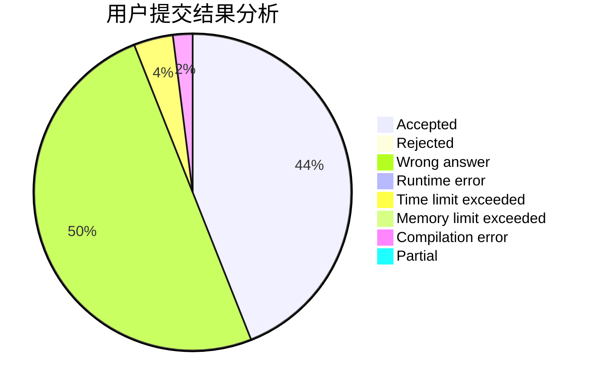
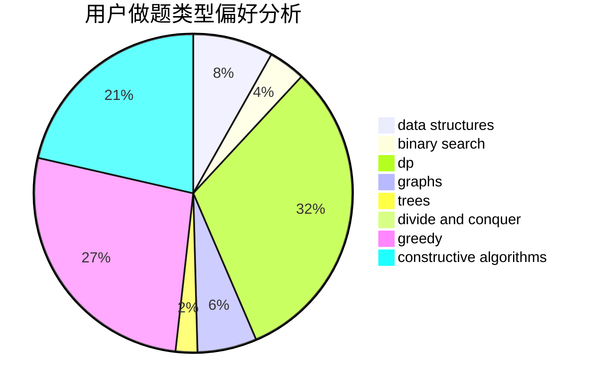
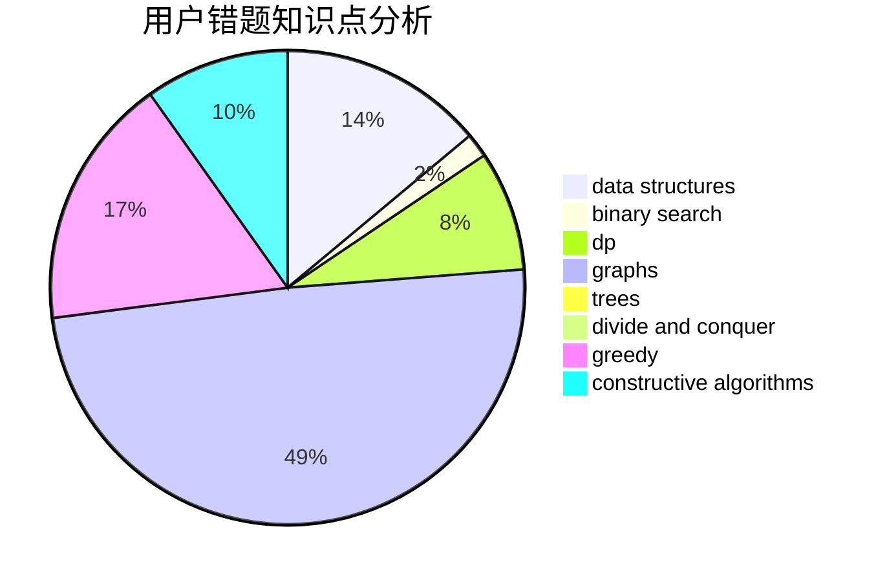

# sun_sky

<!-- tabs:start -->

#### **用户提交结果分析**

#### **用户做题类型偏好分析**

#### **用户错题知识点分析**

<!-- tabs:end -->
# 推荐题目
[982A](https://codeforces.com/contest/982/problem/A)		brute force,
                        constructive algorithms		  
[631B](https://codeforces.com/contest/631/problem/B)		constructive algorithms,
                        implementation		  
[1118B](https://codeforces.com/contest/1118/problem/B)		implementation		  
[1102F](https://codeforces.com/contest/1102/problem/F)		binary search,
                        bitmasks,
                        brute force,
                        dp,
                        graphs		  
[226B](https://codeforces.com/contest/226/problem/B)		greedy		  
[730E](https://codeforces.com/contest/730/problem/E)		greedy,
                        implementation		  
[1172B](https://codeforces.com/contest/1172/problem/B)		combinatorics,
                        dfs and similar,
                        dp,
                        trees		  
[463B](https://codeforces.com/contest/463/problem/B)		brute force,
                        implementation,
                        math		  
[231E](https://codeforces.com/contest/231/problem/E)		data structures,
                        dfs and similar,
                        dp,
                        graphs,
                        trees		  
[1190A](https://codeforces.com/contest/1190/problem/A)		implementation,
                        two pointers		  
