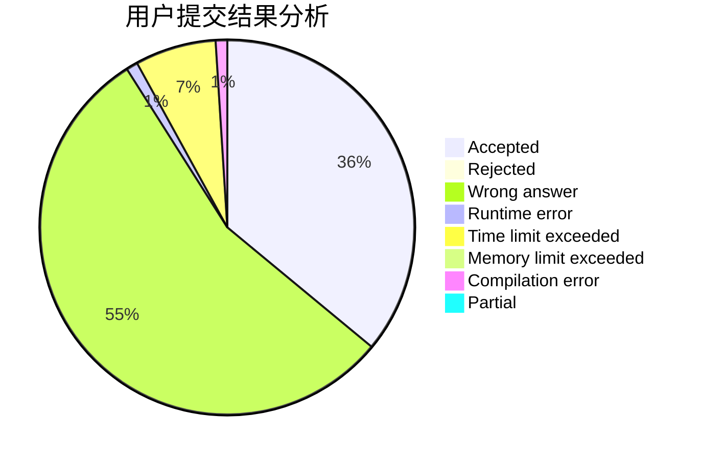
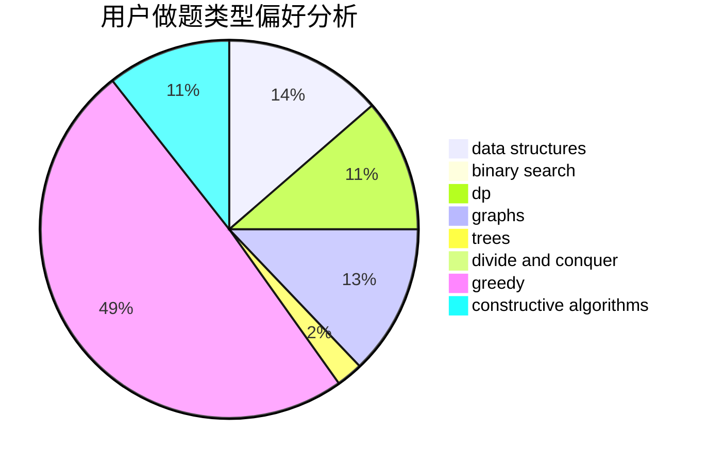
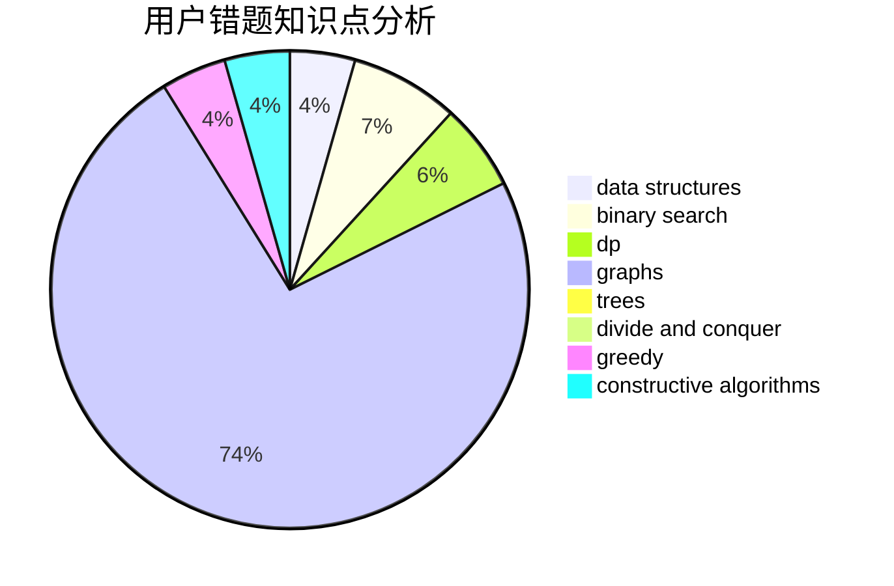

# sunair

<!-- tabs:start -->

#### **用户提交结果分析**

#### **用户做题类型偏好分析**

#### **用户错题知识点分析**

<!-- tabs:end -->
# 推荐题目
[44E](https://codeforces.com/contest/44/problem/E)		dp		  
[416D](https://codeforces.com/contest/416/problem/D)		greedy,
                        implementation,
                        math		  
[1087E](https://codeforces.com/contest/1087/problem/E)		dsu,graphs,sortings,trees		  
[896D](https://codeforces.com/contest/896/problem/D)		chinese remainder theorem,
                        combinatorics,
                        math,
                        number theory		  
[782A](https://codeforces.com/contest/782/problem/A)		dsu,graphs,sortings,trees		  
[932A](https://codeforces.com/contest/932/problem/A)		constructive algorithms		  
[472B](https://codeforces.com/contest/472/problem/B)		nan		  
[1267I](https://codeforces.com/contest/1267/problem/I)		brute force,
                        constructive algorithms,
                        implementation,
                        interactive,
                        sortings		  
[946A](https://codeforces.com/contest/946/problem/A)		greedy		  
[509D](https://codeforces.com/contest/509/problem/D)		constructive algorithms,
                        math		  
