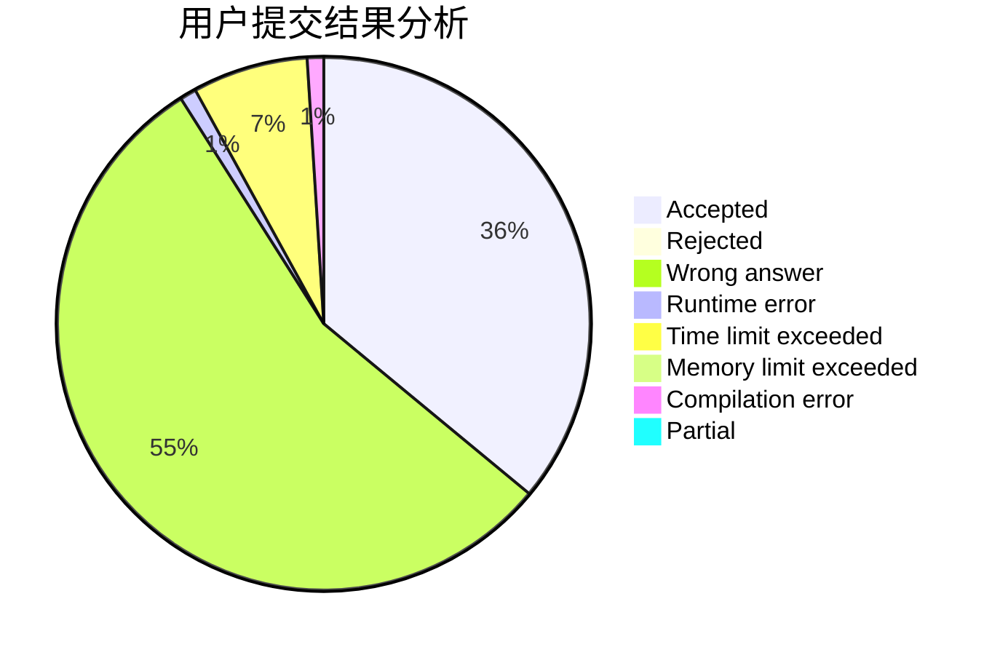
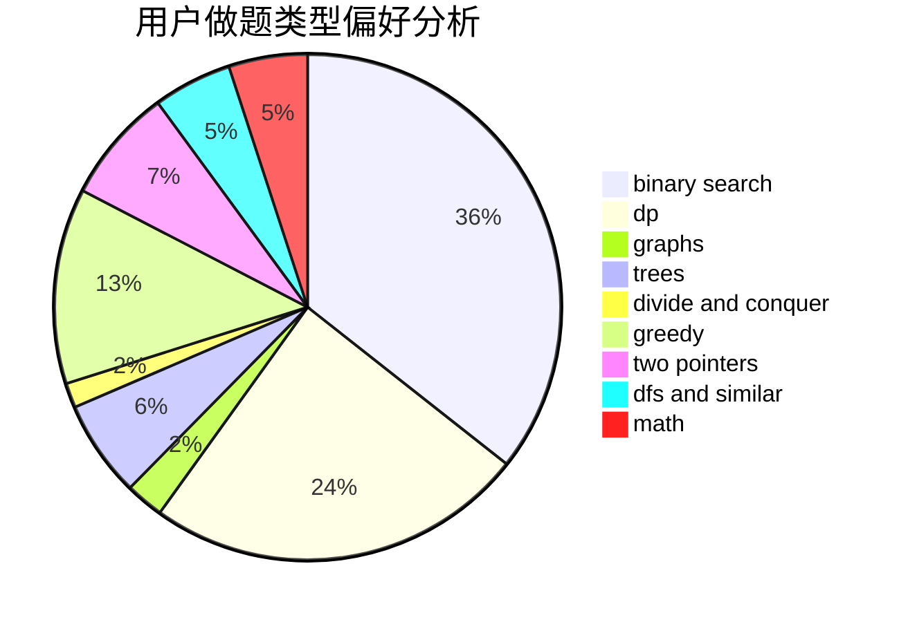

# sunair

<!-- tabs:start -->

#### **用户提交结果分析**

#### **用户做题类型偏好分析**

<!-- tabs:end -->
# 推荐题目
[471D](https://codeforces.com/contest/471/problem/D)
[441D](https://codeforces.com/contest/441/problem/D)
[1088B](https://codeforces.com/contest/1088/problem/B)
[913G](https://codeforces.com/contest/913/problem/G)
[7E](https://codeforces.com/contest/7/problem/E)
[952F](https://codeforces.com/contest/952/problem/F)
[490E](https://codeforces.com/contest/490/problem/E)
[1276D](https://codeforces.com/contest/1276/problem/D)
[962D](https://codeforces.com/contest/962/problem/D)
[52C](https://codeforces.com/contest/52/problem/C)
