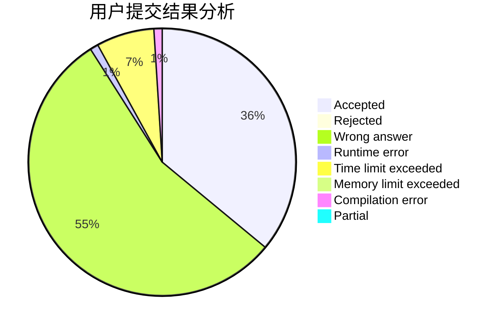
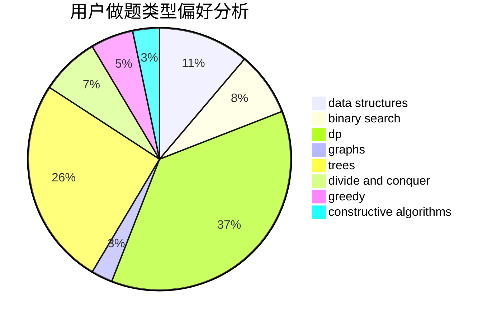
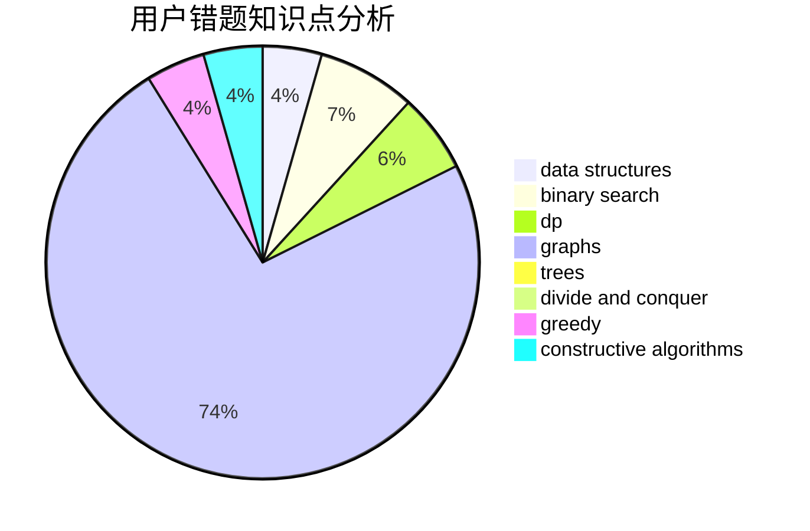

# sunair

<!-- tabs:start -->

#### **用户提交结果分析**

#### **用户做题类型偏好分析**

#### **用户错题知识点分析**

<!-- tabs:end -->
# 推荐题目
[471D](https://codeforces.com/contest/471/problem/D)		string suffix structures,
                        strings		  
[441D](https://codeforces.com/contest/441/problem/D)		constructive algorithms,
                        dsu,
                        graphs,
                        implementation,
                        math,
                        string suffix structures		  
[1088B](https://codeforces.com/contest/1088/problem/B)		implementation,
                        sortings		  
[913G](https://codeforces.com/contest/913/problem/G)		math,
                        number theory		  
[7E](https://codeforces.com/contest/7/problem/E)		dp,
                        expression parsing,
                        implementation		  
[952F](https://codeforces.com/contest/952/problem/F)		nan		  
[490E](https://codeforces.com/contest/490/problem/E)		binary search,
                        brute force,
                        greedy,
                        implementation		  
[1276D](https://codeforces.com/contest/1276/problem/D)		dp,
                        trees		  
[962D](https://codeforces.com/contest/962/problem/D)		data structures,
                        implementation		  
[52C](https://codeforces.com/contest/52/problem/C)		data structures		  
