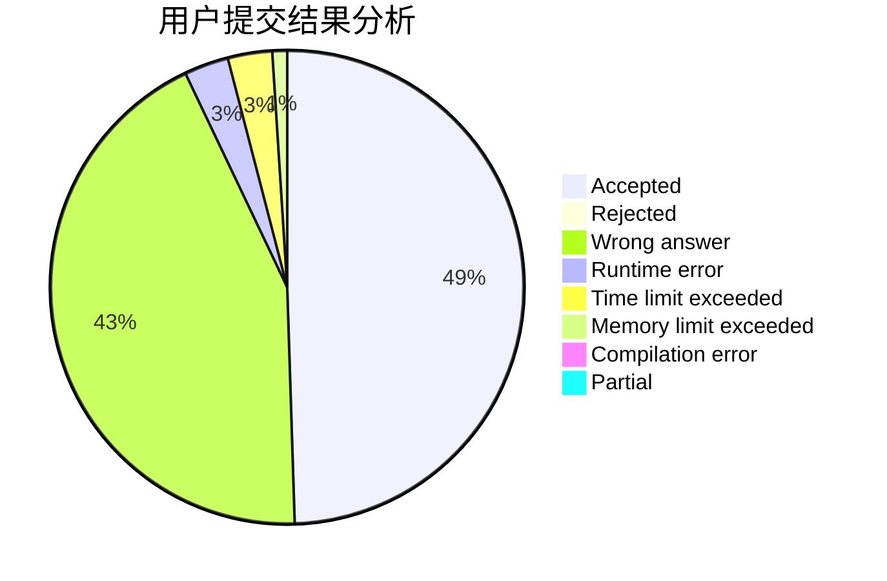
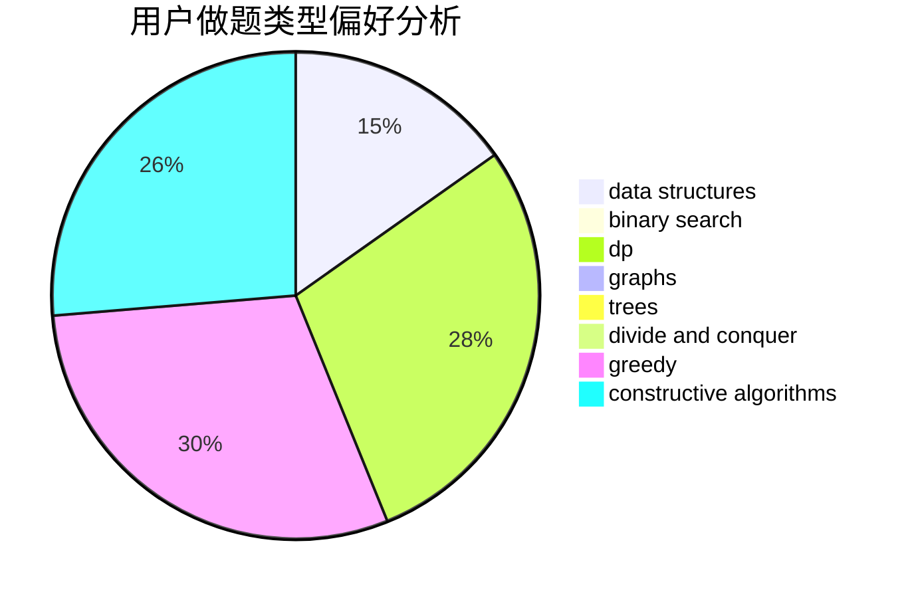
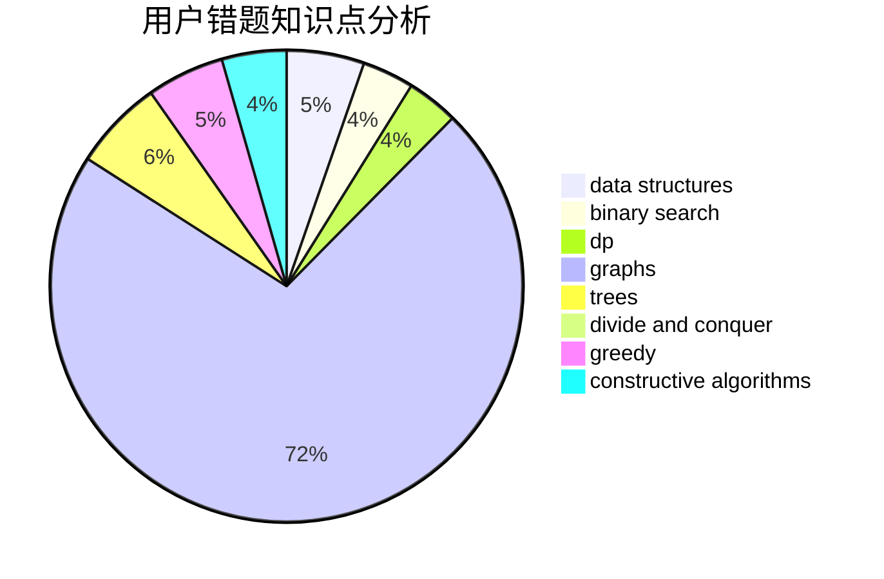

# suncongbo

<!-- tabs:start -->

#### **用户提交结果分析**

#### **用户做题类型偏好分析**

#### **用户错题知识点分析**

<!-- tabs:end -->
# 推荐题目
[98E](https://codeforces.com/contest/98/problem/E)		dp,
                        games,
                        math,
                        probabilities		  
[1147A](https://codeforces.com/contest/1147/problem/A)		graphs		  
[570A](https://codeforces.com/contest/570/problem/A)		implementation		  
[845A](https://codeforces.com/contest/845/problem/A)		implementation,
                        sortings		  
[812C](https://codeforces.com/contest/812/problem/C)		binary search,
                        sortings		  
[1290A](https://codeforces.com/contest/1290/problem/A)		brute force,
                        data structures,
                        implementation		  
[1271F](https://codeforces.com/contest/1271/problem/F)		brute force		  
[976E](https://codeforces.com/contest/976/problem/E)		greedy,
                        sortings		  
[723D](https://codeforces.com/contest/723/problem/D)		dfs and similar,
                        dsu,
                        graphs,
                        greedy,
                        implementation		  
[114B](https://codeforces.com/contest/114/problem/B)		bitmasks,
                        brute force,
                        graphs		  
