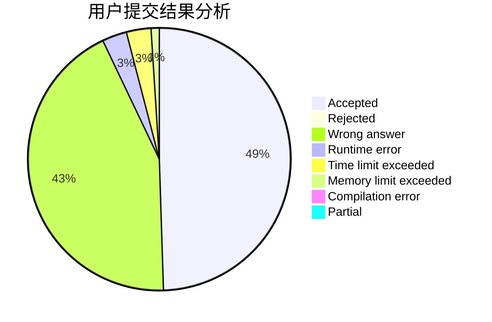
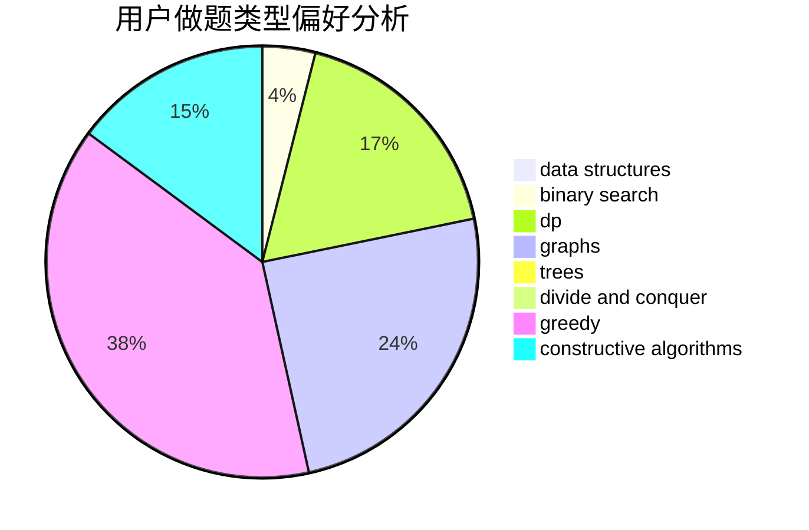
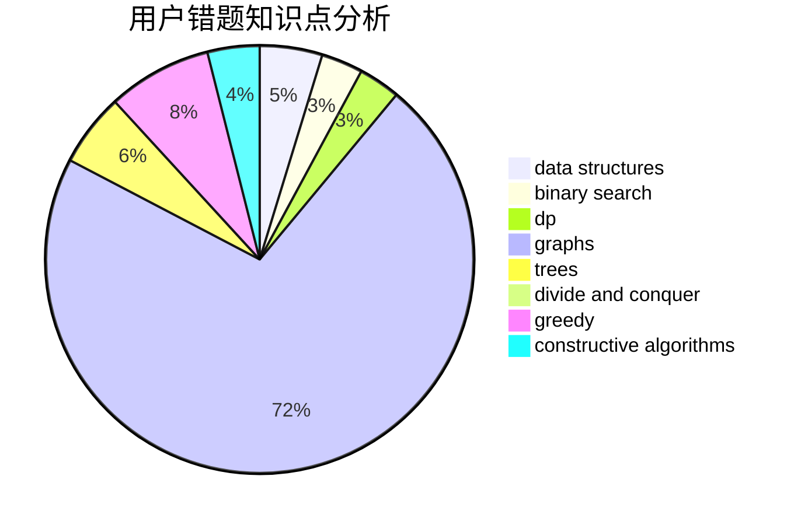

# suncongbo

<!-- tabs:start -->

#### **用户提交结果分析**

#### **用户做题类型偏好分析**

#### **用户错题知识点分析**

<!-- tabs:end -->
# 推荐题目
[976A](https://codeforces.com/contest/976/problem/A)		implementation		  
[1144G](https://codeforces.com/contest/1144/problem/G)		dp,
                        greedy		  
[545D](https://codeforces.com/contest/545/problem/D)		greedy,
                        implementation,
                        sortings		  
[825E](https://codeforces.com/contest/825/problem/E)		data structures,
                        dfs and similar,
                        graphs,
                        greedy		  
[798C](https://codeforces.com/contest/798/problem/C)		dp,
                        greedy,
                        number theory		  
[1283A](https://codeforces.com/contest/1283/problem/A)		math		  
[1266E](https://codeforces.com/contest/1266/problem/E)		data structures,
                        greedy,
                        implementation		  
[954H](https://codeforces.com/contest/954/problem/H)		combinatorics,
                        dp		  
[704D](https://codeforces.com/contest/704/problem/D)		flows,
                        greedy		  
[1148B](https://codeforces.com/contest/1148/problem/B)		binary search,
                        brute force,
                        two pointers		  
