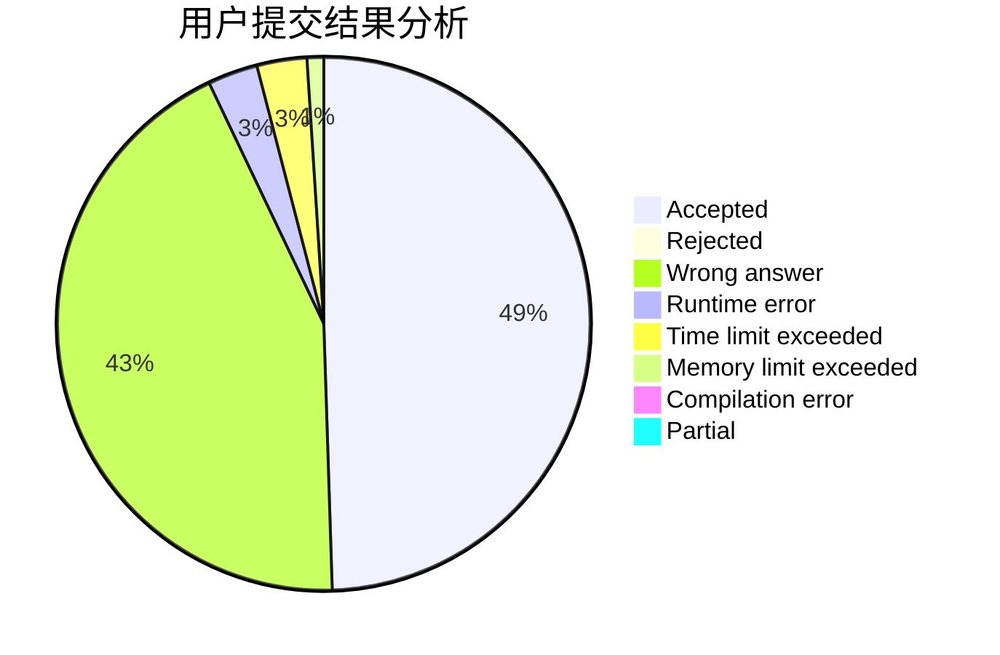
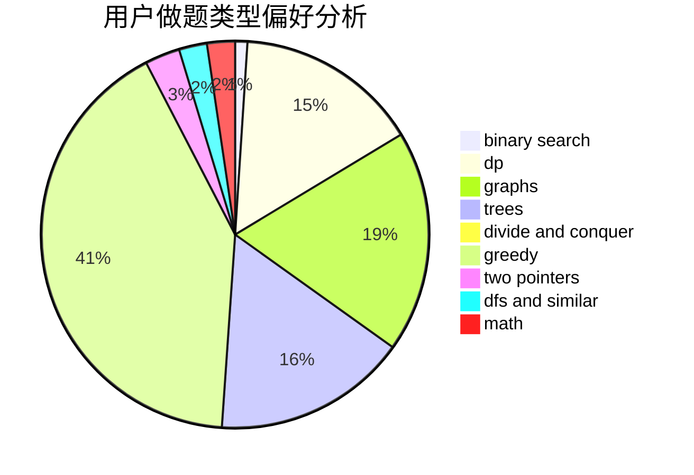

# suncongbo

<!-- tabs:start -->

#### **用户提交结果分析**

#### **用户做题类型偏好分析**

<!-- tabs:end -->
# 推荐题目
[98E](https://codeforces.com/contest/98/problem/E)
[1147A](https://codeforces.com/contest/1147/problem/A)
[570A](https://codeforces.com/contest/570/problem/A)
[845A](https://codeforces.com/contest/845/problem/A)
[812C](https://codeforces.com/contest/812/problem/C)
[1290A](https://codeforces.com/contest/1290/problem/A)
[1271F](https://codeforces.com/contest/1271/problem/F)
[976E](https://codeforces.com/contest/976/problem/E)
[723D](https://codeforces.com/contest/723/problem/D)
[114B](https://codeforces.com/contest/114/problem/B)
