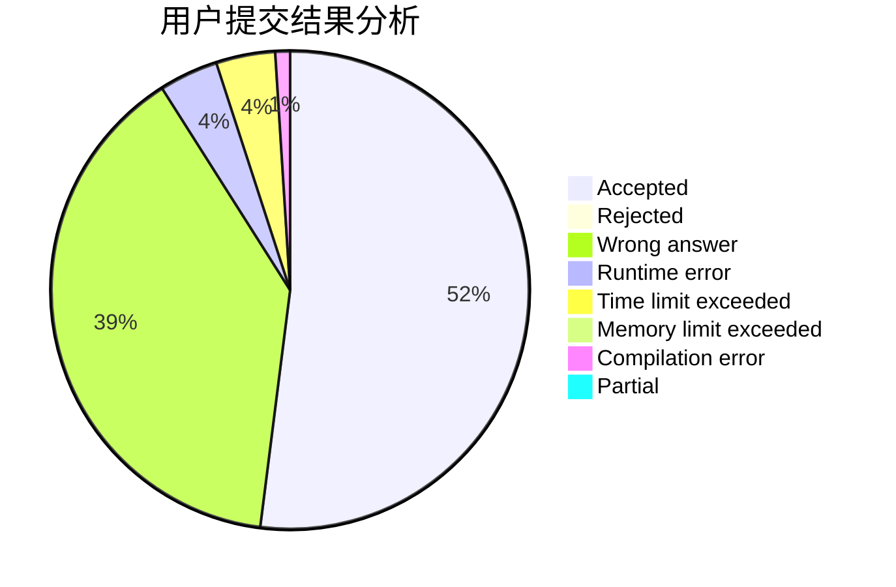
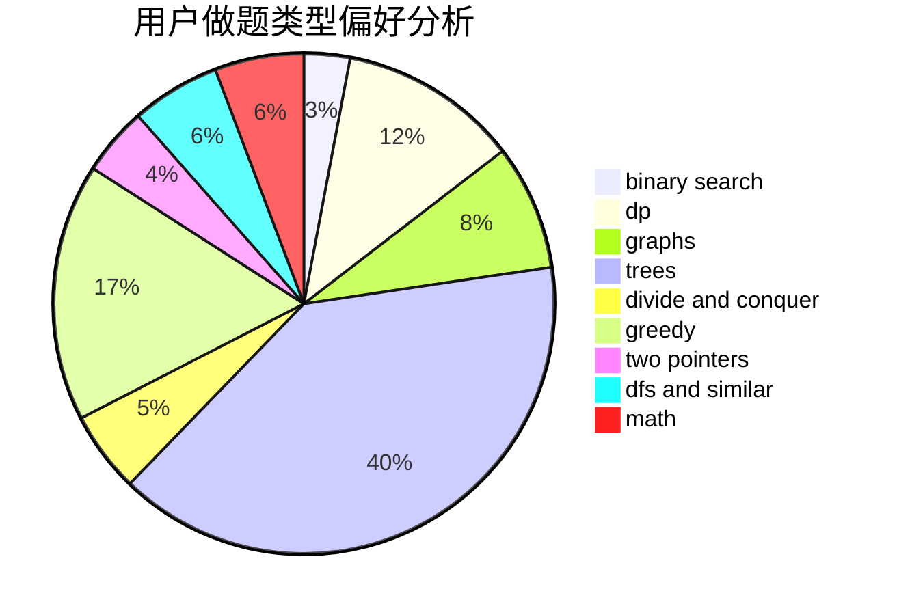

# sunset

<!-- tabs:start -->

#### **用户提交结果分析**

#### **用户做题类型偏好分析**

<!-- tabs:end -->
# 推荐题目
[14512](https://codeforces.com/contest/1451/problem/2)
[441D](https://codeforces.com/contest/441/problem/D)
[13783](https://codeforces.com/contest/1378/problem/3)
[656A](https://codeforces.com/contest/656/problem/A)
[1229D](https://codeforces.com/contest/1229/problem/D)
[916D](https://codeforces.com/contest/916/problem/D)
[279B](https://codeforces.com/contest/279/problem/B)
[819B](https://codeforces.com/contest/819/problem/B)
[567D](https://codeforces.com/contest/567/problem/D)
[533A](https://codeforces.com/contest/533/problem/A)
