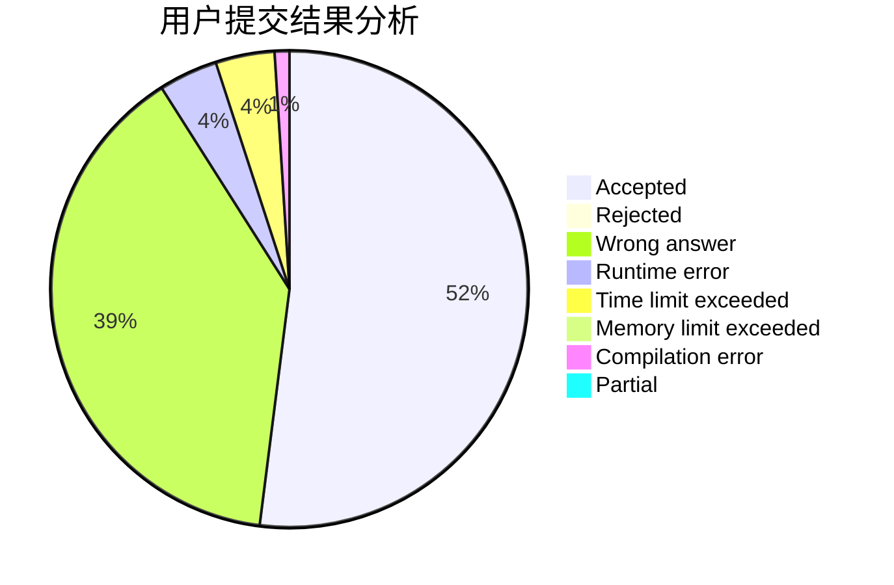
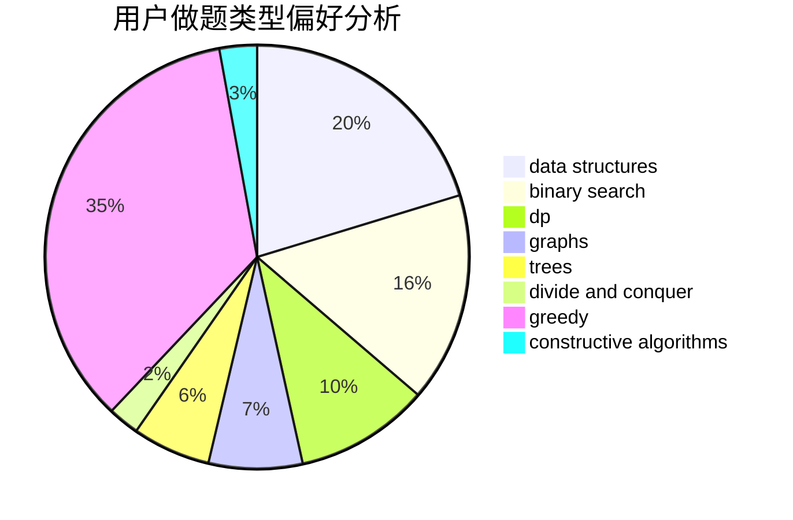
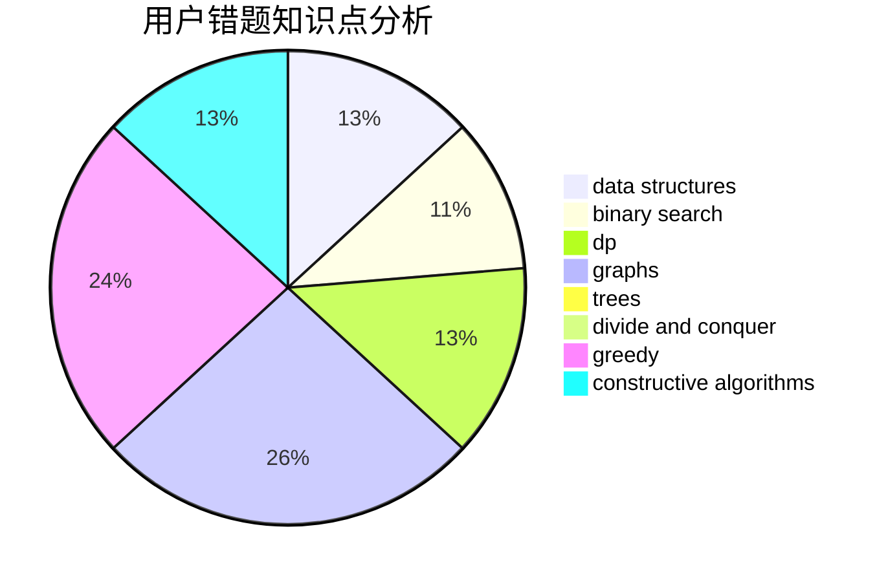

# sunset

<!-- tabs:start -->

#### **用户提交结果分析**

#### **用户做题类型偏好分析**

#### **用户错题知识点分析**

<!-- tabs:end -->
# 推荐题目
[1440B](https://codeforces.com/contest/1440/problem/B)		greedy,
                        math		  
[416D](https://codeforces.com/contest/416/problem/D)		greedy,
                        implementation,
                        math		  
[1370A](https://codeforces.com/contest/1370/problem/A)		greedy,
                        implementation,
                        math,
                        number theory		  
[628B](https://codeforces.com/contest/628/problem/B)		dp		  
[1221C](https://codeforces.com/contest/1221/problem/C)		binary search,
                        math		  
[900A](https://codeforces.com/contest/900/problem/A)		geometry,
                        implementation		  
[260D](https://codeforces.com/contest/260/problem/D)		constructive algorithms,
                        dsu,
                        graphs,
                        greedy,
                        trees		  
[803D](https://codeforces.com/contest/803/problem/D)		binary search,
                        greedy		  
[543B](https://codeforces.com/contest/543/problem/B)		constructive algorithms,
                        graphs,
                        shortest paths		  
[50A](https://codeforces.com/contest/50/problem/A)		greedy,
                        math		  
