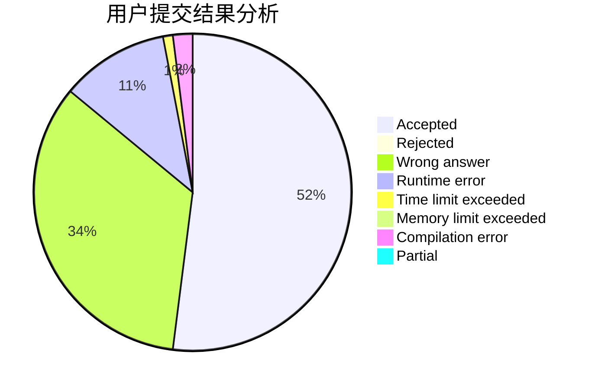
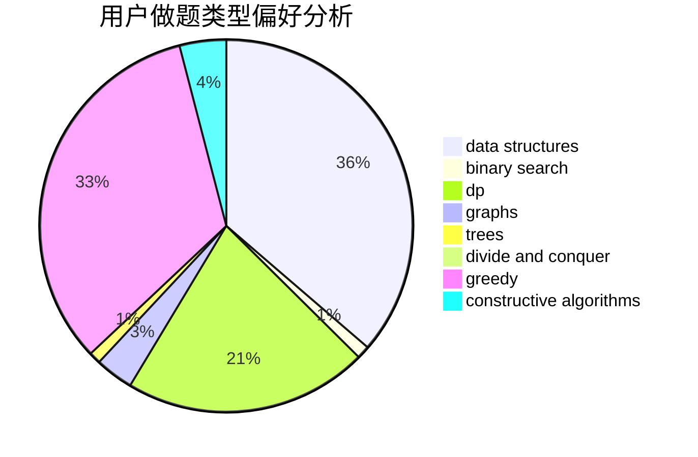
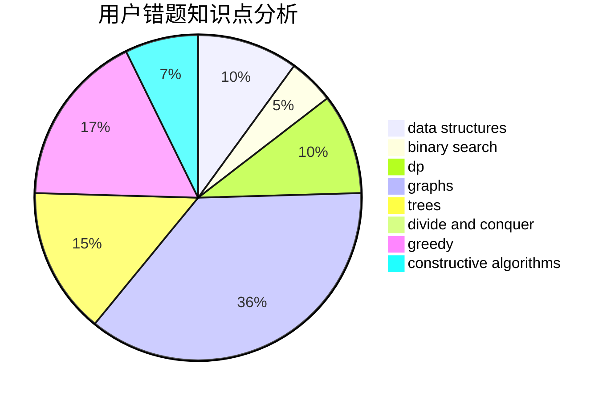

# CQXYM

<!-- tabs:start -->

#### **用户提交结果分析**

#### **用户做题类型偏好分析**

#### **用户错题知识点分析**

<!-- tabs:end -->
# 推荐题目
[1209C](https://codeforces.com/contest/1209/problem/C)		constructive algorithms,
                        greedy,
                        implementation		  
[1365E](https://codeforces.com/contest/1365/problem/E)		brute force,
                        constructive algorithms		  
[622F](https://codeforces.com/contest/622/problem/F)		math		  
[288E](https://codeforces.com/contest/288/problem/E)		dp,
                        implementation,
                        math		  
[626D](https://codeforces.com/contest/626/problem/D)		brute force,
                        combinatorics,
                        dp,
                        probabilities		  
[624A](https://codeforces.com/contest/624/problem/A)		math		  
[628C](https://codeforces.com/contest/628/problem/C)		greedy,
                        strings		  
[521B](https://codeforces.com/contest/521/problem/B)		dsu,graphs,sortings,trees		  
[249E](https://codeforces.com/contest/249/problem/E)		math		  
[627E](https://codeforces.com/contest/627/problem/E)		two pointers		  
