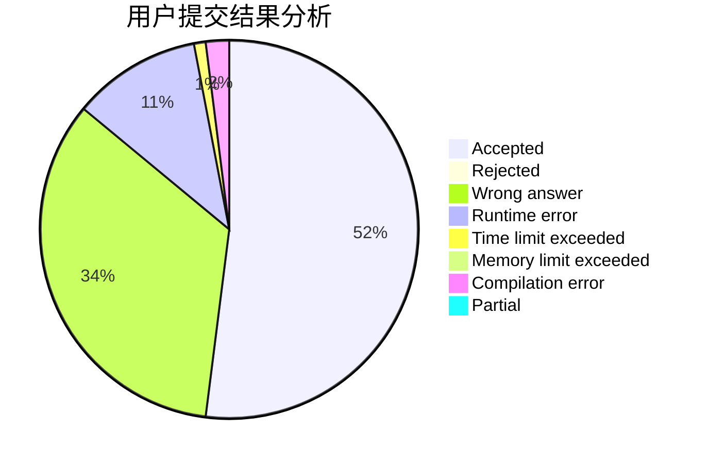
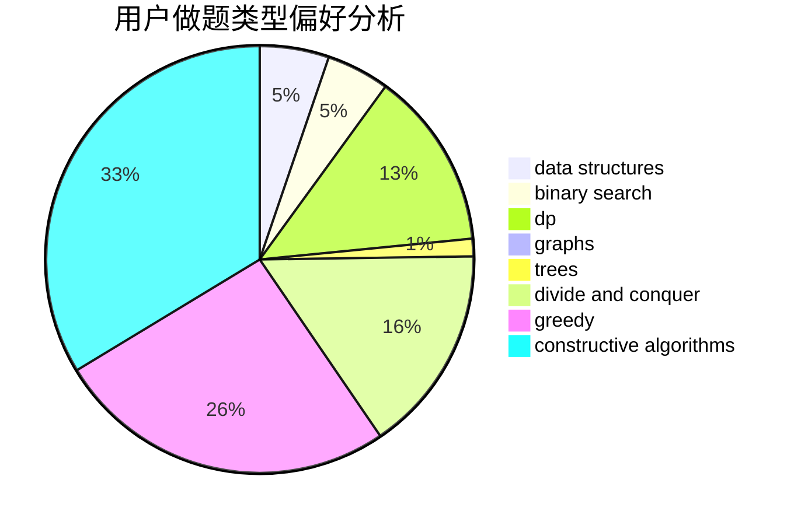
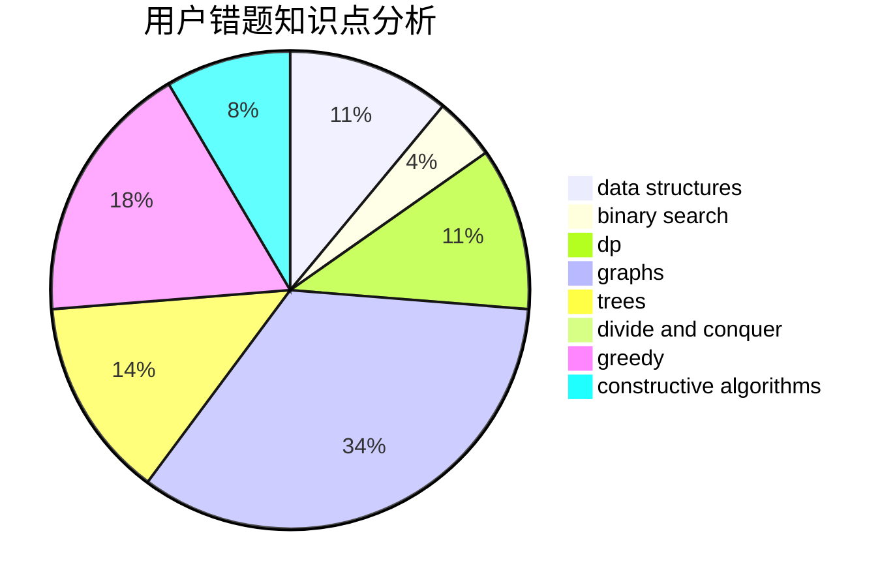

# CQXYM
<!-- tabs:start -->
#### **用户提交结果分析**

#### **用户做题类型偏好分析**

#### **用户错题知识点分析**

<!-- tabs:end -->
# 推荐题目
[Chocolate Bunny](http://codeforces.com/problemset/problem/1407/C)		constructive algorithms,
                        interactive,
                        math,
                        two pointers		  
[Zuma](http://codeforces.com/problemset/problem/607/B)		dp		  
[Necklace Assembly](http://codeforces.com/problemset/problem/1367/E)		brute force,
                        dfs and similar,
                        dp,
                        graphs,
                        greedy,
                        number theory		  
[Middle of the Contest](http://codeforces.com/problemset/problem/1133/A)		implementation		  
[Dima and Horses](http://codeforces.com/problemset/problem/272/E)		combinatorics,
                        constructive algorithms,
                        graphs		  
[Almost Equal](http://codeforces.com/problemset/problem/1205/A)		constructive algorithms,
                        greedy,
                        math		  
[Quantum Classification - Dataset 5](http://codeforces.com/problemset/problem/1357/D3)		nan		  
[Towers](http://codeforces.com/problemset/problem/229/D)		dp,
                        greedy,
                        two pointers		  
[Sorting Railway Cars](http://codeforces.com/problemset/problem/605/A)		constructive algorithms,
                        greedy		  
[Zuma](https://codeforces.com/contest/608/problem/D)		dp		  
<!-- tabs:start -->
#### **data structures**
[Chocolate Bunny](https://codeforces.com/contest/1180/problem/C)		data structures,
                        implementation		  
[Zuma](http://codeforces.com/problemset/problem/605/B)		constructive algorithms,
                        data structures,
                        graphs		  
[Necklace Assembly](http://codeforces.com/problemset/problem/1216/F)		data structures,
                        dp,
                        greedy		  
[Middle of the Contest](http://codeforces.com/problemset/problem/607/D)		data structures,
                        trees		  
[Dima and Horses](http://codeforces.com/problemset/problem/605/D)		data structures,
                        dfs and similar		  
[Almost Equal](http://codeforces.com/problemset/problem/1492/B)		data structures,
                        greedy,
                        math		  
[Quantum Classification - Dataset 5](http://codeforces.com/problemset/problem/1439/C)		binary search,
                        data structures,
                        divide and conquer,
                        greedy,
                        implementation		  
[Towers](http://codeforces.com/problemset/problem/1492/C)		binary search,
                        data structures,
                        dp,
                        greedy,
                        two pointers		  
[Sorting Railway Cars](http://codeforces.com/problemset/problem/1490/G)		binary search,
                        data structures,
                        math		  
[Zuma](http://codeforces.com/problemset/problem/1479/D)		binary search,
                        bitmasks,
                        brute force,
                        data structures,
                        probabilities,
                        trees		  
#### **binary search**
[Chocolate Bunny](http://codeforces.com/problemset/problem/607/E)		binary search,
                        geometry		  
[Zuma](http://codeforces.com/problemset/problem/152/B)		binary search,
                        implementation		  
[Necklace Assembly](http://codeforces.com/problemset/problem/1148/B)		binary search,
                        brute force,
                        two pointers		  
[Middle of the Contest](http://codeforces.com/problemset/problem/1195/B)		binary search,
                        brute force,
                        math		  
[Dima and Horses](http://codeforces.com/problemset/problem/607/A)		binary search,
                        dp		  
[Almost Equal](http://codeforces.com/problemset/problem/604/B)		binary search,
                        greedy		  
[Quantum Classification - Dataset 5](http://codeforces.com/problemset/problem/1439/C)		binary search,
                        data structures,
                        divide and conquer,
                        greedy,
                        implementation		  
[Towers](http://codeforces.com/problemset/problem/1492/C)		binary search,
                        data structures,
                        dp,
                        greedy,
                        two pointers		  
[Sorting Railway Cars](http://codeforces.com/problemset/problem/1463/D)		binary search,
                        constructive algorithms,
                        greedy,
                        two pointers		  
[Zuma](http://codeforces.com/problemset/problem/1490/G)		binary search,
                        data structures,
                        math		  
#### **dp**
[Chocolate Bunny](http://codeforces.com/problemset/problem/607/B)		dp		  
[Zuma](http://codeforces.com/problemset/problem/1367/E)		brute force,
                        dfs and similar,
                        dp,
                        graphs,
                        greedy,
                        number theory		  
[Necklace Assembly](http://codeforces.com/problemset/problem/229/D)		dp,
                        greedy,
                        two pointers		  
[Middle of the Contest](https://codeforces.com/contest/608/problem/D)		dp		  
[Dima and Horses](https://codeforces.com/contest/604/problem/C)		dp,
                        greedy,
                        math		  
[Almost Equal](http://codeforces.com/problemset/problem/1216/F)		data structures,
                        dp,
                        greedy		  
[Quantum Classification - Dataset 5](https://codeforces.com/contest/1341/problem/E)		dfs and similar,
                        dp,
                        graphs,
                        shortest paths		  
[Towers](http://codeforces.com/problemset/problem/1154/F)		dp,
                        greedy,
                        sortings		  
[Sorting Railway Cars](http://codeforces.com/problemset/problem/607/A)		binary search,
                        dp		  
[Zuma](http://codeforces.com/problemset/problem/1007/E)		dp		  
#### **graph**
[Chocolate Bunny](http://codeforces.com/problemset/problem/1367/E)		brute force,
                        dfs and similar,
                        dp,
                        graphs,
                        greedy,
                        number theory		  
[Zuma](http://codeforces.com/problemset/problem/272/E)		combinatorics,
                        constructive algorithms,
                        graphs		  
[Necklace Assembly](http://codeforces.com/problemset/problem/500/B)		dfs and similar,
                        dsu,
                        graphs,
                        greedy,
                        math,
                        sortings		  
[Middle of the Contest](http://codeforces.com/problemset/problem/303/C)		brute force,
                        graphs,
                        math,
                        number theory		  
[Dima and Horses](http://codeforces.com/problemset/problem/605/B)		constructive algorithms,
                        data structures,
                        graphs		  
[Almost Equal](https://codeforces.com/contest/1341/problem/E)		dfs and similar,
                        dp,
                        graphs,
                        shortest paths		  
[Quantum Classification - Dataset 5](http://codeforces.com/problemset/problem/1184/E1)		graphs,
                        trees		  
[Towers](http://codeforces.com/problemset/problem/1495/D)		combinatorics,
                        dfs and similar,
                        graphs,
                        math,
                        shortest paths,
                        trees		  
[Sorting Railway Cars](http://codeforces.com/problemset/problem/120/H)		graph matchings		  
[Zuma](http://codeforces.com/problemset/problem/223/E)		flows,
                        geometry,
                        graphs		  
#### **trees**
[Chocolate Bunny](http://codeforces.com/problemset/problem/607/D)		data structures,
                        trees		  
[Zuma](http://codeforces.com/problemset/problem/1184/E1)		graphs,
                        trees		  
[Necklace Assembly](http://codeforces.com/problemset/problem/1495/D)		combinatorics,
                        dfs and similar,
                        graphs,
                        math,
                        shortest paths,
                        trees		  
[Middle of the Contest](http://codeforces.com/problemset/problem/1479/D)		binary search,
                        bitmasks,
                        brute force,
                        data structures,
                        probabilities,
                        trees		  
[Dima and Horses](http://codeforces.com/problemset/problem/1511/C)		brute force,
                        data structures,
                        implementation,
                        trees		  
[Almost Equal](http://codeforces.com/problemset/problem/1499/F)		combinatorics,
                        dfs and similar,
                        dp,
                        trees		  
[Quantum Classification - Dataset 5](http://codeforces.com/problemset/problem/1491/E)		brute force,
                        dfs and similar,
                        divide and conquer,
                        number theory,
                        trees		  
[Towers](http://codeforces.com/problemset/problem/1466/D)		data structures,
                        greedy,
                        sortings,
                        trees		  
[Sorting Railway Cars](http://codeforces.com/problemset/problem/1495/D)		combinatorics,
                        dfs and similar,
                        graphs,
                        math,
                        shortest paths,
                        trees		  
[Zuma](http://codeforces.com/problemset/problem/1303/G)		data structures,
                        divide and conquer,
                        geometry,
                        trees		  
#### **divide and conquer**
[Chocolate Bunny](http://codeforces.com/problemset/problem/1439/C)		binary search,
                        data structures,
                        divide and conquer,
                        greedy,
                        implementation		  
[Zuma](http://codeforces.com/problemset/problem/1461/D)		binary search,
                        brute force,
                        data structures,
                        divide and conquer,
                        implementation,
                        sortings		  
[Necklace Assembly](http://codeforces.com/problemset/problem/1466/G)		combinatorics,
                        divide and conquer,
                        hashing,
                        math,
                        string suffix structures,
                        strings		  
[Middle of the Contest](http://codeforces.com/problemset/problem/1490/D)		dfs and similar,
                        divide and conquer,
                        implementation		  
[Dima and Horses](https://codeforces.com/contest/1483/problem/C)		data structures,
                        divide and conquer,
                        dp		  
[Almost Equal](http://codeforces.com/problemset/problem/1491/E)		brute force,
                        dfs and similar,
                        divide and conquer,
                        number theory,
                        trees		  
[Quantum Classification - Dataset 5](http://codeforces.com/problemset/problem/1303/G)		data structures,
                        divide and conquer,
                        geometry,
                        trees		  
[Towers](http://codeforces.com/problemset/problem/1494/D)		constructive algorithms,
                        data structures,
                        dfs and similar,
                        divide and conquer,
                        dsu,
                        greedy,
                        sortings,
                        trees		  
[Sorting Railway Cars](http://codeforces.com/problemset/problem/1482/E)		data structures,
                        divide and conquer,
                        dp		  
[Zuma](http://codeforces.com/problemset/problem/566/C)		dfs and similar,
                        divide and conquer,
                        trees		  
#### **greedy**
[Chocolate Bunny](http://codeforces.com/problemset/problem/1367/E)		brute force,
                        dfs and similar,
                        dp,
                        graphs,
                        greedy,
                        number theory		  
[Zuma](http://codeforces.com/problemset/problem/1205/A)		constructive algorithms,
                        greedy,
                        math		  
[Necklace Assembly](http://codeforces.com/problemset/problem/229/D)		dp,
                        greedy,
                        two pointers		  
[Middle of the Contest](http://codeforces.com/problemset/problem/605/A)		constructive algorithms,
                        greedy		  
[Dima and Horses](http://codeforces.com/problemset/problem/500/B)		dfs and similar,
                        dsu,
                        graphs,
                        greedy,
                        math,
                        sortings		  
[Almost Equal](https://codeforces.com/contest/606/problem/C)		constructive algorithms,
                        greedy		  
[Quantum Classification - Dataset 5](http://codeforces.com/problemset/problem/1008/B)		greedy,
                        sortings		  
[Towers](https://codeforces.com/contest/604/problem/C)		dp,
                        greedy,
                        math		  
[Sorting Railway Cars](http://codeforces.com/problemset/problem/609/A)		greedy,
                        implementation,
                        sortings		  
[Zuma](http://codeforces.com/problemset/problem/1482/C)		brute force,
                        constructive algorithms,
                        greedy,
                        implementation		  
#### **constructive algorithms**
[Chocolate Bunny](http://codeforces.com/problemset/problem/1407/C)		constructive algorithms,
                        interactive,
                        math,
                        two pointers		  
[Zuma](http://codeforces.com/problemset/problem/272/E)		combinatorics,
                        constructive algorithms,
                        graphs		  
[Necklace Assembly](http://codeforces.com/problemset/problem/1205/A)		constructive algorithms,
                        greedy,
                        math		  
[Middle of the Contest](http://codeforces.com/problemset/problem/605/A)		constructive algorithms,
                        greedy		  
[Dima and Horses](https://codeforces.com/contest/606/problem/C)		constructive algorithms,
                        greedy		  
[Almost Equal](http://codeforces.com/problemset/problem/605/B)		constructive algorithms,
                        data structures,
                        graphs		  
[Quantum Classification - Dataset 5](http://codeforces.com/problemset/problem/1482/C)		brute force,
                        constructive algorithms,
                        greedy,
                        implementation		  
[Towers](http://codeforces.com/problemset/problem/609/B)		constructive algorithms,
                        implementation		  
[Sorting Railway Cars](http://codeforces.com/problemset/problem/482/A)		constructive algorithms,
                        greedy		  
[Zuma](http://codeforces.com/problemset/problem/1493/A)		constructive algorithms,
                        greedy		  
#### **sortings**
[Chocolate Bunny](http://codeforces.com/problemset/problem/500/B)		dfs and similar,
                        dsu,
                        graphs,
                        greedy,
                        math,
                        sortings		  
[Zuma](http://codeforces.com/problemset/problem/1008/B)		greedy,
                        sortings		  
[Necklace Assembly](http://codeforces.com/problemset/problem/609/A)		greedy,
                        implementation,
                        sortings		  
[Middle of the Contest](http://codeforces.com/problemset/problem/1154/F)		dp,
                        greedy,
                        sortings		  
[Dima and Horses](https://codeforces.com/contest/1496/problem/C)		geometry,
                        greedy,
                        math,
                        sortings		  
[Almost Equal](http://codeforces.com/problemset/problem/1495/A)		geometry,
                        greedy,
                        math,
                        sortings		  
[Quantum Classification - Dataset 5](http://codeforces.com/problemset/problem/1497/A)		brute force,
                        data structures,
                        greedy,
                        sortings		  
[Towers](http://codeforces.com/problemset/problem/1427/A)		math,
                        sortings		  
[Sorting Railway Cars](http://codeforces.com/problemset/problem/1461/D)		binary search,
                        brute force,
                        data structures,
                        divide and conquer,
                        implementation,
                        sortings		  
[Zuma](http://codeforces.com/problemset/problem/1437/C)		dp,
                        flows,
                        graph matchings,
                        greedy,
                        math,
                        sortings		  
<!-- tabs:end -->
