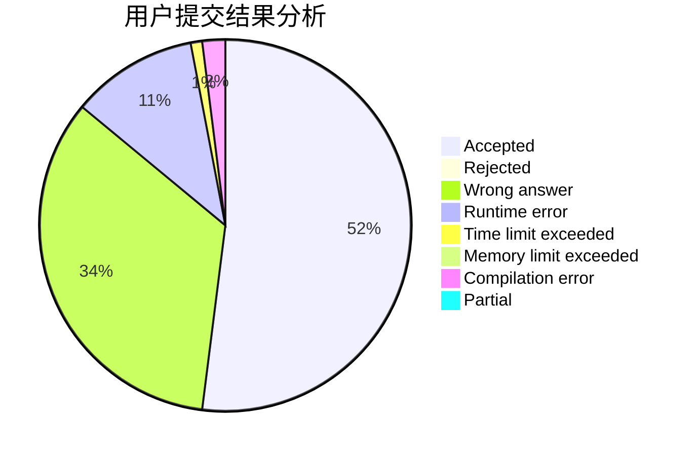
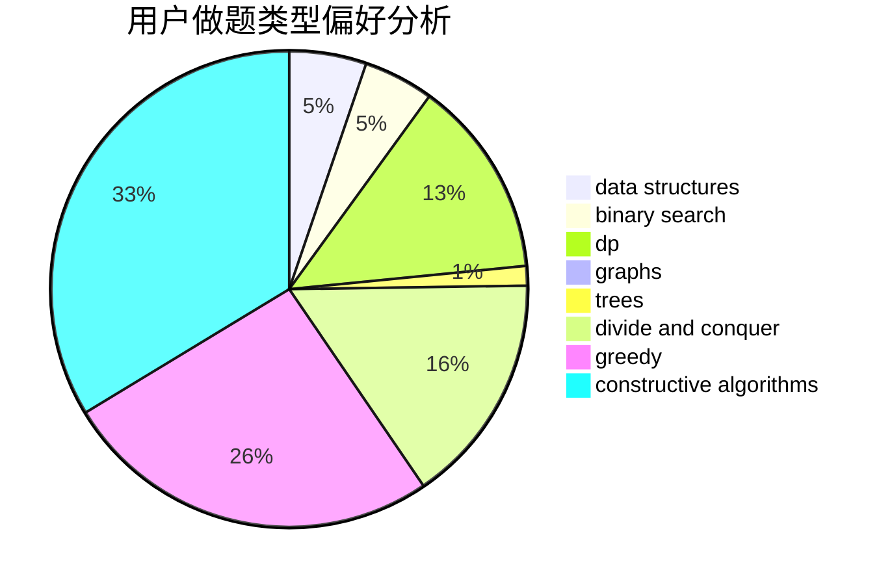
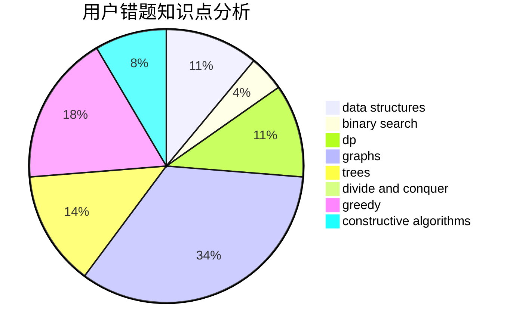

# CQXYM

<!-- tabs:start -->

#### **用户提交结果分析**

#### **用户做题类型偏好分析**

#### **用户错题知识点分析**

<!-- tabs:end -->
# 推荐题目
[1205A](https://codeforces.com/contest/1205/problem/A)		constructive algorithms,
                        greedy,
                        math		  
[1357D3](https://codeforces.com/contest/1357D/problem/3)		nan		  
[604C](https://codeforces.com/contest/604/problem/C)		dsu,graphs,sortings,trees		  
[272E](https://codeforces.com/contest/272/problem/E)		combinatorics,
                        constructive algorithms,
                        graphs		  
[607B](https://codeforces.com/contest/607/problem/B)		dp		  
[606A](https://codeforces.com/contest/606/problem/A)		implementation		  
[609C](https://codeforces.com/contest/609/problem/C)		implementation,
                        math		  
[500B](https://codeforces.com/contest/500/problem/B)		dfs and similar,
                        dsu,
                        graphs,
                        greedy,
                        math,
                        sortings		  
[229D](https://codeforces.com/contest/229/problem/D)		dp,
                        greedy,
                        two pointers		  
[608D](https://codeforces.com/contest/608/problem/D)		dsu,graphs,sortings,trees		  
