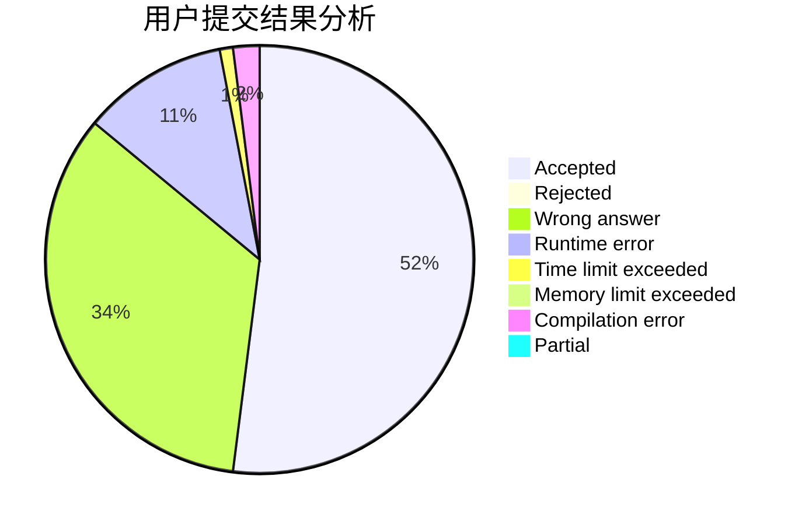
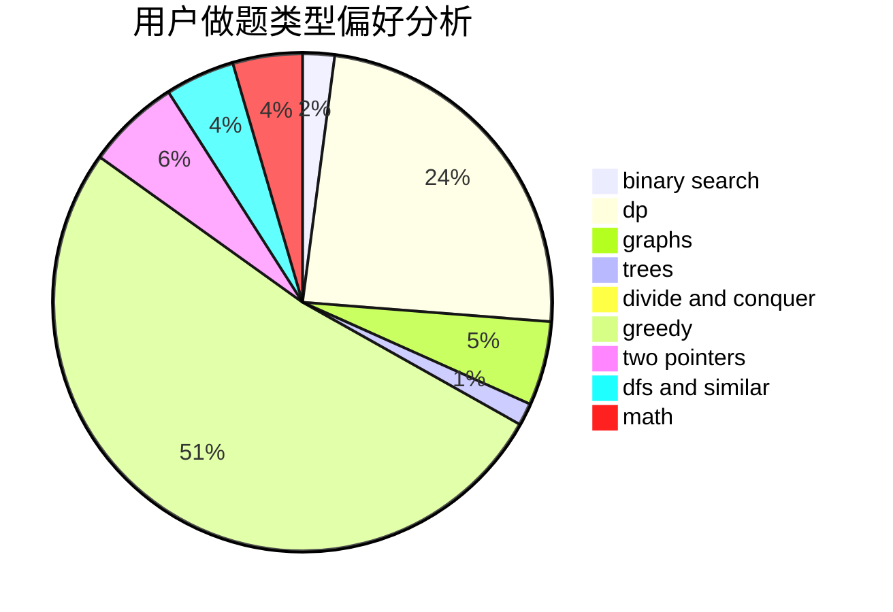

# CQXYM

<!-- tabs:start -->

#### **用户提交结果分析**

#### **用户做题类型偏好分析**

<!-- tabs:end -->
# 推荐题目
[1209C](https://codeforces.com/contest/1209/problem/C)
[1365E](https://codeforces.com/contest/1365/problem/E)
[622F](https://codeforces.com/contest/622/problem/F)
[288E](https://codeforces.com/contest/288/problem/E)
[626D](https://codeforces.com/contest/626/problem/D)
[624A](https://codeforces.com/contest/624/problem/A)
[628C](https://codeforces.com/contest/628/problem/C)
[521B](https://codeforces.com/contest/521/problem/B)
[249E](https://codeforces.com/contest/249/problem/E)
[627E](https://codeforces.com/contest/627/problem/E)
