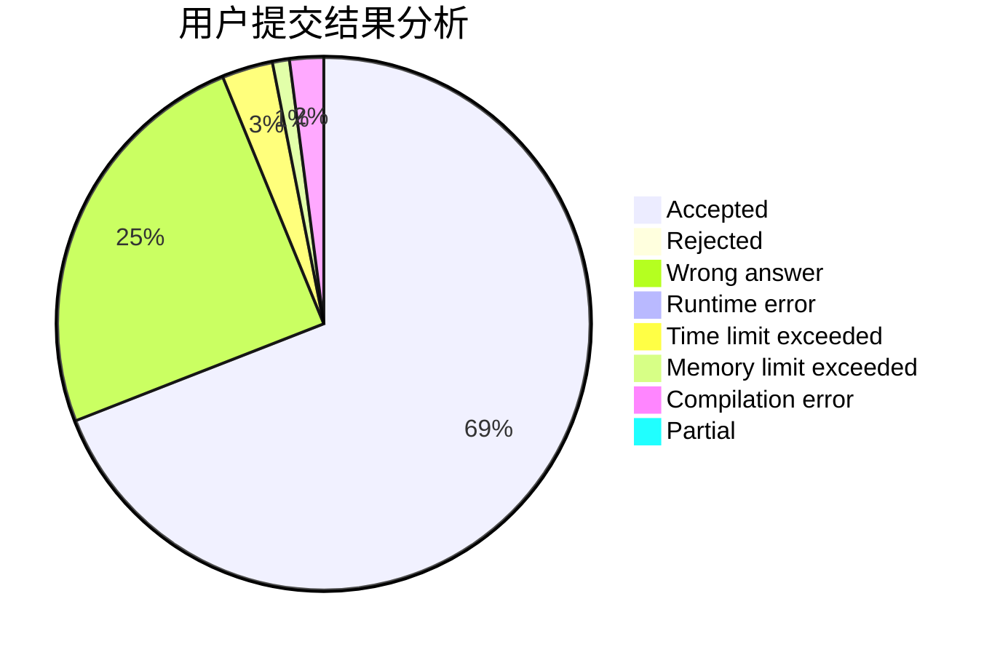
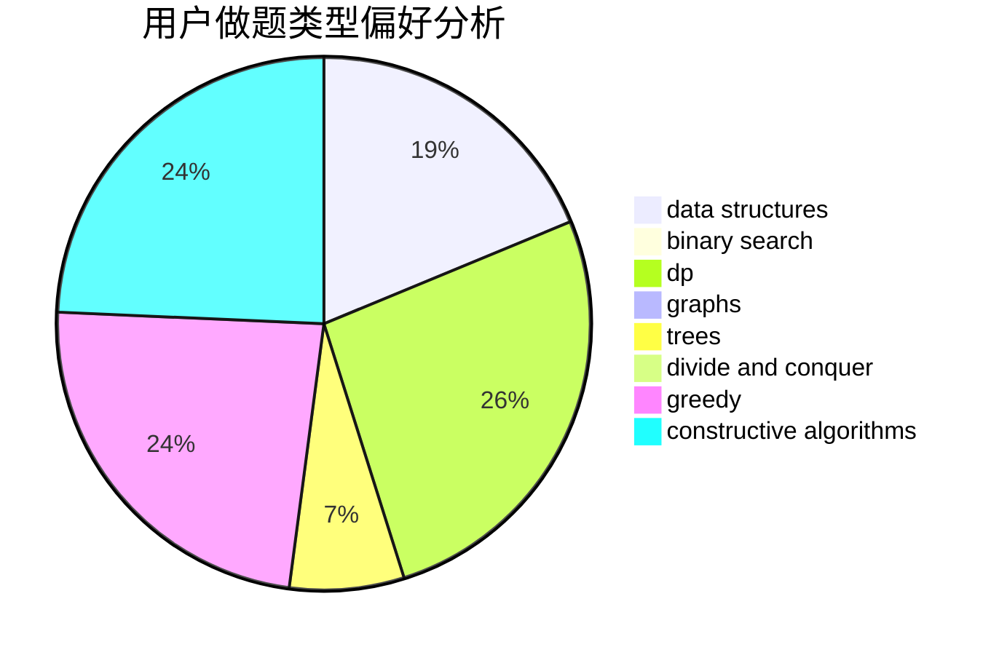
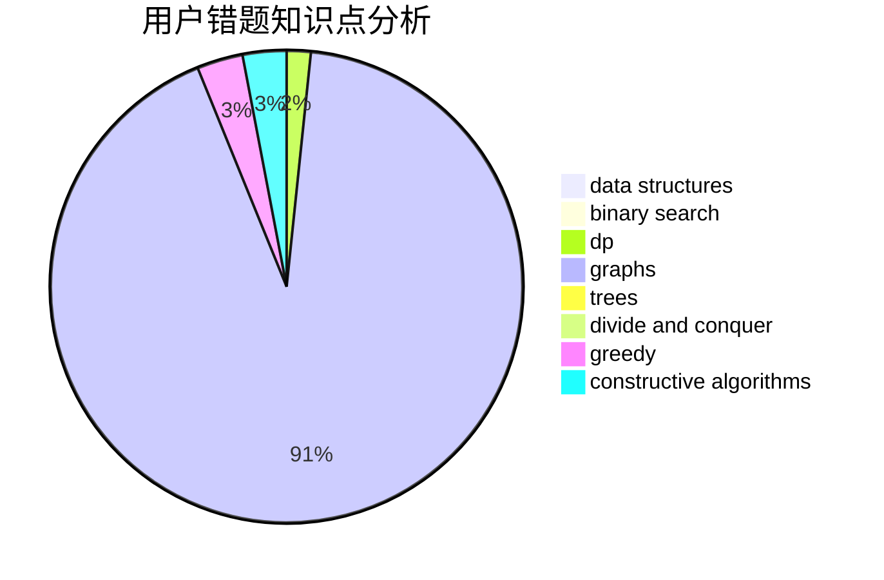

# sunsetcolors

<!-- tabs:start -->

#### **用户提交结果分析**

#### **用户做题类型偏好分析**

#### **用户错题知识点分析**

<!-- tabs:end -->
# 推荐题目
[581B](https://codeforces.com/contest/581/problem/B)		implementation,
                        math		  
[741B](https://codeforces.com/contest/741/problem/B)		dfs and similar,
                        dp,
                        dsu		  
[1260E](https://codeforces.com/contest/1260/problem/E)		brute force,
                        dp,
                        greedy		  
[276E](https://codeforces.com/contest/276/problem/E)		data structures,
                        graphs,
                        trees		  
[536D](https://codeforces.com/contest/536/problem/D)		dp,
                        games		  
[988F](https://codeforces.com/contest/988/problem/F)		dp		  
[1237F](https://codeforces.com/contest/1237/problem/F)		combinatorics,
                        dp		  
[1103C](https://codeforces.com/contest/1103/problem/C)		constructive algorithms,
                        dfs and similar,
                        graphs,
                        math		  
[724F](https://codeforces.com/contest/724/problem/F)		combinatorics,
                        dp,
                        trees		  
[949C](https://codeforces.com/contest/949/problem/C)		dfs and similar,
                        graphs		  
