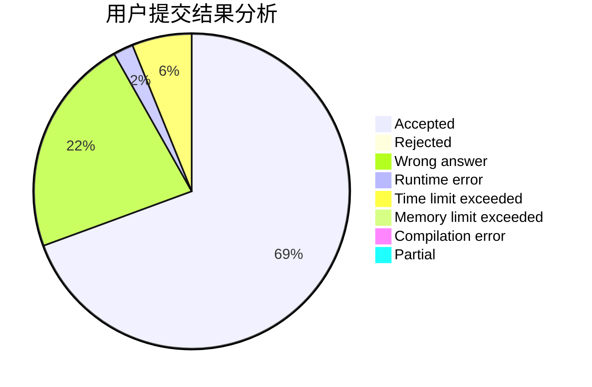
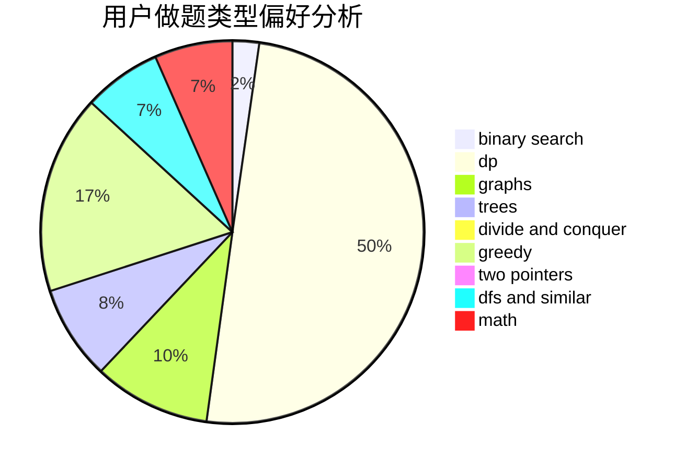

# sunshine_chen

<!-- tabs:start -->

#### **用户提交结果分析**

#### **用户做题类型偏好分析**

<!-- tabs:end -->
# 推荐题目
[45G](https://codeforces.com/contest/45/problem/G)
[1089D](https://codeforces.com/contest/1089/problem/D)
[1129E](https://codeforces.com/contest/1129/problem/E)
[1131B](https://codeforces.com/contest/1131/problem/B)
[607D](https://codeforces.com/contest/607/problem/D)
[36D](https://codeforces.com/contest/36/problem/D)
[930B](https://codeforces.com/contest/930/problem/B)
[309B](https://codeforces.com/contest/309/problem/B)
[938G](https://codeforces.com/contest/938/problem/G)
[746D](https://codeforces.com/contest/746/problem/D)
