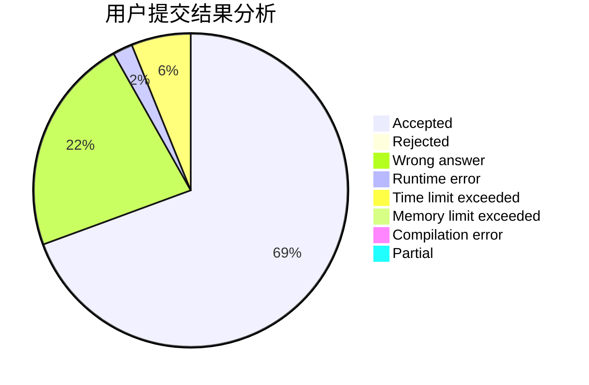
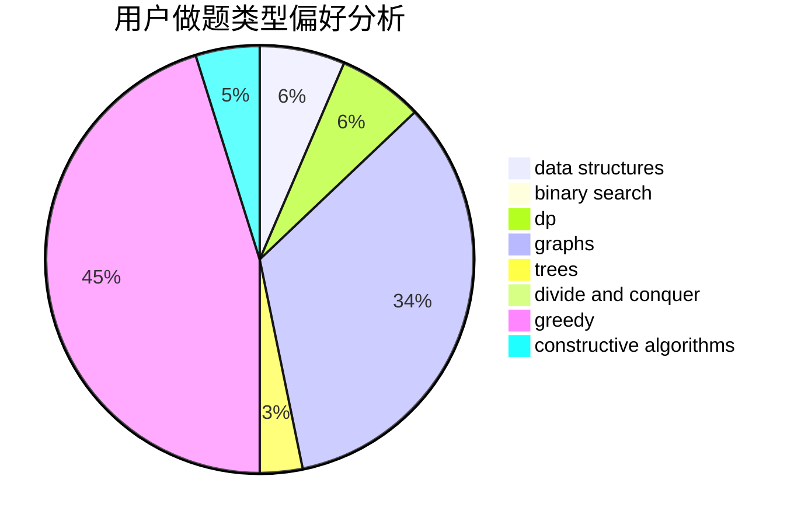
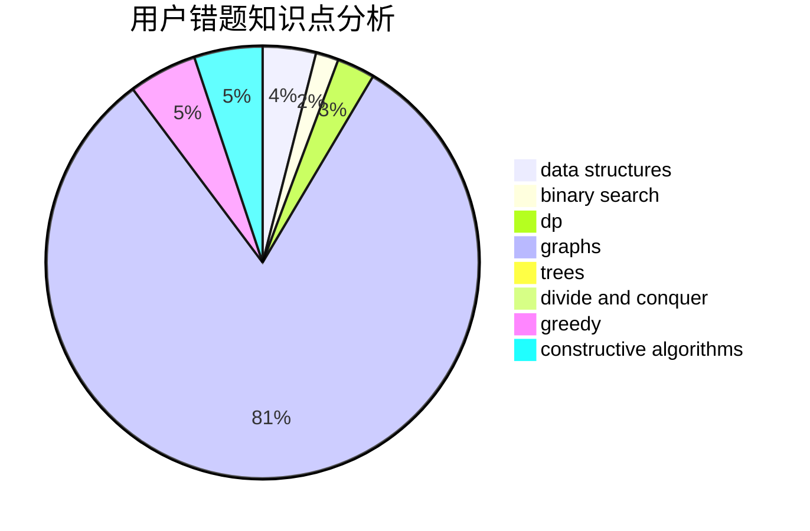

# sunshine_chen

<!-- tabs:start -->

#### **用户提交结果分析**

#### **用户做题类型偏好分析**

#### **用户错题知识点分析**

<!-- tabs:end -->
# 推荐题目
[438B](https://codeforces.com/contest/438/problem/B)		dsu,graphs,sortings,trees		  
[1088E](https://codeforces.com/contest/1088/problem/E)		dp,
                        greedy,
                        math,
                        trees		  
[1120A](https://codeforces.com/contest/1120/problem/A)		greedy,
                        implementation,
                        two pointers		  
[1129B](https://codeforces.com/contest/1129/problem/B)		constructive algorithms		  
[587C](https://codeforces.com/contest/587/problem/C)		data structures,
                        trees		  
[343C](https://codeforces.com/contest/343/problem/C)		binary search,
                        greedy,
                        two pointers		  
[911F](https://codeforces.com/contest/911/problem/F)		constructive algorithms,
                        dfs and similar,
                        graphs,
                        greedy,
                        trees		  
[292E](https://codeforces.com/contest/292/problem/E)		data structures		  
[918D](https://codeforces.com/contest/918/problem/D)		dsu,graphs,sortings,trees		  
[729D](https://codeforces.com/contest/729/problem/D)		constructive algorithms,
                        greedy,
                        math		  
