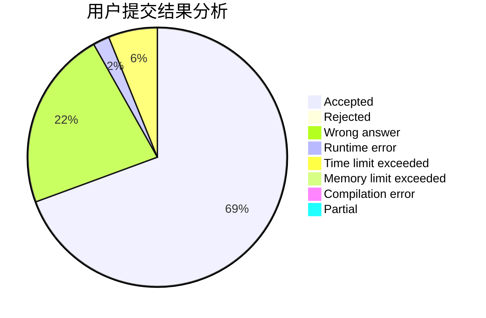
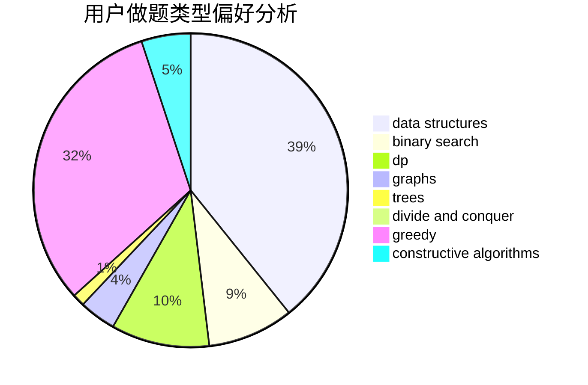
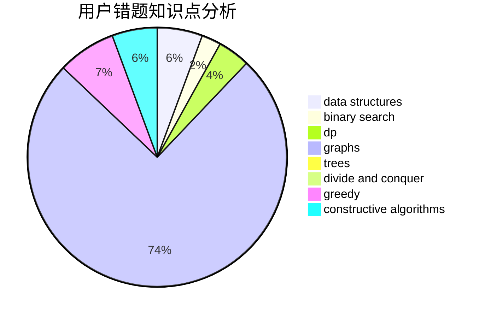

# sunshine_chen

<!-- tabs:start -->

#### **用户提交结果分析**

#### **用户做题类型偏好分析**

#### **用户错题知识点分析**

<!-- tabs:end -->
# 推荐题目
[45G](https://codeforces.com/contest/45/problem/G)		number theory		  
[1089D](https://codeforces.com/contest/1089/problem/D)		graphs		  
[1129E](https://codeforces.com/contest/1129/problem/E)		binary search,
                        interactive,
                        trees		  
[1131B](https://codeforces.com/contest/1131/problem/B)		greedy,
                        implementation		  
[607D](https://codeforces.com/contest/607/problem/D)		data structures,
                        trees		  
[36D](https://codeforces.com/contest/36/problem/D)		games		  
[930B](https://codeforces.com/contest/930/problem/B)		implementation,
                        probabilities,
                        strings		  
[309B](https://codeforces.com/contest/309/problem/B)		dp,
                        two pointers		  
[938G](https://codeforces.com/contest/938/problem/G)		bitmasks,
                        data structures,
                        dsu,
                        graphs		  
[746D](https://codeforces.com/contest/746/problem/D)		constructive algorithms,
                        greedy,
                        math		  
