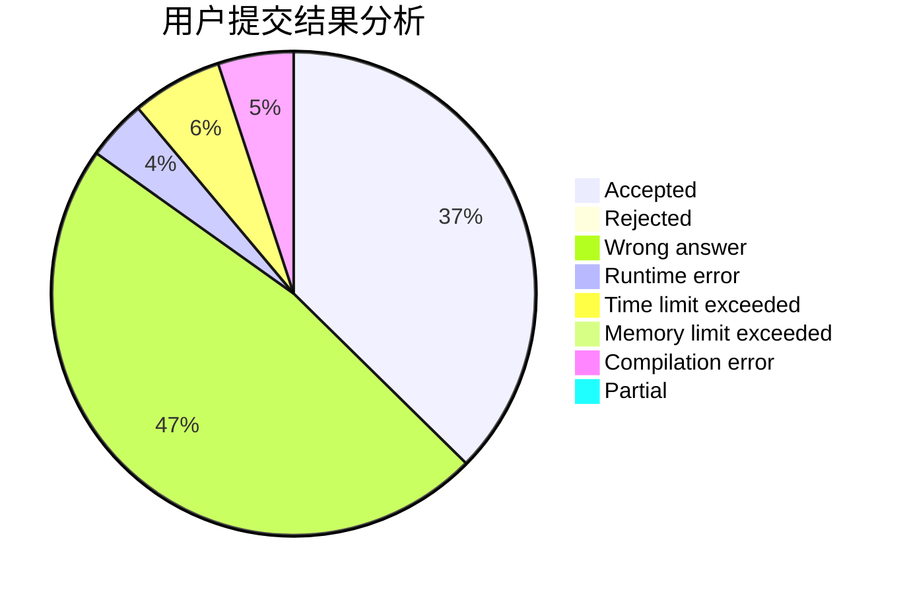
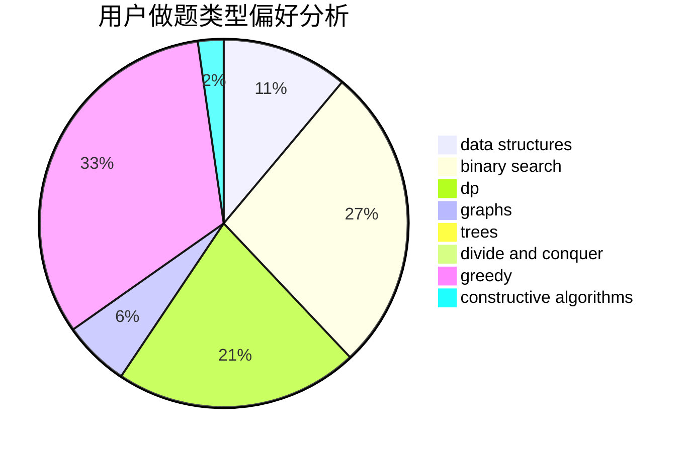
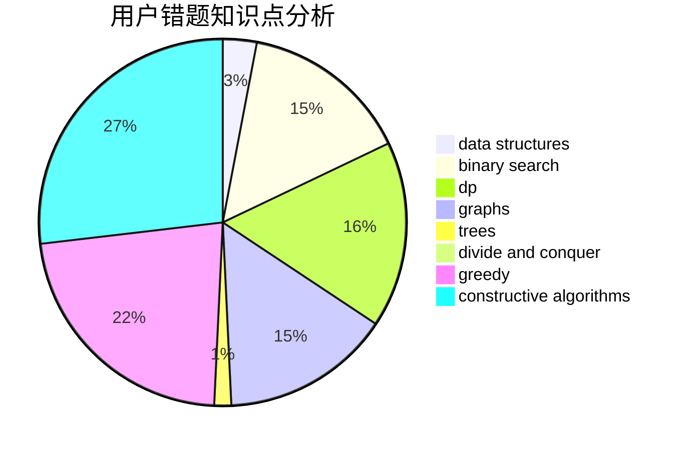

# sunstar2020

<!-- tabs:start -->

#### **用户提交结果分析**

#### **用户做题类型偏好分析**

#### **用户错题知识点分析**

<!-- tabs:end -->
# 推荐题目
[363D](https://codeforces.com/contest/363/problem/D)		binary search,
                        greedy		  
[429A](https://codeforces.com/contest/429/problem/A)		dfs and similar,
                        trees		  
[1391D](https://codeforces.com/contest/1391/problem/D)		bitmasks,
                        brute force,
                        constructive algorithms,
                        dp,
                        greedy,
                        implementation		  
[369A](https://codeforces.com/contest/369/problem/A)		greedy,
                        implementation		  
[264B](https://codeforces.com/contest/264/problem/B)		dp,
                        number theory		  
[667C](https://codeforces.com/contest/667/problem/C)		dsu,graphs,sortings,trees		  
[668D](https://codeforces.com/contest/668/problem/D)		dsu,graphs,sortings,trees		  
[576D](https://codeforces.com/contest/576/problem/D)		dp,
                        matrices		  
[708E](https://codeforces.com/contest/708/problem/E)		dp,
                        math		  
[1141A](https://codeforces.com/contest/1141/problem/A)		implementation,
                        math		  
