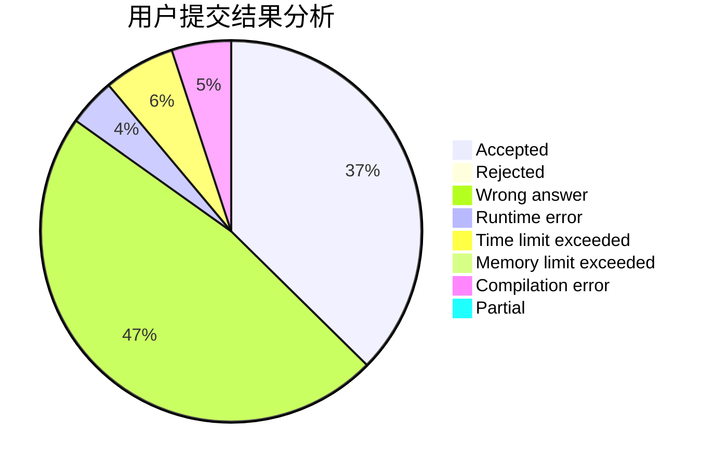
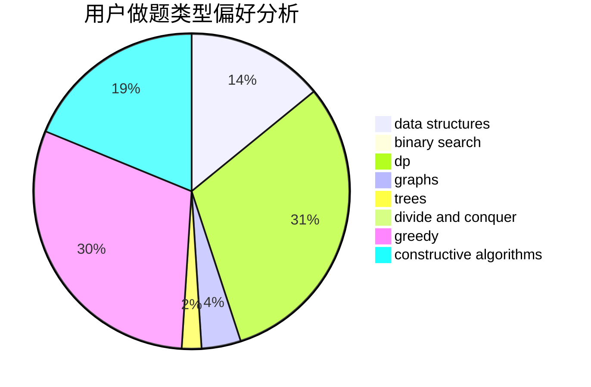
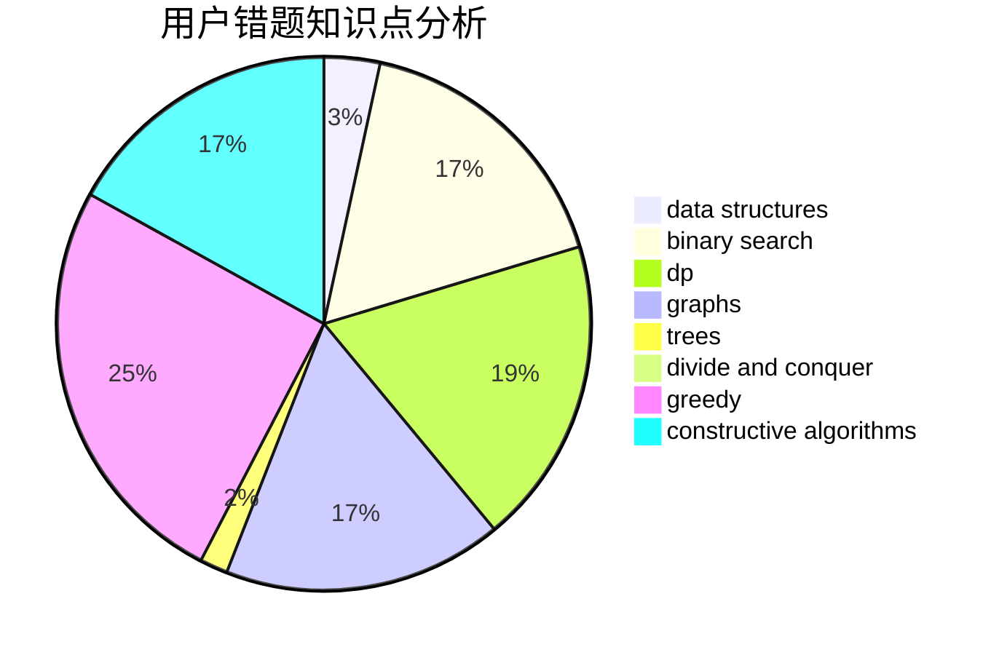

# sunstar2020

<!-- tabs:start -->

#### **用户提交结果分析**

#### **用户做题类型偏好分析**

#### **用户错题知识点分析**

<!-- tabs:end -->
# 推荐题目
[38C](https://codeforces.com/contest/38/problem/C)		brute force		  
[44E](https://codeforces.com/contest/44/problem/E)		dp		  
[13A](https://codeforces.com/contest/13/problem/A)		implementation,
                        math		  
[39C](https://codeforces.com/contest/39/problem/C)		dp,
                        sortings		  
[280B](https://codeforces.com/contest/280/problem/B)		data structures,
                        implementation,
                        two pointers		  
[689D](https://codeforces.com/contest/689/problem/D)		binary search,
                        data structures		  
[691A](https://codeforces.com/contest/691/problem/A)		implementation		  
[598D](https://codeforces.com/contest/598/problem/D)		dfs and similar,
                        graphs,
                        shortest paths		  
[729A](https://codeforces.com/contest/729/problem/A)		implementation,
                        strings		  
[1143A](https://codeforces.com/contest/1143/problem/A)		implementation		  
