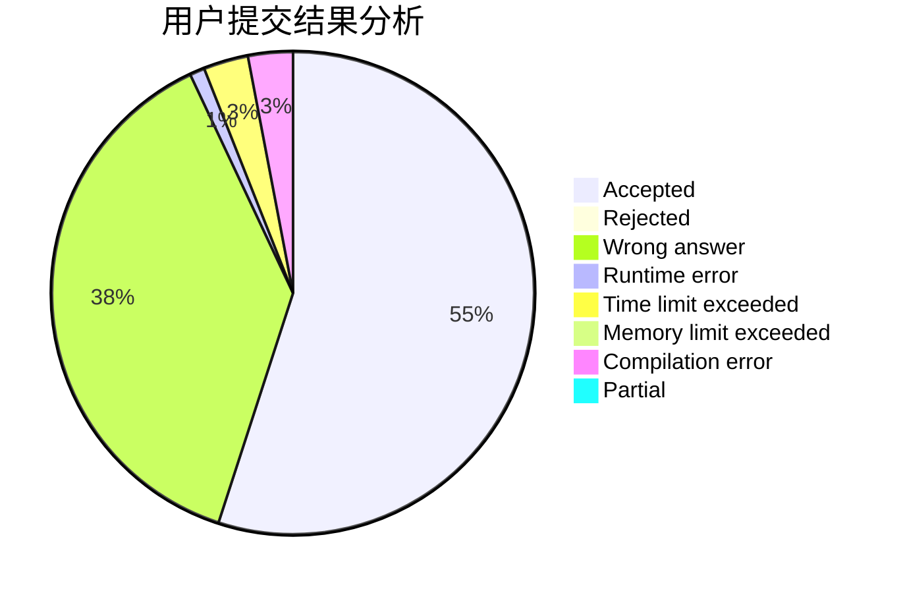
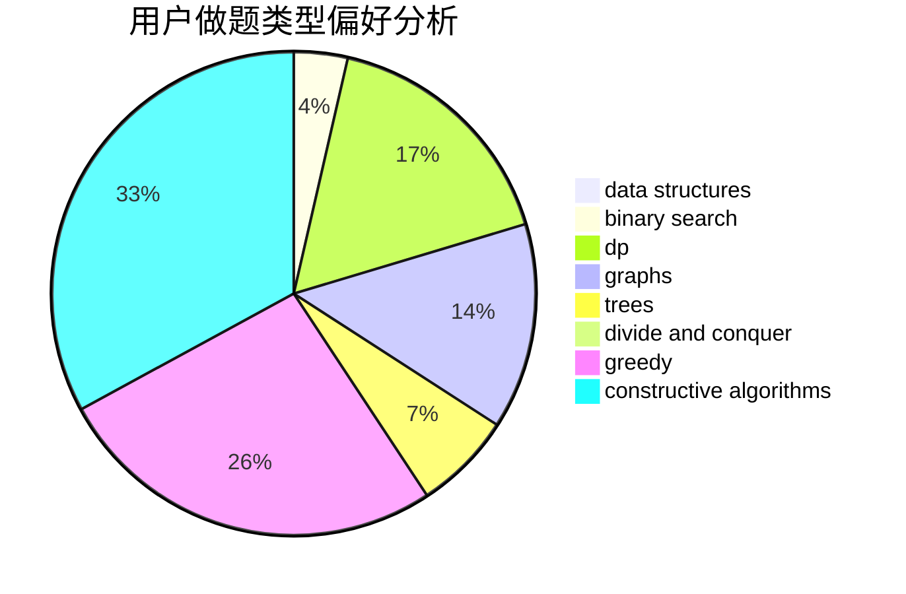
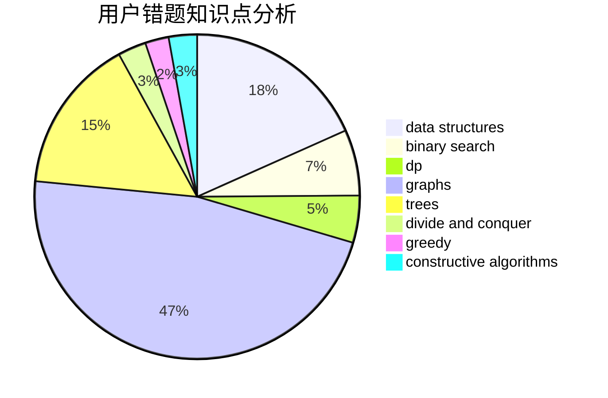

# sunyuhan1998
<!-- tabs:start -->
#### **用户提交结果分析**

#### **用户做题类型偏好分析**

#### **用户错题知识点分析**

<!-- tabs:end -->
# 推荐题目
[Suborrays](http://codeforces.com/problemset/problem/1391/A)		constructive algorithms,
                        math		  
[Sasha and Array](http://codeforces.com/problemset/problem/718/C)		data structures,
                        math,
                        matrices		  
[New Year Garland](http://codeforces.com/problemset/problem/140/E)		combinatorics,
                        dp		  
[Neko Rules the Catniverse (Large Version)](http://codeforces.com/problemset/problem/1152/F2)		bitmasks,
                        dp,
                        matrices		  
[Generate a String](http://codeforces.com/problemset/problem/710/E)		dfs and similar,
                        dp		  
[Protect Sheep](http://codeforces.com/problemset/problem/948/A)		brute force,
                        dfs and similar,
                        graphs,
                        implementation		  
[Sonya and Problem Wihtout a Legend](https://codeforces.com/contest/714/problem/E)		dp,
                        sortings		  
[A polyline](http://codeforces.com/problemset/problem/171/H)		*special problem,
                        implementation		  
[Important Exam](http://codeforces.com/problemset/problem/1201/A)		implementation,
                        strings		  
[Yet Another Meme Problem](http://codeforces.com/problemset/problem/1288/B)		math		  
<!-- tabs:start -->
#### **data structures**
[Suborrays](http://codeforces.com/problemset/problem/718/C)		data structures,
                        math,
                        matrices		  
[Sasha and Array](http://codeforces.com/problemset/problem/1056/G)		brute force,
                        data structures,
                        graphs		  
[New Year Garland](http://codeforces.com/problemset/problem/978/F)		binary search,
                        data structures,
                        implementation		  
[Neko Rules the Catniverse (Large Version)](http://codeforces.com/problemset/problem/1154/E)		data structures,
                        implementation,
                        sortings		  
[Generate a String](http://codeforces.com/problemset/problem/878/C)		data structures,
                        graphs		  
[Protect Sheep](http://codeforces.com/problemset/problem/1446/F)		binary search,
                        data structures,
                        geometry		  
[Sonya and Problem Wihtout a Legend](http://codeforces.com/problemset/problem/739/C)		data structures		  
[A polyline](http://codeforces.com/problemset/problem/1468/A)		data structures,
                        dp,
                        greedy		  
[Important Exam](http://codeforces.com/problemset/problem/1492/C)		binary search,
                        data structures,
                        dp,
                        greedy,
                        two pointers		  
[Yet Another Meme Problem](http://codeforces.com/problemset/problem/1490/G)		binary search,
                        data structures,
                        math		  
#### **binary search**
[Suborrays](http://codeforces.com/problemset/problem/978/F)		binary search,
                        data structures,
                        implementation		  
[Sasha and Array](http://codeforces.com/problemset/problem/1056/F)		binary search,
                        dp,
                        math		  
[New Year Garland](http://codeforces.com/problemset/problem/1427/H)		binary search,
                        games,
                        geometry,
                        ternary search		  
[Neko Rules the Catniverse (Large Version)](http://codeforces.com/problemset/problem/949/D)		binary search,
                        brute force,
                        greedy,
                        sortings		  
[Generate a String](http://codeforces.com/problemset/problem/1446/F)		binary search,
                        data structures,
                        geometry		  
[Protect Sheep](http://codeforces.com/problemset/problem/1492/C)		binary search,
                        data structures,
                        dp,
                        greedy,
                        two pointers		  
[Sonya and Problem Wihtout a Legend](http://codeforces.com/problemset/problem/1463/D)		binary search,
                        constructive algorithms,
                        greedy,
                        two pointers		  
[A polyline](http://codeforces.com/problemset/problem/1490/G)		binary search,
                        data structures,
                        math		  
[Important Exam](http://codeforces.com/problemset/problem/1479/D)		binary search,
                        bitmasks,
                        brute force,
                        data structures,
                        probabilities,
                        trees		  
[Yet Another Meme Problem](http://codeforces.com/problemset/problem/1436/E)		binary search,
                        data structures,
                        two pointers		  
#### **dp**
[Suborrays](http://codeforces.com/problemset/problem/140/E)		combinatorics,
                        dp		  
[Sasha and Array](http://codeforces.com/problemset/problem/1152/F2)		bitmasks,
                        dp,
                        matrices		  
[New Year Garland](http://codeforces.com/problemset/problem/710/E)		dfs and similar,
                        dp		  
[Neko Rules the Catniverse (Large Version)](https://codeforces.com/contest/714/problem/E)		dp,
                        sortings		  
[Generate a String](http://codeforces.com/problemset/problem/1056/F)		binary search,
                        dp,
                        math		  
[Protect Sheep](http://codeforces.com/problemset/problem/1403/C)		*special problem,
                        combinatorics,
                        dp,
                        implementation,
                        math		  
[Sonya and Problem Wihtout a Legend](http://codeforces.com/problemset/problem/212/C)		combinatorics,
                        dp,
                        math		  
[A polyline](http://codeforces.com/problemset/problem/1005/D)		dp,
                        greedy,
                        number theory		  
[Important Exam](http://codeforces.com/problemset/problem/353/D)		constructive algorithms,
                        dp		  
[Yet Another Meme Problem](http://codeforces.com/problemset/problem/568/B)		combinatorics,
                        dp,
                        math		  
#### **graph**
[Suborrays](http://codeforces.com/problemset/problem/948/A)		brute force,
                        dfs and similar,
                        graphs,
                        implementation		  
[Sasha and Array](http://codeforces.com/problemset/problem/1056/G)		brute force,
                        data structures,
                        graphs		  
[New Year Garland](http://codeforces.com/problemset/problem/1009/D)		brute force,
                        constructive algorithms,
                        graphs,
                        greedy,
                        math		  
[Neko Rules the Catniverse (Large Version)](http://codeforces.com/problemset/problem/878/C)		data structures,
                        graphs		  
[Generate a String](http://codeforces.com/problemset/problem/1344/C)		dfs and similar,
                        dp,
                        graphs,
                        math		  
[Protect Sheep](http://codeforces.com/problemset/problem/1487/C)		brute force,
                        constructive algorithms,
                        dfs and similar,
                        graphs,
                        greedy,
                        implementation,
                        math		  
[Sonya and Problem Wihtout a Legend](http://codeforces.com/problemset/problem/1437/C)		dp,
                        flows,
                        graph matchings,
                        greedy,
                        math,
                        sortings		  
[A polyline](http://codeforces.com/problemset/problem/1470/D)		constructive algorithms,
                        dfs and similar,
                        graph matchings,
                        graphs,
                        greedy		  
[Important Exam](http://codeforces.com/problemset/problem/1476/C)		dp,
                        graphs,
                        greedy		  
[Yet Another Meme Problem](http://codeforces.com/problemset/problem/1304/D)		constructive algorithms,
                        graphs,
                        greedy,
                        two pointers		  
#### **trees**
[Suborrays](http://codeforces.com/problemset/problem/1479/D)		binary search,
                        bitmasks,
                        brute force,
                        data structures,
                        probabilities,
                        trees		  
[Sasha and Array](http://codeforces.com/problemset/problem/1511/C)		brute force,
                        data structures,
                        implementation,
                        trees		  
[New Year Garland](http://codeforces.com/problemset/problem/1499/F)		combinatorics,
                        dfs and similar,
                        dp,
                        trees		  
[Neko Rules the Catniverse (Large Version)](http://codeforces.com/problemset/problem/1491/E)		brute force,
                        dfs and similar,
                        divide and conquer,
                        number theory,
                        trees		  
[Generate a String](http://codeforces.com/problemset/problem/1466/D)		data structures,
                        greedy,
                        sortings,
                        trees		  
[Protect Sheep](http://codeforces.com/problemset/problem/1495/D)		combinatorics,
                        dfs and similar,
                        graphs,
                        math,
                        shortest paths,
                        trees		  
[Sonya and Problem Wihtout a Legend](http://codeforces.com/problemset/problem/1303/G)		data structures,
                        divide and conquer,
                        geometry,
                        trees		  
[A polyline](http://codeforces.com/problemset/problem/1454/E)		combinatorics,
                        dfs and similar,
                        graphs,
                        trees		  
[Important Exam](http://codeforces.com/problemset/problem/1494/D)		constructive algorithms,
                        data structures,
                        dfs and similar,
                        divide and conquer,
                        dsu,
                        greedy,
                        sortings,
                        trees		  
[Yet Another Meme Problem](http://codeforces.com/problemset/problem/1292/C)		combinatorics,
                        dfs and similar,
                        dp,
                        greedy,
                        trees		  
#### **divide and conquer**
[Suborrays](http://codeforces.com/problemset/problem/1461/D)		binary search,
                        brute force,
                        data structures,
                        divide and conquer,
                        implementation,
                        sortings		  
[Sasha and Array](http://codeforces.com/problemset/problem/1466/G)		combinatorics,
                        divide and conquer,
                        hashing,
                        math,
                        string suffix structures,
                        strings		  
[New Year Garland](http://codeforces.com/problemset/problem/1490/D)		dfs and similar,
                        divide and conquer,
                        implementation		  
[Neko Rules the Catniverse (Large Version)](https://codeforces.com/contest/1483/problem/C)		data structures,
                        divide and conquer,
                        dp		  
[Generate a String](http://codeforces.com/problemset/problem/1491/E)		brute force,
                        dfs and similar,
                        divide and conquer,
                        number theory,
                        trees		  
[Protect Sheep](http://codeforces.com/problemset/problem/1303/G)		data structures,
                        divide and conquer,
                        geometry,
                        trees		  
[Sonya and Problem Wihtout a Legend](http://codeforces.com/problemset/problem/1494/D)		constructive algorithms,
                        data structures,
                        dfs and similar,
                        divide and conquer,
                        dsu,
                        greedy,
                        sortings,
                        trees		  
[A polyline](http://codeforces.com/problemset/problem/1482/E)		data structures,
                        divide and conquer,
                        dp		  
[Important Exam](http://codeforces.com/problemset/problem/566/C)		dfs and similar,
                        divide and conquer,
                        trees		  
[Yet Another Meme Problem](http://codeforces.com/problemset/problem/1428/F)		binary search,
                        data structures,
                        divide and conquer,
                        dp,
                        two pointers		  
#### **greedy**
[Suborrays](http://codeforces.com/problemset/problem/1009/D)		brute force,
                        constructive algorithms,
                        graphs,
                        greedy,
                        math		  
[Sasha and Array](http://codeforces.com/problemset/problem/949/D)		binary search,
                        brute force,
                        greedy,
                        sortings		  
[New Year Garland](http://codeforces.com/problemset/problem/605/A)		constructive algorithms,
                        greedy		  
[Neko Rules the Catniverse (Large Version)](http://codeforces.com/problemset/problem/1017/C)		constructive algorithms,
                        greedy		  
[Generate a String](http://codeforces.com/problemset/problem/1005/D)		dp,
                        greedy,
                        number theory		  
[Protect Sheep](http://codeforces.com/problemset/problem/1433/C)		constructive algorithms,
                        greedy		  
[Sonya and Problem Wihtout a Legend](http://codeforces.com/problemset/problem/1252/E)		greedy,
                        two pointers		  
[A polyline](https://codeforces.com/contest/1504/problem/C)		constructive algorithms,
                        greedy		  
[Important Exam](http://codeforces.com/problemset/problem/1384/B2)		constructive algorithms,
                        dp,
                        greedy,
                        implementation		  
[Yet Another Meme Problem](http://codeforces.com/problemset/problem/1468/A)		data structures,
                        dp,
                        greedy		  
#### **constructive algorithms**
[Suborrays](http://codeforces.com/problemset/problem/1391/A)		constructive algorithms,
                        math		  
[Sasha and Array](http://codeforces.com/problemset/problem/667/B)		constructive algorithms,
                        geometry		  
[New Year Garland](http://codeforces.com/problemset/problem/1009/D)		brute force,
                        constructive algorithms,
                        graphs,
                        greedy,
                        math		  
[Neko Rules the Catniverse (Large Version)](http://codeforces.com/problemset/problem/605/A)		constructive algorithms,
                        greedy		  
[Generate a String](http://codeforces.com/problemset/problem/1017/C)		constructive algorithms,
                        greedy		  
[Protect Sheep](http://codeforces.com/problemset/problem/353/D)		constructive algorithms,
                        dp		  
[Sonya and Problem Wihtout a Legend](http://codeforces.com/problemset/problem/1433/C)		constructive algorithms,
                        greedy		  
[A polyline](https://codeforces.com/contest/1504/problem/C)		constructive algorithms,
                        greedy		  
[Important Exam](http://codeforces.com/problemset/problem/940/C)		constructive algorithms,
                        implementation,
                        strings		  
[Yet Another Meme Problem](http://codeforces.com/problemset/problem/1384/B2)		constructive algorithms,
                        dp,
                        greedy,
                        implementation		  
#### **sortings**
[Suborrays](https://codeforces.com/contest/714/problem/E)		dp,
                        sortings		  
[Sasha and Array](http://codeforces.com/problemset/problem/1154/E)		data structures,
                        implementation,
                        sortings		  
[New Year Garland](http://codeforces.com/problemset/problem/949/D)		binary search,
                        brute force,
                        greedy,
                        sortings		  
[Neko Rules the Catniverse (Large Version)](http://codeforces.com/problemset/problem/268/E)		math,
                        probabilities,
                        sortings		  
[Generate a String](https://codeforces.com/contest/1496/problem/C)		geometry,
                        greedy,
                        math,
                        sortings		  
[Protect Sheep](http://codeforces.com/problemset/problem/1495/A)		geometry,
                        greedy,
                        math,
                        sortings		  
[Sonya and Problem Wihtout a Legend](http://codeforces.com/problemset/problem/1497/A)		brute force,
                        data structures,
                        greedy,
                        sortings		  
[A polyline](http://codeforces.com/problemset/problem/1427/A)		math,
                        sortings		  
[Important Exam](http://codeforces.com/problemset/problem/1461/D)		binary search,
                        brute force,
                        data structures,
                        divide and conquer,
                        implementation,
                        sortings		  
[Yet Another Meme Problem](http://codeforces.com/problemset/problem/1437/C)		dp,
                        flows,
                        graph matchings,
                        greedy,
                        math,
                        sortings		  
<!-- tabs:end -->
