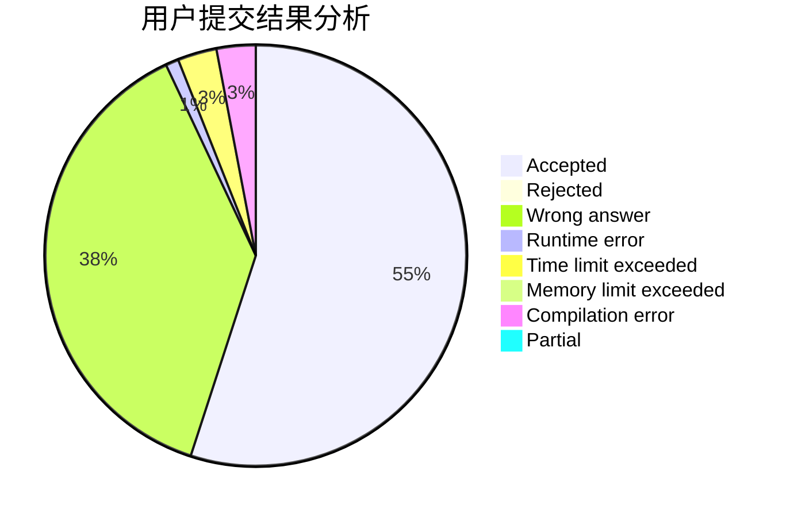
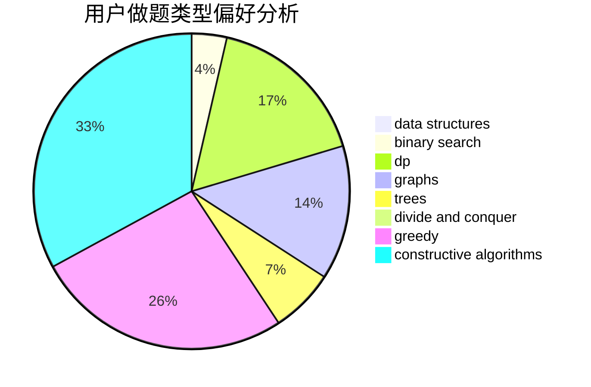
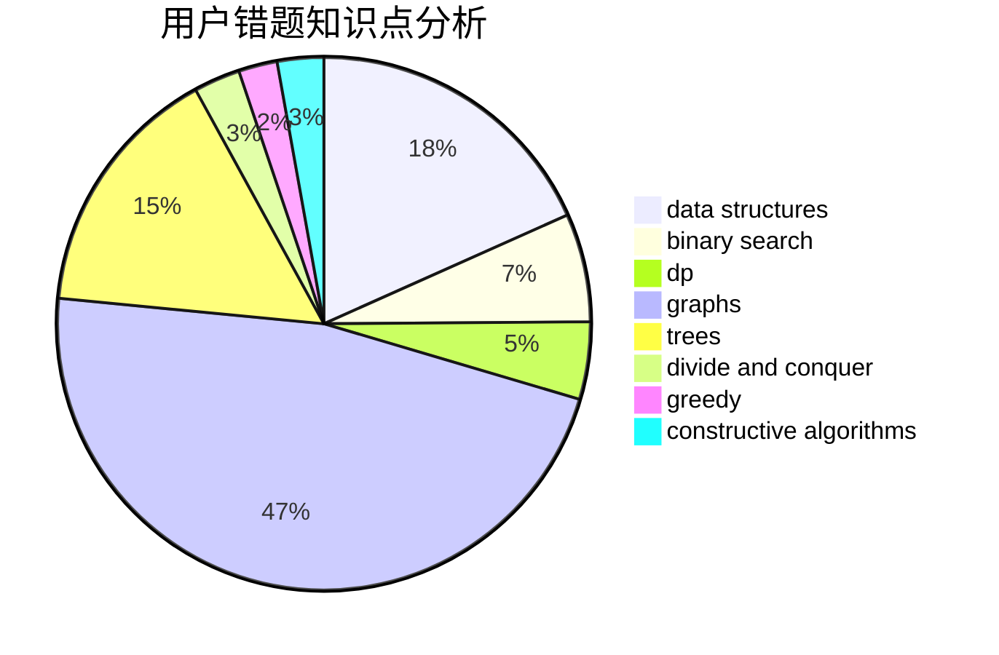

# sunyuhan1998

<!-- tabs:start -->

#### **用户提交结果分析**

#### **用户做题类型偏好分析**

#### **用户错题知识点分析**

<!-- tabs:end -->
# 推荐题目
[212C](https://codeforces.com/contest/212/problem/C)		combinatorics,
                        dp,
                        math		  
[949D](https://codeforces.com/contest/949/problem/D)		binary search,
                        brute force,
                        greedy,
                        sortings		  
[605A](https://codeforces.com/contest/605/problem/A)		constructive algorithms,
                        greedy		  
[424A](https://codeforces.com/contest/424/problem/A)		implementation		  
[1201A](https://codeforces.com/contest/1201/problem/A)		implementation,
                        strings		  
[1227F2](https://codeforces.com/contest/1227F/problem/2)		combinatorics,
                        math		  
[171H](https://codeforces.com/contest/171/problem/H)		*special problem,
                        implementation		  
[876A](https://codeforces.com/contest/876/problem/A)		math		  
[1056G](https://codeforces.com/contest/1056/problem/G)		brute force,
                        data structures,
                        graphs		  
[667E](https://codeforces.com/contest/667/problem/E)		dsu,graphs,sortings,trees		  
