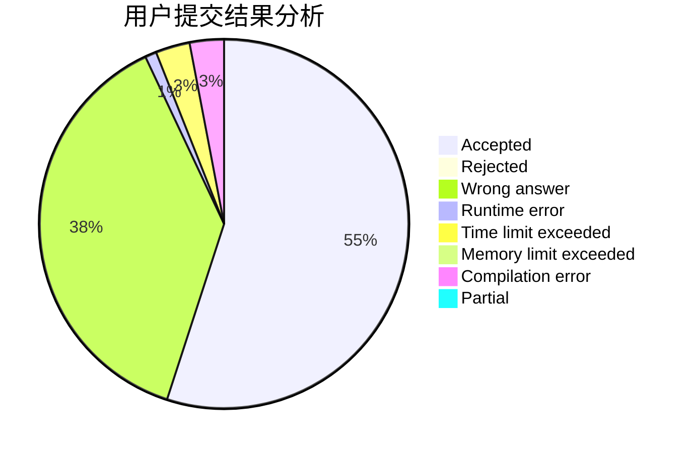
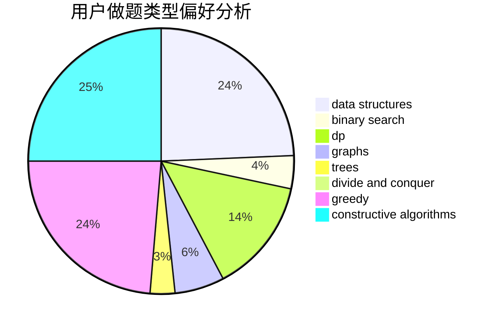
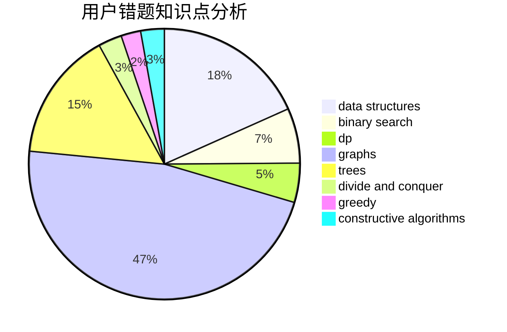

# sunyuhan1998

<!-- tabs:start -->

#### **用户提交结果分析**

#### **用户做题类型偏好分析**

#### **用户错题知识点分析**

<!-- tabs:end -->
# 推荐题目
[232B](https://codeforces.com/contest/232/problem/B)		bitmasks,
                        combinatorics,
                        dp,
                        math		  
[966C](https://codeforces.com/contest/966/problem/C)		dsu,graphs,sortings,trees		  
[623A](https://codeforces.com/contest/623/problem/A)		constructive algorithms,
                        graphs		  
[446E](https://codeforces.com/contest/446/problem/E)		math,
                        matrices		  
[1205E](https://codeforces.com/contest/1205/problem/E)		combinatorics,
                        strings		  
[1236D](https://codeforces.com/contest/1236/problem/D)		brute force,
                        data structures,
                        greedy,
                        implementation		  
[19A](https://codeforces.com/contest/19/problem/A)		implementation		  
[896B](https://codeforces.com/contest/896/problem/B)		binary search,
                        constructive algorithms,
                        games,
                        greedy,
                        interactive		  
[1058A](https://codeforces.com/contest/1058/problem/A)		dsu,graphs,sortings,trees		  
[689E](https://codeforces.com/contest/689/problem/E)		combinatorics,
                        data structures,
                        dp,
                        geometry,
                        implementation		  
