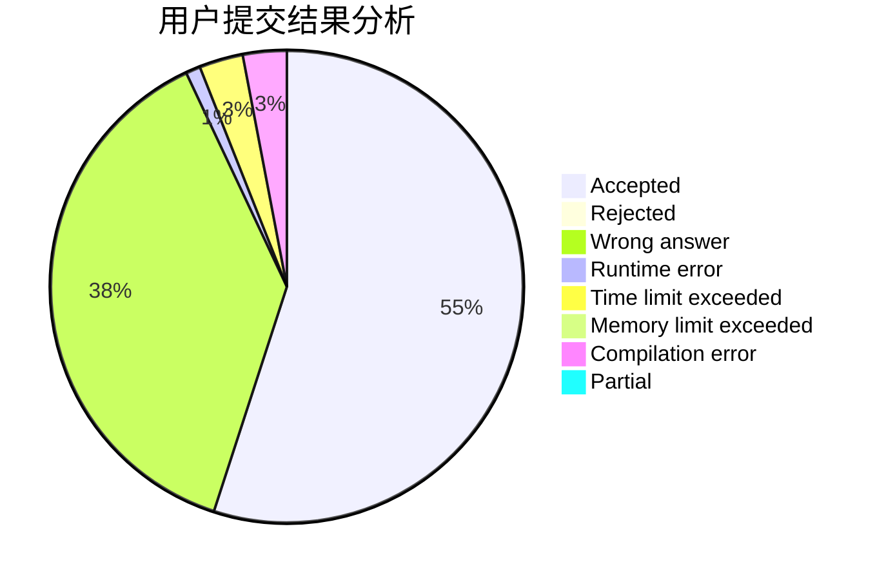
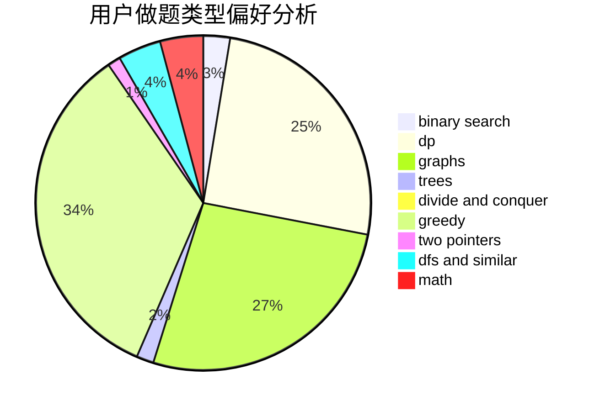

# sunyuhan1998

<!-- tabs:start -->

#### **用户提交结果分析**

#### **用户做题类型偏好分析**

<!-- tabs:end -->
# 推荐题目
[232B](https://codeforces.com/contest/232/problem/B)
[966C](https://codeforces.com/contest/966/problem/C)
[623A](https://codeforces.com/contest/623/problem/A)
[446E](https://codeforces.com/contest/446/problem/E)
[1205E](https://codeforces.com/contest/1205/problem/E)
[1236D](https://codeforces.com/contest/1236/problem/D)
[19A](https://codeforces.com/contest/19/problem/A)
[896B](https://codeforces.com/contest/896/problem/B)
[1058A](https://codeforces.com/contest/1058/problem/A)
[689E](https://codeforces.com/contest/689/problem/E)
