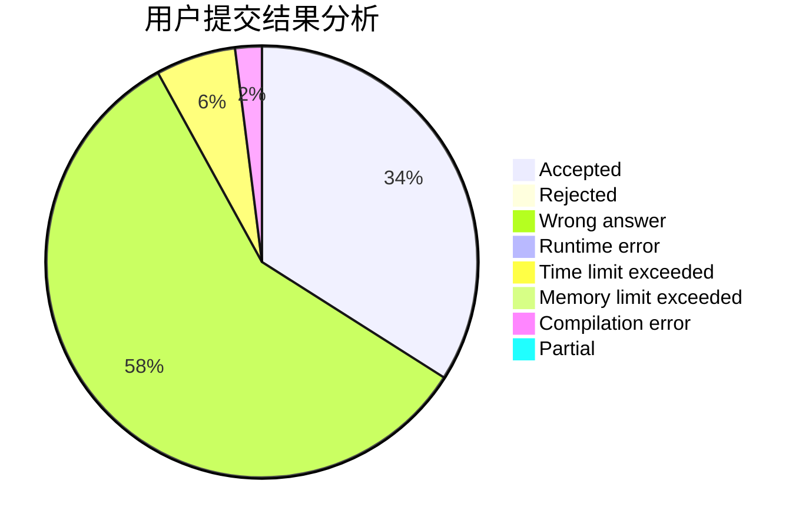
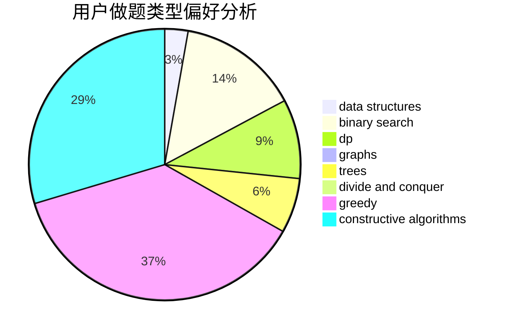
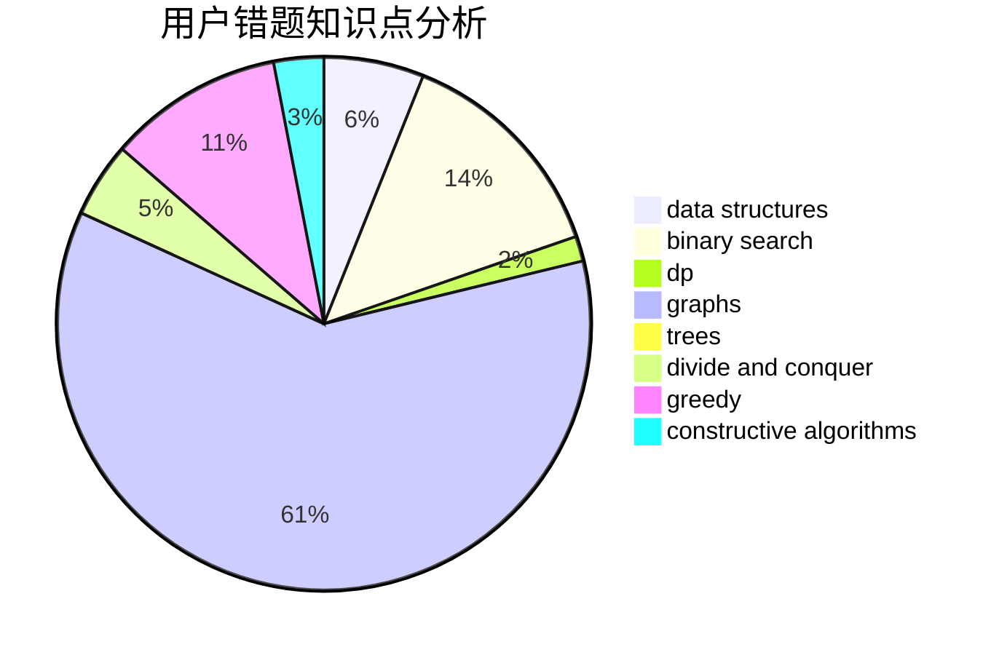

# sunyx20060115

<!-- tabs:start -->

#### **用户提交结果分析**

#### **用户做题类型偏好分析**

#### **用户错题知识点分析**

<!-- tabs:end -->
# 推荐题目
[1065F](https://codeforces.com/contest/1065/problem/F)		dfs and similar,
                        dp,
                        trees		  
[705A](https://codeforces.com/contest/705/problem/A)		implementation		  
[859A](https://codeforces.com/contest/859/problem/A)		greedy,
                        implementation		  
[356C](https://codeforces.com/contest/356/problem/C)		combinatorics,
                        constructive algorithms,
                        greedy,
                        implementation		  
[550B](https://codeforces.com/contest/550/problem/B)		bitmasks,
                        brute force		  
[1216F](https://codeforces.com/contest/1216/problem/F)		data structures,
                        dp,
                        greedy		  
[10B](https://codeforces.com/contest/10/problem/B)		dp,
                        implementation		  
[716B](https://codeforces.com/contest/716/problem/B)		greedy,
                        two pointers		  
[1179A](https://codeforces.com/contest/1179/problem/A)		data structures,
                        implementation		  
[937A](https://codeforces.com/contest/937/problem/A)		implementation,
                        sortings		  
