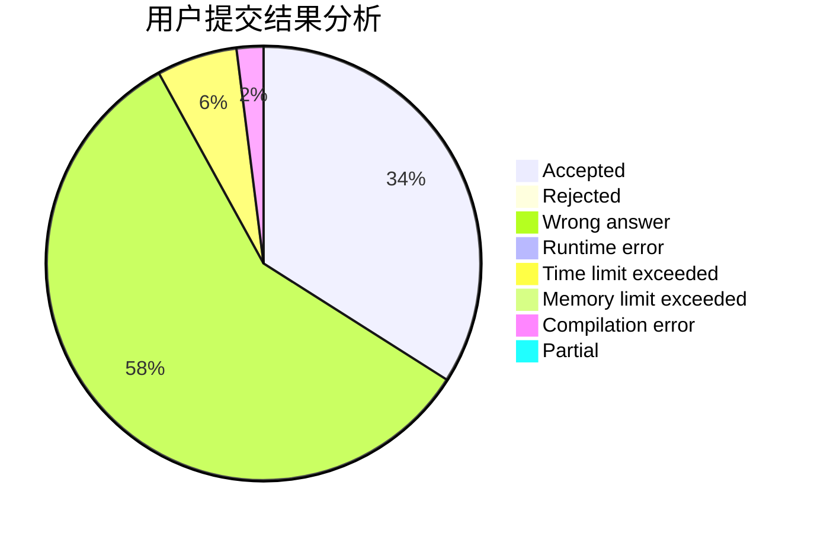
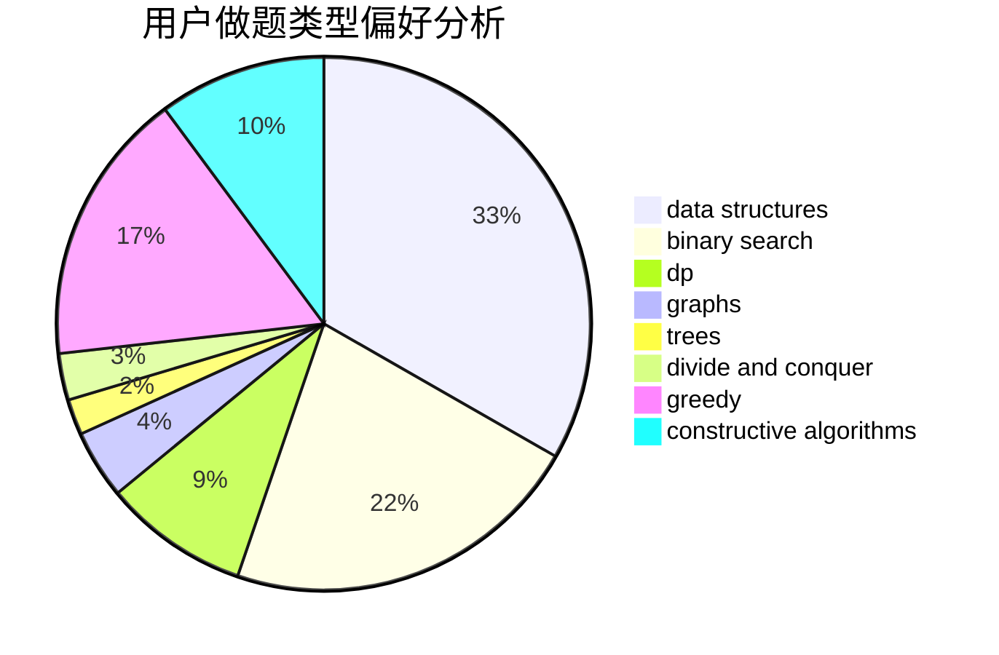
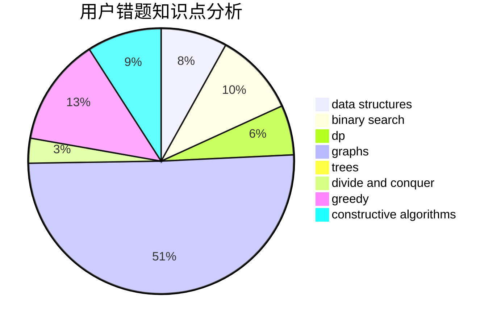

# sunyx20060115

<!-- tabs:start -->

#### **用户提交结果分析**

#### **用户做题类型偏好分析**

#### **用户错题知识点分析**

<!-- tabs:end -->
# 推荐题目
[1065B](https://codeforces.com/contest/1065/problem/B)		constructive algorithms,
                        graphs		  
[681B](https://codeforces.com/contest/681/problem/B)		brute force		  
[839D](https://codeforces.com/contest/839/problem/D)		combinatorics,
                        dp,
                        math,
                        number theory		  
[327D](https://codeforces.com/contest/327/problem/D)		constructive algorithms,
                        dfs and similar,
                        graphs		  
[526B](https://codeforces.com/contest/526/problem/B)		dfs and similar,
                        greedy,
                        implementation		  
[1210F2](https://codeforces.com/contest/1210F/problem/2)		brute force,
                        probabilities		  
[1099F](https://codeforces.com/contest/1099/problem/F)		binary search,
                        data structures,
                        dfs and similar,
                        dp,
                        games,
                        trees		  
[699C](https://codeforces.com/contest/699/problem/C)		dsu,graphs,sortings,trees		  
[1175G](https://codeforces.com/contest/1175/problem/G)		data structures,
                        divide and conquer,
                        dp,
                        geometry,
                        two pointers		  
[916E](https://codeforces.com/contest/916/problem/E)		data structures,
                        trees		  
