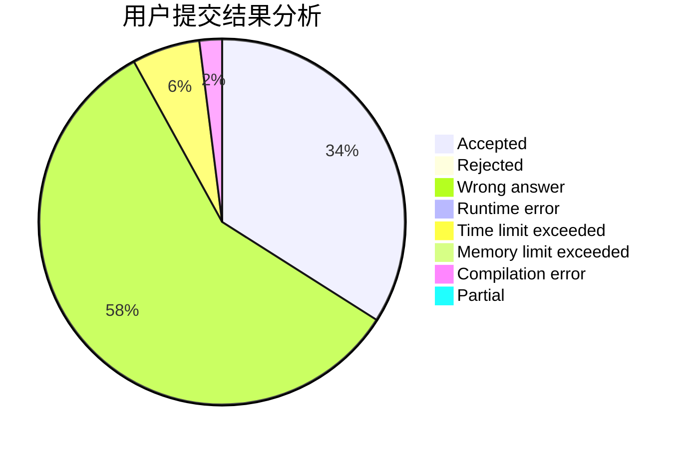
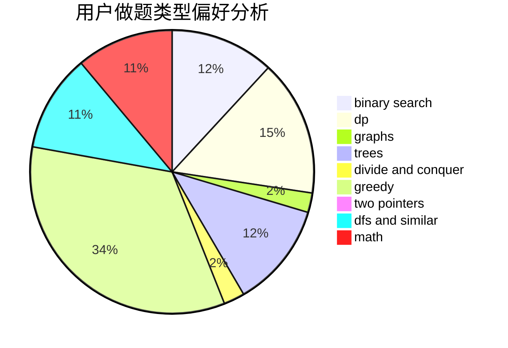

# sunyx20060115

<!-- tabs:start -->

#### **用户提交结果分析**

#### **用户做题类型偏好分析**

<!-- tabs:end -->
# 推荐题目
[1065F](https://codeforces.com/contest/1065/problem/F)
[705A](https://codeforces.com/contest/705/problem/A)
[859A](https://codeforces.com/contest/859/problem/A)
[356C](https://codeforces.com/contest/356/problem/C)
[550B](https://codeforces.com/contest/550/problem/B)
[1216F](https://codeforces.com/contest/1216/problem/F)
[10B](https://codeforces.com/contest/10/problem/B)
[716B](https://codeforces.com/contest/716/problem/B)
[1179A](https://codeforces.com/contest/1179/problem/A)
[937A](https://codeforces.com/contest/937/problem/A)
