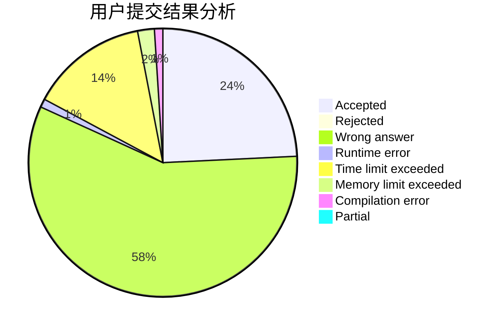
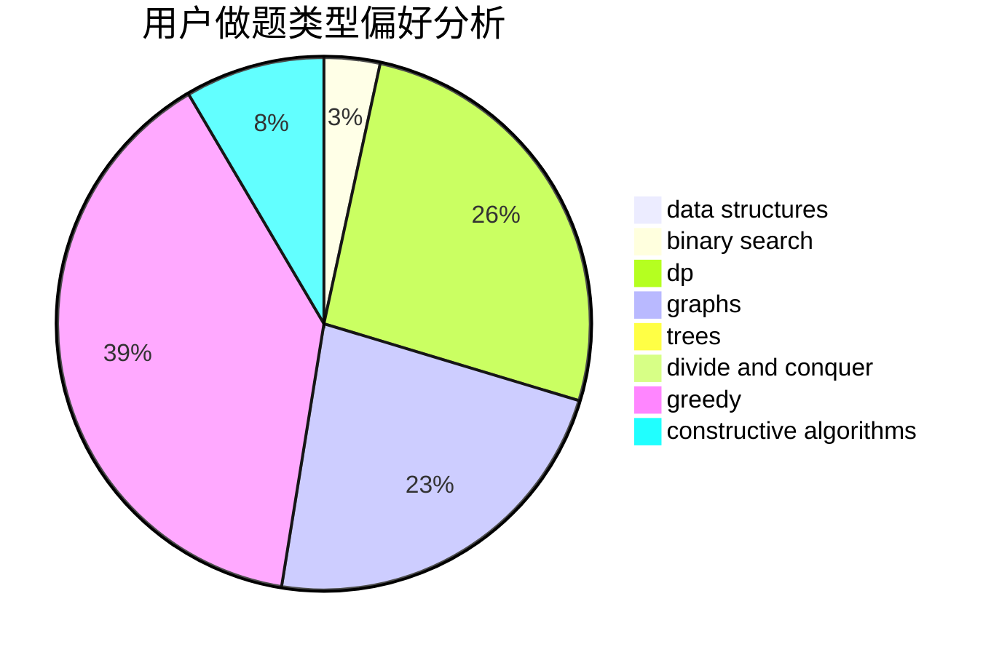
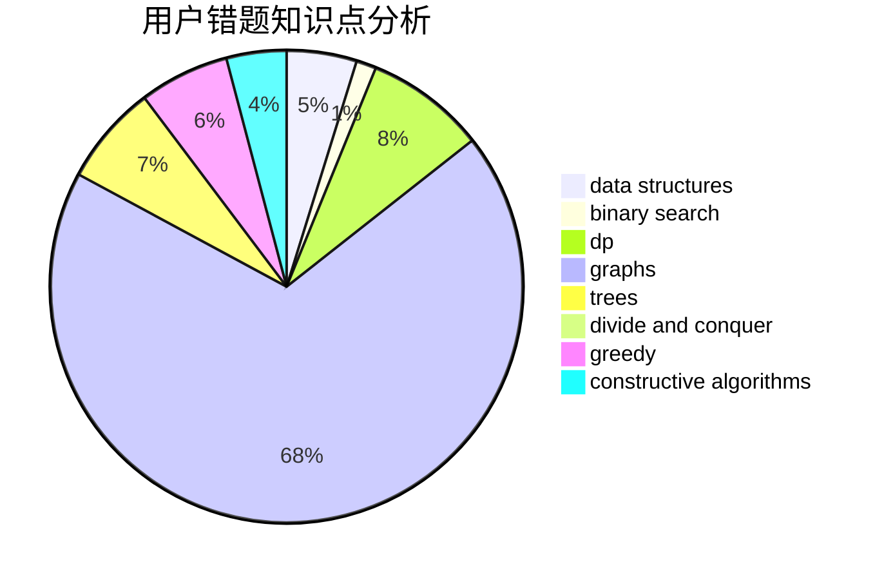

# sunzihao

<!-- tabs:start -->

#### **用户提交结果分析**

#### **用户做题类型偏好分析**

#### **用户错题知识点分析**

<!-- tabs:end -->
# 推荐题目
[667A](https://codeforces.com/contest/667/problem/A)		geometry,
                        math		  
[851A](https://codeforces.com/contest/851/problem/A)		implementation,
                        math		  
[828B](https://codeforces.com/contest/828/problem/B)		implementation		  
[1174E](https://codeforces.com/contest/1174/problem/E)		combinatorics,
                        dp,
                        math,
                        number theory		  
[533F](https://codeforces.com/contest/533/problem/F)		hashing,
                        string suffix structures,
                        strings		  
[438A](https://codeforces.com/contest/438/problem/A)		dsu,graphs,sortings,trees		  
[374A](https://codeforces.com/contest/374/problem/A)		greedy,
                        implementation		  
[157C](https://codeforces.com/contest/157/problem/C)		dsu,graphs,sortings,trees		  
[778A](https://codeforces.com/contest/778/problem/A)		binary search,
                        greedy,
                        strings		  
[1418A](https://codeforces.com/contest/1418/problem/A)		math		  
