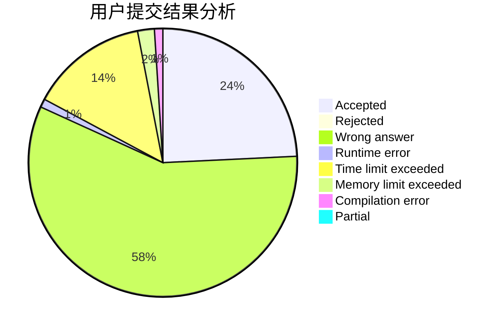
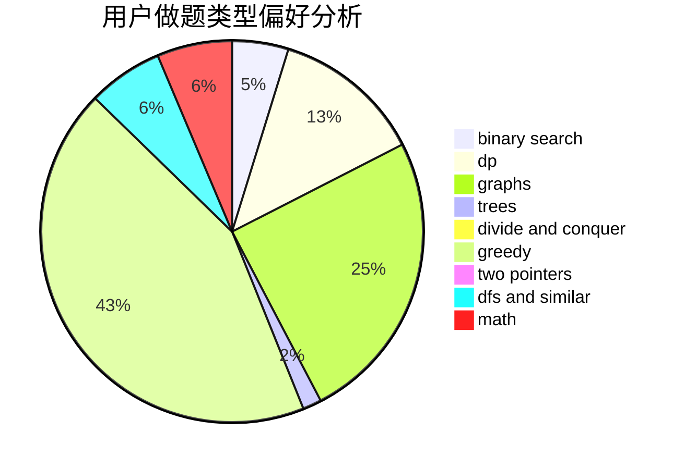

# sunzihao

<!-- tabs:start -->

#### **用户提交结果分析**

#### **用户做题类型偏好分析**

<!-- tabs:end -->
# 推荐题目
[689A](https://codeforces.com/contest/689/problem/A)
[86B](https://codeforces.com/contest/86/problem/B)
[846E](https://codeforces.com/contest/846/problem/E)
[11781](https://codeforces.com/contest/1178/problem/1)
[555D](https://codeforces.com/contest/555/problem/D)
[45D](https://codeforces.com/contest/45/problem/D)
[402E](https://codeforces.com/contest/402/problem/E)
[1782](https://codeforces.com/contest/178/problem/2)
[796C](https://codeforces.com/contest/796/problem/C)
[1425E](https://codeforces.com/contest/1425/problem/E)
