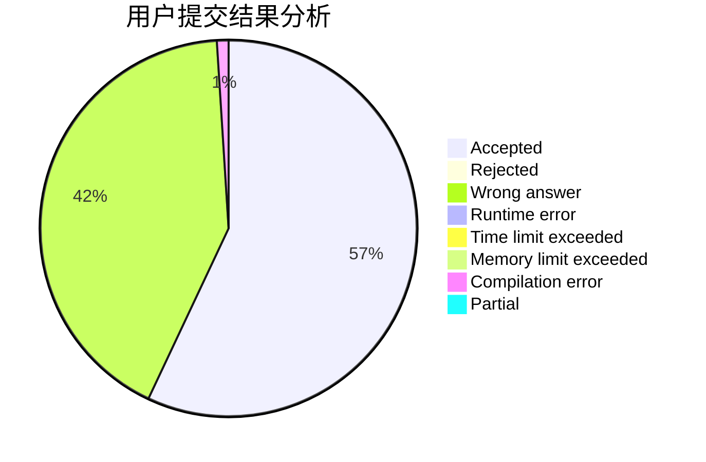
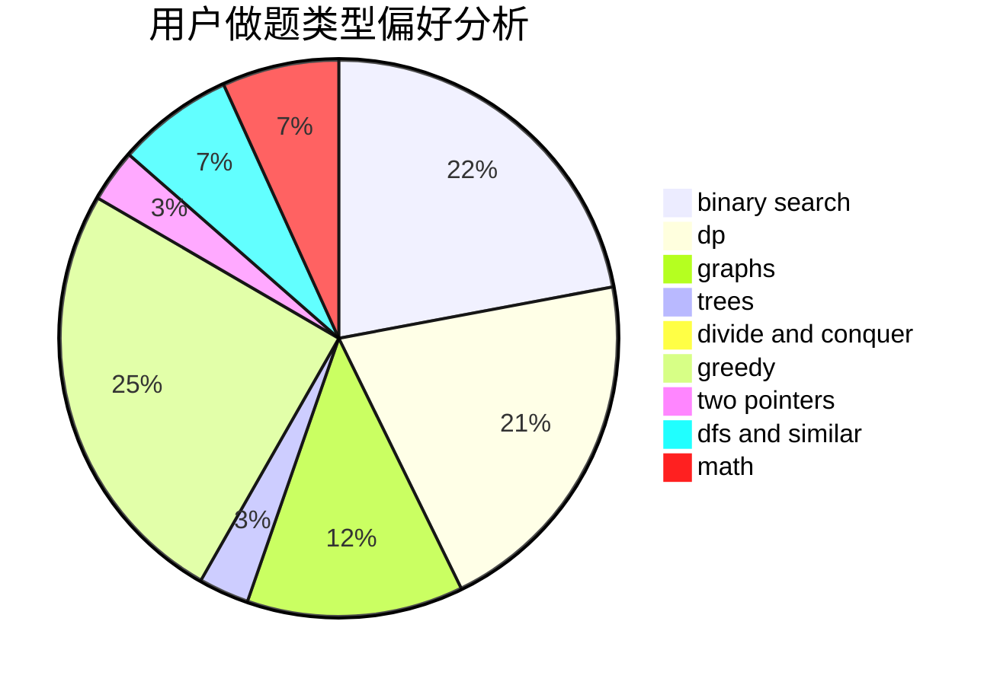

# superstarch

<!-- tabs:start -->

#### **用户提交结果分析**

#### **用户做题类型偏好分析**

<!-- tabs:end -->
# 推荐题目
[1310B](https://codeforces.com/contest/1310/problem/B)
[758F](https://codeforces.com/contest/758/problem/F)
[817B](https://codeforces.com/contest/817/problem/B)
[906A](https://codeforces.com/contest/906/problem/A)
[907B](https://codeforces.com/contest/907/problem/B)
[514D](https://codeforces.com/contest/514/problem/D)
[907D](https://codeforces.com/contest/907/problem/D)
[859F](https://codeforces.com/contest/859/problem/F)
[1328C](https://codeforces.com/contest/1328/problem/C)
[863C](https://codeforces.com/contest/863/problem/C)
