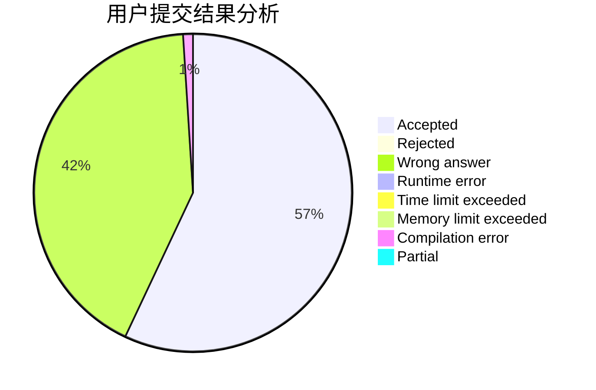
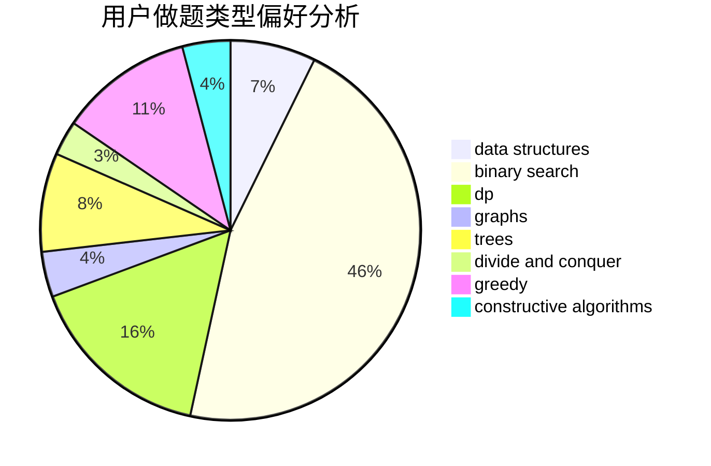
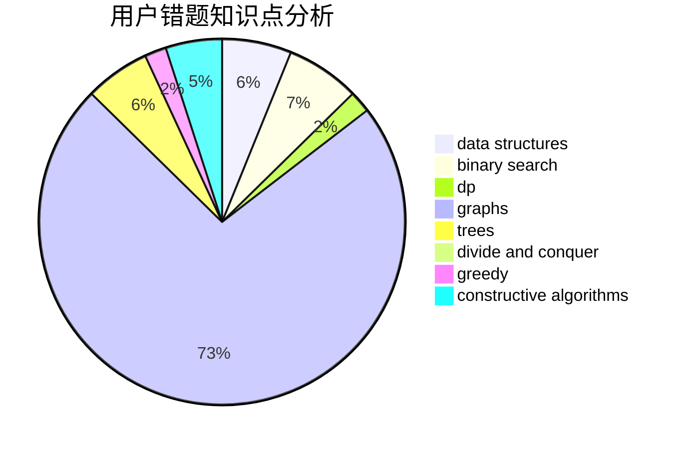

# superstarch

<!-- tabs:start -->

#### **用户提交结果分析**

#### **用户做题类型偏好分析**

#### **用户错题知识点分析**

<!-- tabs:end -->
# 推荐题目
[1310B](https://codeforces.com/contest/1310/problem/B)		dp,
                        implementation		  
[758F](https://codeforces.com/contest/758/problem/F)		brute force,
                        math,
                        number theory		  
[817B](https://codeforces.com/contest/817/problem/B)		combinatorics,
                        implementation,
                        math,
                        sortings		  
[906A](https://codeforces.com/contest/906/problem/A)		implementation,
                        strings		  
[907B](https://codeforces.com/contest/907/problem/B)		implementation		  
[514D](https://codeforces.com/contest/514/problem/D)		binary search,
                        data structures,
                        two pointers		  
[907D](https://codeforces.com/contest/907/problem/D)		dsu,graphs,sortings,trees		  
[859F](https://codeforces.com/contest/859/problem/F)		greedy		  
[1328C](https://codeforces.com/contest/1328/problem/C)		greedy,
                        implementation		  
[863C](https://codeforces.com/contest/863/problem/C)		graphs,
                        implementation		  
