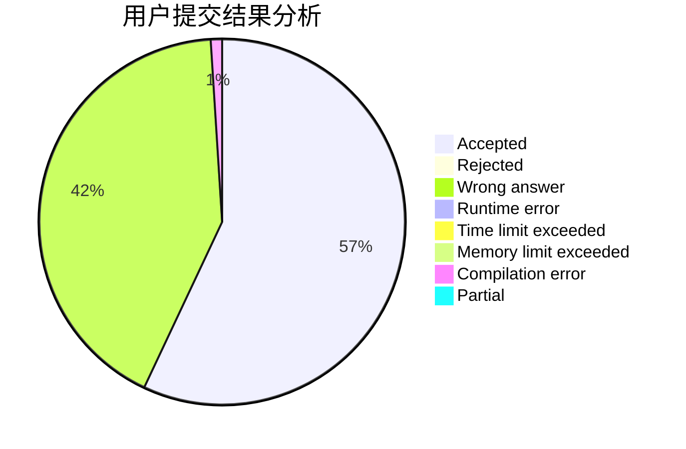
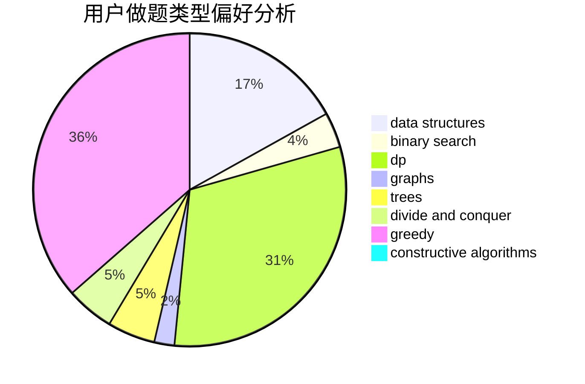
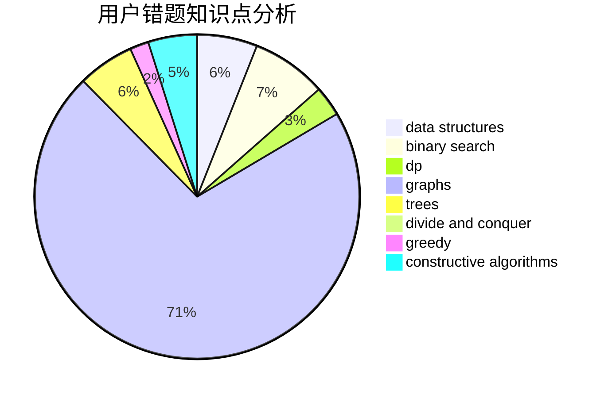

# superstarch

<!-- tabs:start -->

#### **用户提交结果分析**

#### **用户做题类型偏好分析**

#### **用户错题知识点分析**

<!-- tabs:end -->
# 推荐题目
[1300D](https://codeforces.com/contest/1300/problem/D)		dsu,graphs,sortings,trees		  
[737B](https://codeforces.com/contest/737/problem/B)		dsu,graphs,sortings,trees		  
[802C](https://codeforces.com/contest/802/problem/C)		flows		  
[886F](https://codeforces.com/contest/886/problem/F)		geometry		  
[887F](https://codeforces.com/contest/887/problem/F)		greedy,
                        sortings		  
[494C](https://codeforces.com/contest/494/problem/C)		dp,
                        probabilities		  
[888B](https://codeforces.com/contest/888/problem/B)		greedy		  
[840B](https://codeforces.com/contest/840/problem/B)		constructive algorithms,
                        data structures,
                        dfs and similar,
                        dp,
                        graphs		  
[1321D](https://codeforces.com/contest/1321/problem/D)		dsu,graphs,sortings,trees		  
[845B](https://codeforces.com/contest/845/problem/B)		brute force,
                        greedy,
                        implementation		  
