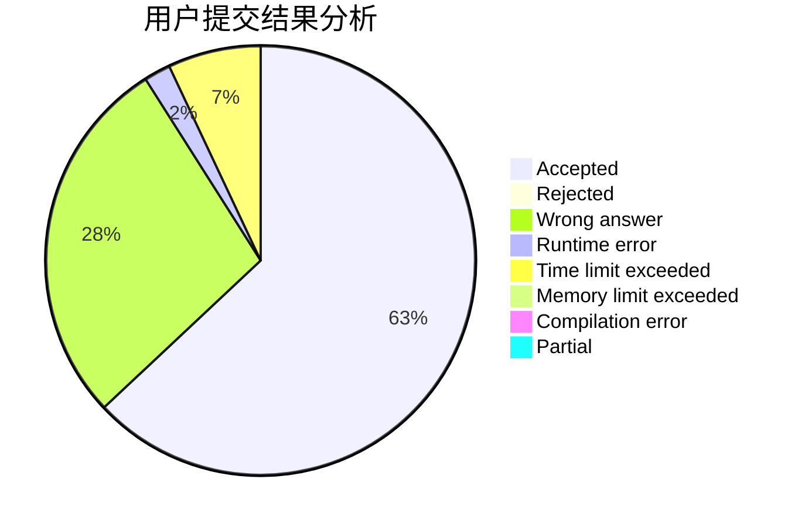
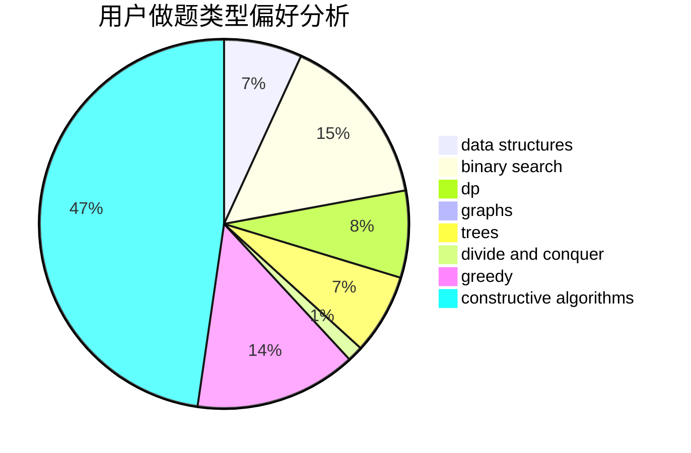
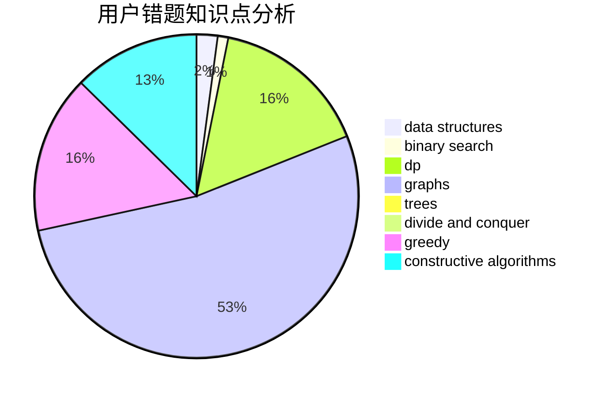

# supy

<!-- tabs:start -->

#### **用户提交结果分析**

#### **用户做题类型偏好分析**

#### **用户错题知识点分析**

<!-- tabs:end -->
# 推荐题目
[915C](https://codeforces.com/contest/915/problem/C)		dp,
                        greedy		  
[959F](https://codeforces.com/contest/959/problem/F)		bitmasks,
                        dp,
                        math,
                        matrices		  
[704D](https://codeforces.com/contest/704/problem/D)		flows,
                        greedy		  
[317C](https://codeforces.com/contest/317/problem/C)		constructive algorithms,
                        dfs and similar,
                        graphs,
                        trees		  
[659E](https://codeforces.com/contest/659/problem/E)		data structures,
                        dfs and similar,
                        dsu,
                        graphs,
                        greedy		  
[385E](https://codeforces.com/contest/385/problem/E)		math,
                        matrices		  
[702E](https://codeforces.com/contest/702/problem/E)		data structures,
                        graphs		  
[706D](https://codeforces.com/contest/706/problem/D)		binary search,
                        bitmasks,
                        data structures,
                        trees		  
[1004F](https://codeforces.com/contest/1004/problem/F)		bitmasks,
                        data structures,
                        divide and conquer		  
[268A](https://codeforces.com/contest/268/problem/A)		brute force		  
