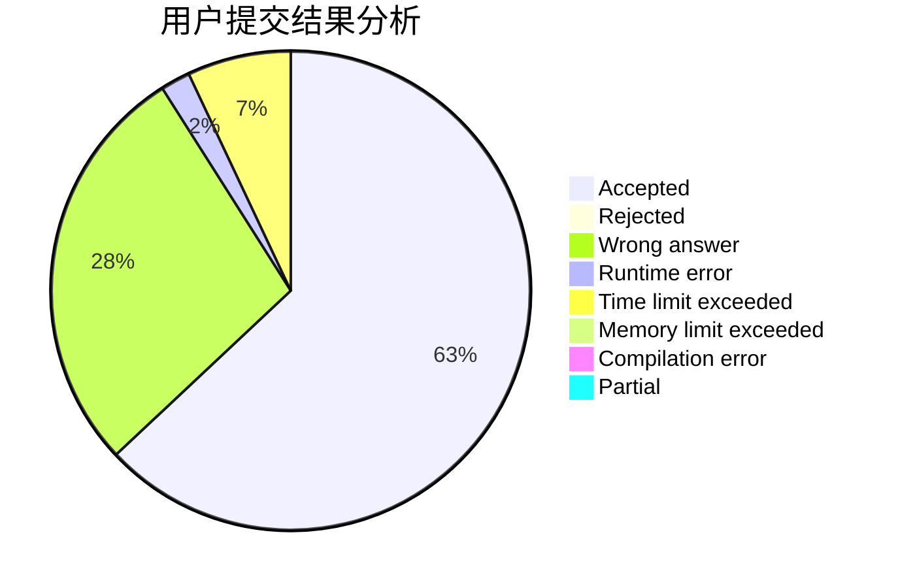
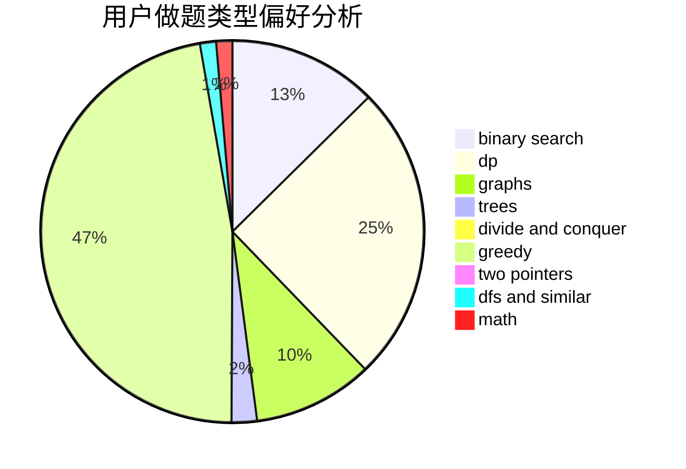

# supy

<!-- tabs:start -->

#### **用户提交结果分析**

#### **用户做题类型偏好分析**

<!-- tabs:end -->
# 推荐题目
[935B](https://codeforces.com/contest/935/problem/B)
[981D](https://codeforces.com/contest/981/problem/D)
[723D](https://codeforces.com/contest/723/problem/D)
[346E](https://codeforces.com/contest/346/problem/E)
[679E](https://codeforces.com/contest/679/problem/E)
[415A](https://codeforces.com/contest/415/problem/A)
[721C](https://codeforces.com/contest/721/problem/C)
[725A](https://codeforces.com/contest/725/problem/A)
[1005A](https://codeforces.com/contest/1005/problem/A)
[283B](https://codeforces.com/contest/283/problem/B)
