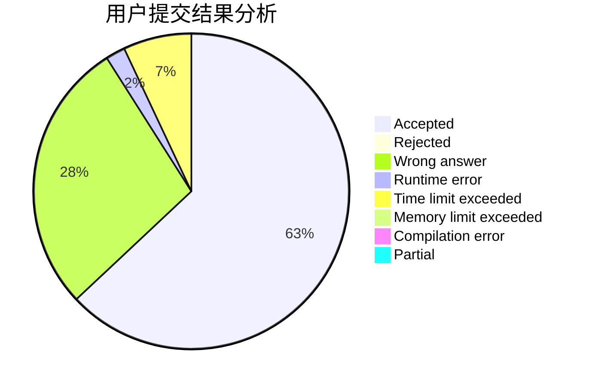
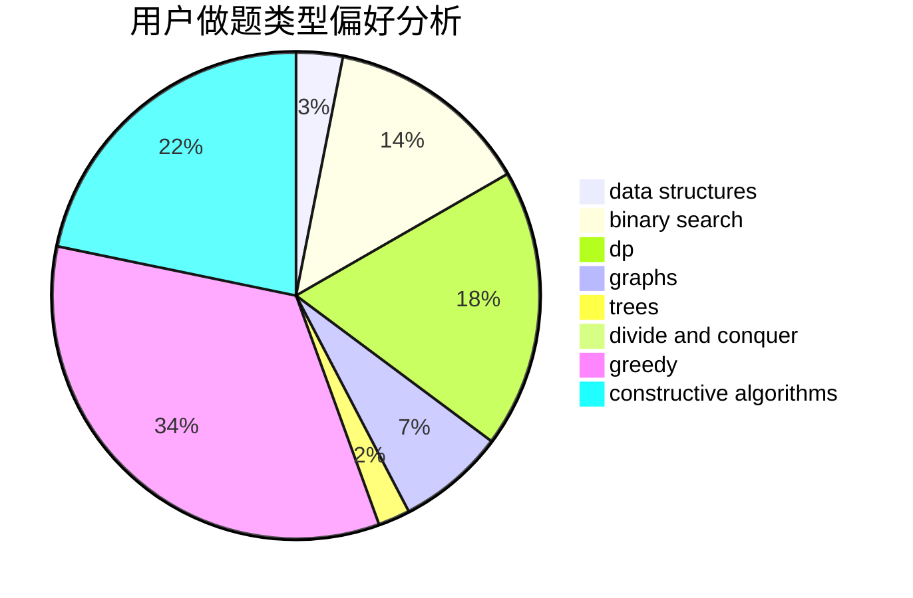
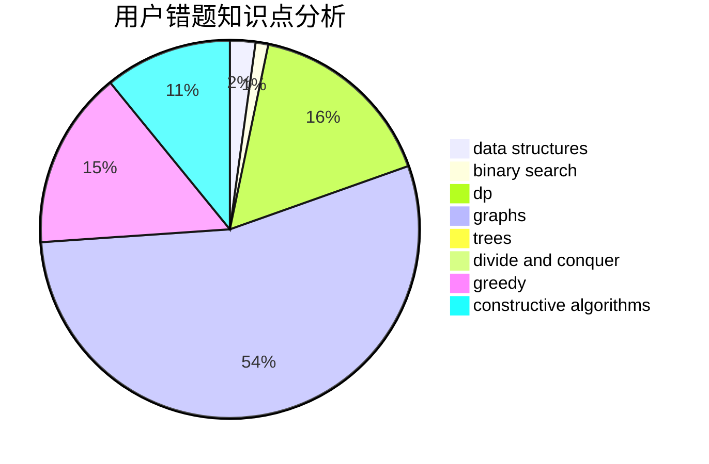

# supy

<!-- tabs:start -->

#### **用户提交结果分析**

#### **用户做题类型偏好分析**

#### **用户错题知识点分析**

<!-- tabs:end -->
# 推荐题目
[935B](https://codeforces.com/contest/935/problem/B)		implementation		  
[981D](https://codeforces.com/contest/981/problem/D)		bitmasks,
                        dp,
                        greedy		  
[723D](https://codeforces.com/contest/723/problem/D)		dfs and similar,
                        dsu,
                        graphs,
                        greedy,
                        implementation		  
[346E](https://codeforces.com/contest/346/problem/E)		math,
                        number theory		  
[679E](https://codeforces.com/contest/679/problem/E)		data structures		  
[415A](https://codeforces.com/contest/415/problem/A)		implementation		  
[721C](https://codeforces.com/contest/721/problem/C)		dp,
                        graphs		  
[725A](https://codeforces.com/contest/725/problem/A)		implementation		  
[1005A](https://codeforces.com/contest/1005/problem/A)		implementation		  
[283B](https://codeforces.com/contest/283/problem/B)		dfs and similar,
                        dp,
                        graphs		  
