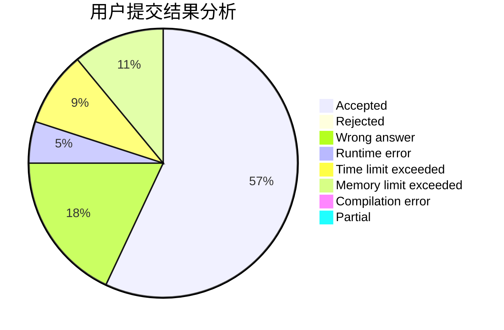
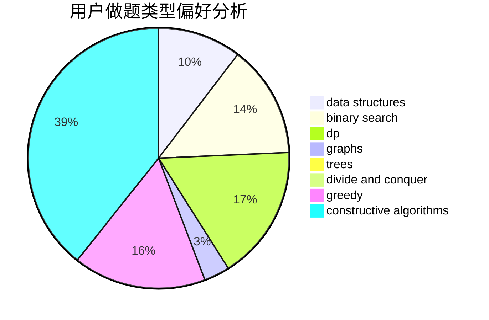

# suyucheng

<!-- tabs:start -->

#### **用户提交结果分析**

#### **用户做题类型偏好分析**

#### **用户错题知识点分析**

<!-- tabs:end -->
# 推荐题目
[1156D](https://codeforces.com/contest/1156/problem/D)		dfs and similar,
                        divide and conquer,
                        dp,
                        dsu,
                        trees		  
[573E](https://codeforces.com/contest/573/problem/E)		data structures,
                        greedy		  
[664A](https://codeforces.com/contest/664/problem/A)		math,
                        number theory		  
[1156C](https://codeforces.com/contest/1156/problem/C)		binary search,
                        greedy,
                        sortings,
                        ternary search,
                        two pointers		  
[49E](https://codeforces.com/contest/49/problem/E)		dp		  
[1256B](https://codeforces.com/contest/1256/problem/B)		greedy		  
[1194D](https://codeforces.com/contest/1194/problem/D)		games,
                        math		  
[1452F](https://codeforces.com/contest/1452/problem/F)		constructive algorithms,
                        greedy		  
[567C](https://codeforces.com/contest/567/problem/C)		binary search,
                        data structures,
                        dp		  
[1311A](https://codeforces.com/contest/1311/problem/A)		greedy,
                        implementation,
                        math		  
